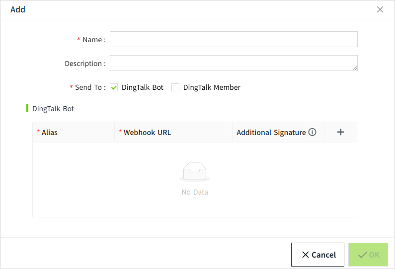
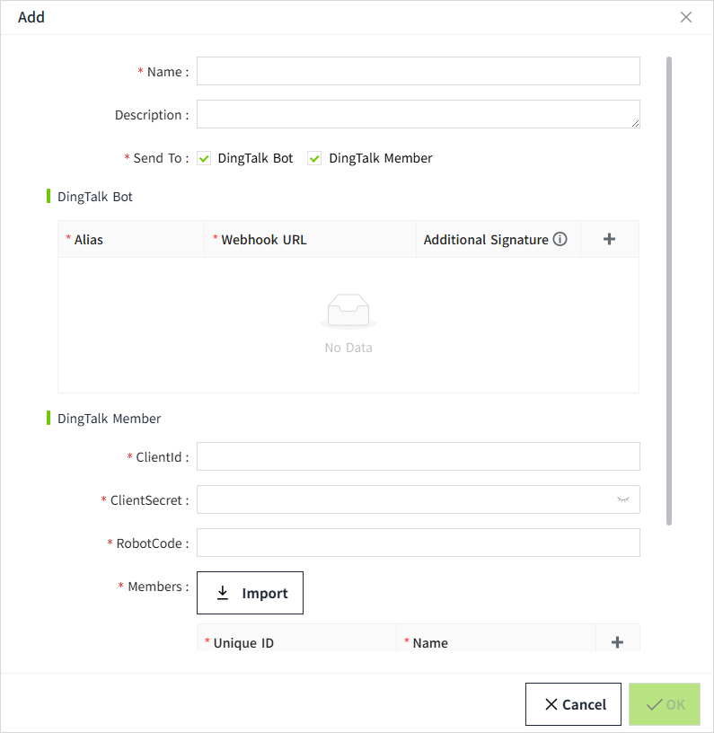
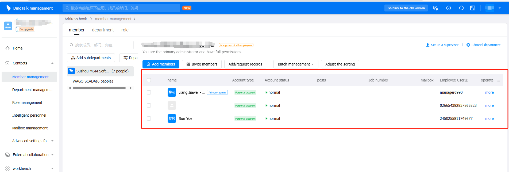
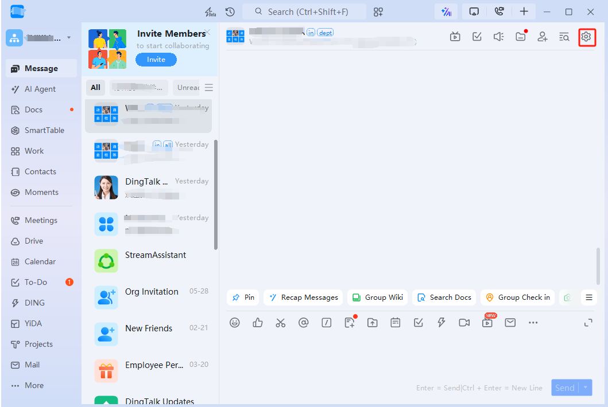
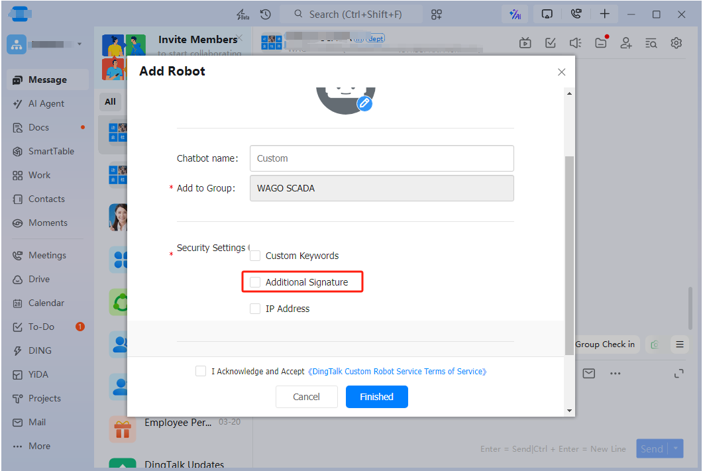
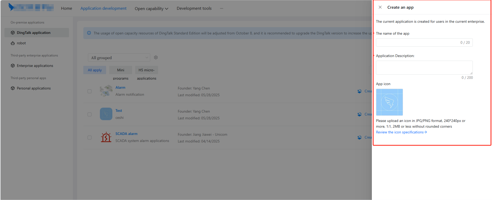
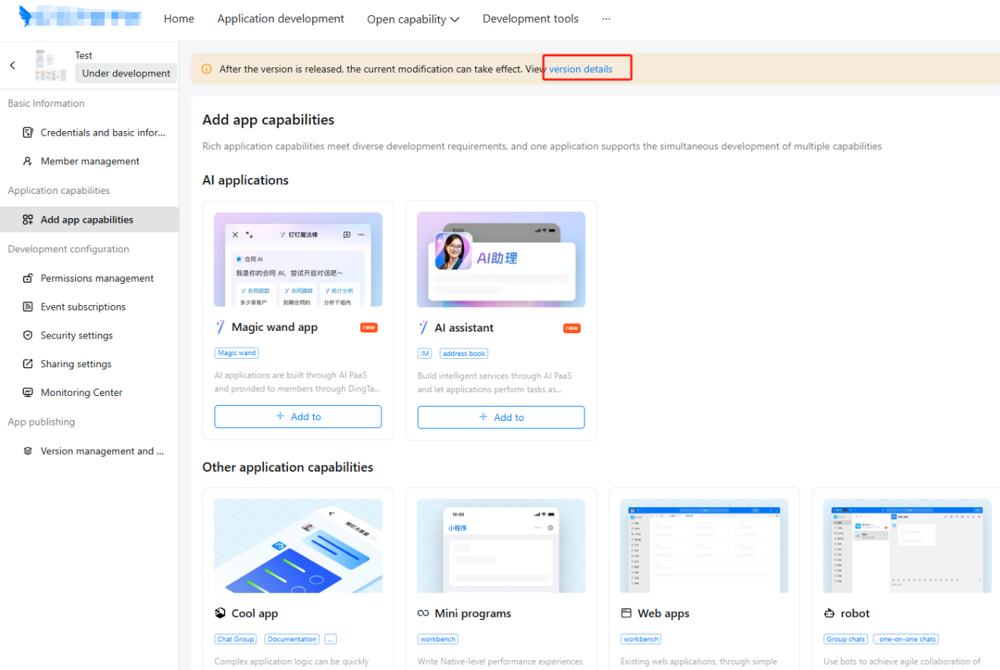
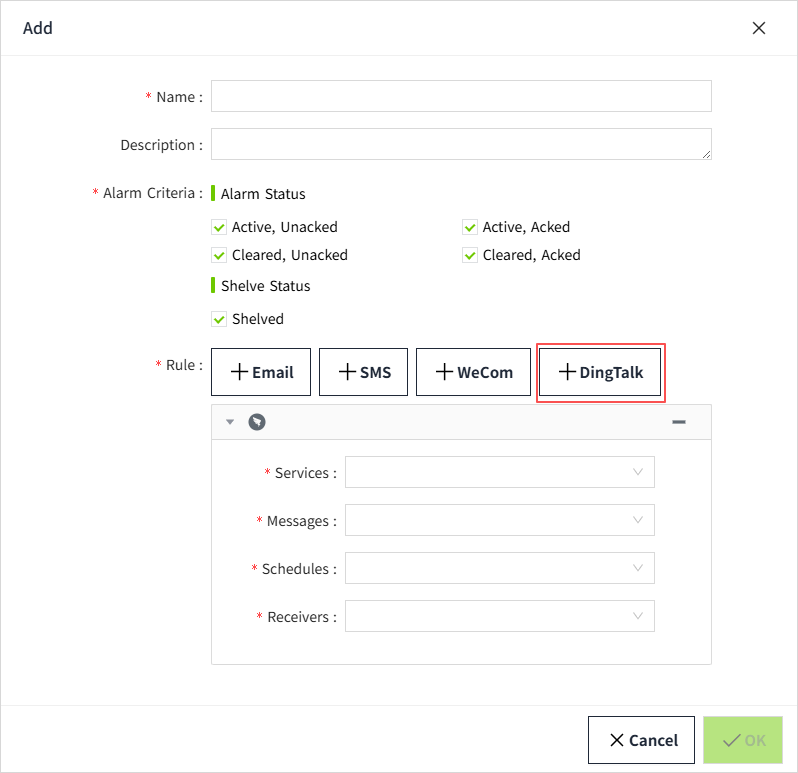

# DingTalk

Used to configure sending alarm notifications via DingTalk to specific groups or user accounts.

## Create WeCom Service

1. Click "**Alarming**" -> "**Alarm Notifications**" -> "**Services**" to open the “**Services**” list page.
    
2. Click the "Add" button. In the new pop-up window, select "DingTalk".
    
3. Click "Next" to enter the detailed configuration window. 
    
    In the “Send To” field, **DingTalk Group** is selected by default. To send notifications to individual users, check the **DingTalk Memeber** option. You may select both simultaneously.
    
4. Once the settings are complete, click the 'OK' button to add this configuration data.

**Properties**

| **Name** |**Description** |
|---------------|----------------|
| Name             | Notification service name.|
| Description      | Notification service description. |
| Send To          | You can configure recipients as either DingTalk groups or individual DingTalk Members. After selecting the type, add the corresponding information in the section below. |
| DingTalk Group   | When “Send To” is set to “DingTalk Group,” display this configuration section, which is used to specify the DingTalk groups that should receive alarm notifications.The group name needs to be the same as the group name in the DingTalk.   - **Group Name:** The name of the DingTalk group.   - **Group Robot Webhook URL:** The HTTP endpoint automatically generated when a robot is configured in the DingTalk. Use this URL to send notifications to the group.  The format of a Webhook URL is usually:https://oapi.dingtalk.com/robot/send?access_token*=......*   - `oapi.dingtalk.com`：API domain names open to the public by DingTalk  - `/robot/send`：Fixed Path for Bot Message Push  - `access_token=…`：Unique identity credentials for each bot, automatically generated when the bot is created  Additional Signature：Required only if the group robot is enabled for “Additional Signature”. |
| DingTalk Memeber | When “Send To” is set to “ DingTalk Memeber,” display this configuration section. It is used to specify the DingTalk accounts that should receive alarm notifications.  If you want to send notifications to an individual user, you need to create an app in the DingTalk Open Platform→ “App Development” page first, and send notifications through the app.   **ClientId**  App Credential, used to uniquely identify your DingTalk application.   1. Access the DingTalk Open Platform, navigate to the “App Development” page, and select the DingTalk application.   2. Click the “Application Details” button of the application to enter the application details page, and click “Credentials and Basic Information” on the left menu to view **ClientId** and **ClientSecret.**    **ClientSecret**   Used in conjunction with the ClientId to obtain an `access_token`    **RobotCode**   The **RobotCode** is the unique identifier used to specify the target robot. On the application details page, click **Application capabilities → robot** in the left menu to open the robot details page, where you can view the RobotCode.   **Members**  Configure the DingTalk accounts that will receive alarm notifications. The account identifiers must match those in the DingTalk management system: “Contacts”->"Member management".  If you prefer to add accounts via import, export them from the DingTalk management system first.    |

#### How to add a group robot

1. Click the settings button of an  DingTalk group 
    
2. In the Group Settings window, click on “Bot”.
    
3. Click “Add Bot” (Note: Only group owners and group administrators can add bots).
    
4. Click “Custom” 
    
5. Click the "Add" button
    
6. Add Robot
    
    If “Additional Signature” is enabled under **Security Settings**, then when creating a DingTalk service and adding a DingTalk group, you must enter the robot’s generated signature key into the corresponding **Secret** field. If “Additional Signature” is not enabled, no secret needs to be provided.
    

**Note**: Adding group robots is only supported on the desktop client; it is not supported on mobile. 

## How to view group robot Webhook URL and Additional Signature

In a DingTalk group, click the **Group Settings** button in the top-right corner. In the settings dialog, click on a specific group robot to view that robot’s Webhook URL and Additional Signature information.

**Note:**  Only group robots that created by yourself can view their Webhook URL.

#### How to create an app

1. Log in to the  DingTalk management  system (  [https://open-dev.dingtalk.com](https://open-dev.dingtalk.com/) )，Click **Create an app** on the “App Management” page.
    
2. Fill in and save your application information.
    
3. After saving, you will be redirected to the following page, click “View Version Details” at the top of the page to enter the details page.
    
4. Click the edit button
    
5. When you are finished editing, click ”Save” button
    
6. Click "Direct Publishing" to publish the application
    
7. You can view the created applications on the** Application Development** page
    
8. On the “Application Development” page, click the “Application Details” button of the application to enter the Add Application Capability page.
    
9. Click the robot to start the robot configuration. After the configuration is completed, click the "Publish" button at the bottom of the page to publish.
    
10. Open **Robot Configuration** and click the “Publish” button at the bottom of the page to publish the configuration.
    
11. Configuration completed

## How to use the Email Notification Service

In the alarm notification rules, you will select the notification service.

1. Click on **"Alarming" -> "Alarm Notifications" -> "Rules"** to enter the notification rules list page.
2. Click the **"New"** button in the upper right corner of the list.
3. In the pop-up window, click the **'+DingTalk'** button to add a new Email notification rule.In the notification service dropdown, select the previously created notification service.

    

