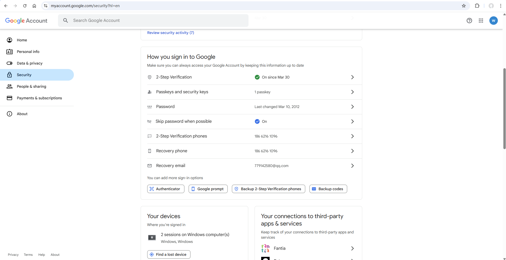

# Email(SMTP)

Used to configure the email sending service for alarm notifications.

## Create Email (SMTP) Service

1. Click "**Alarming**" -> "**Alarm Notifications**" -> "**Services**" to open the “**Services**” list page.
    
2. Click the "Add" button. In the new pop-up window, select "Email (SMTP)".
    
3. Click "Next" to enter the detailed configuration window. 
    
4. After setting up, click the **"Connection Test"** button to check if the connection is successful.
5. If the test is successful, click the **"OK"** button to add the data.

**Properties**

| **Name**          | **Description**                                                                  |
|-------------------|----------------------------------------------------------------------------------|
| Name              | Notification service name.                                                       |
| Description       | Notification service description.                                                |
| From Address      | Email account required for sending emails.                                       |
| SMTP Server       | SMTP server address required for sending emails.                                 |
| Secure Connection | SMTP server secure connection method.                                            |
| SMTP Port         | SMTP server port address.                                                        |
| User Name         | User name for logging into the SMTP server (usually the sender’s email account). |
| Password          | Password for logging into the SMTP server (usually the sender’s email password). |
| SMTP Timeout(ms)  | SMTP server connection timeout.                                                  |
| Connection Test   | Click the button to test if the email configuration is successful.               |

#### Setting a GMAIL Password

For security purposes, Google's Gmail requires the use of an app-specific password when authorizing third-party login.

To use an app-specific password, the Gmail account must have two-step verification enabled. If two-step verification is already enabled, you can proceed directly to the steps for creating an app-specific password

**2-Step Verification**

1. Open your  [Google Account](https://myaccount.google.com/).
2. In the navigation panel, select **Security**.
3. Under “How you sign in to Google,” select **Turn on** **2-Step Verification**.
4. Follow the steps.

    

**Sign in with app passwords**

**Important Note: To create an app-specific password, you must enable two-step verification for your Google account**

1. Visit the app-specific password creation webpage: https://myaccount.google.com/apppasswords.
2. Enter the name of the application that requires the password, such as "VCHub"
3. Copy and save the app-specific password for future use

 

 If the following situation occurs when you open the application-specific password creation page, please refer to the above instructions, **enable two-step verification**, and then reopen the page

 

**Enable Smtp**

1. On your computer, open  [Gmail](https://mail.google.com/)
2. In the top right, click Settings   **See all settings.**
    
3. Click the **Forwarding and POP/IMAP** tab.
    
4. In the "POP download" section, select **Enable POP for mail that arrives from now on.**

**Test Gmail**

After entering your account and password(**For Gmail service, please enter the application-specific password created above**) on the configuration page, you can click "Connection Test " to verify whether the account credentials are correct.

## References

 [POP, IMAP, and SMTP settings for Outlook.com - Microsoft Support](https://support.microsoft.com/en-us/office/pop-imap-and-smtp-settings-for-outlook-com-d088b986-291d-42b8-9564-9c414e2aa040)

 [IMAP, POP, and SMTP  |  Gmail  |  Google for Developers](https://developers.google.com/gmail/imap/imap-smtp)

#### How to use the Email Notification Service

In the alarm notification rules, you will select the notification service.

1. Click on **"Alarming" -> "Alarm Notifications" -> "Rules"** to enter the notification rules list page.
2. Click the **"New"** button in the upper right corner of the list.
3. In the pop-up window, click the **'+Email'** button to add a new Email notification rule.In the notification service dropdown, select the previously created notification service.

    

