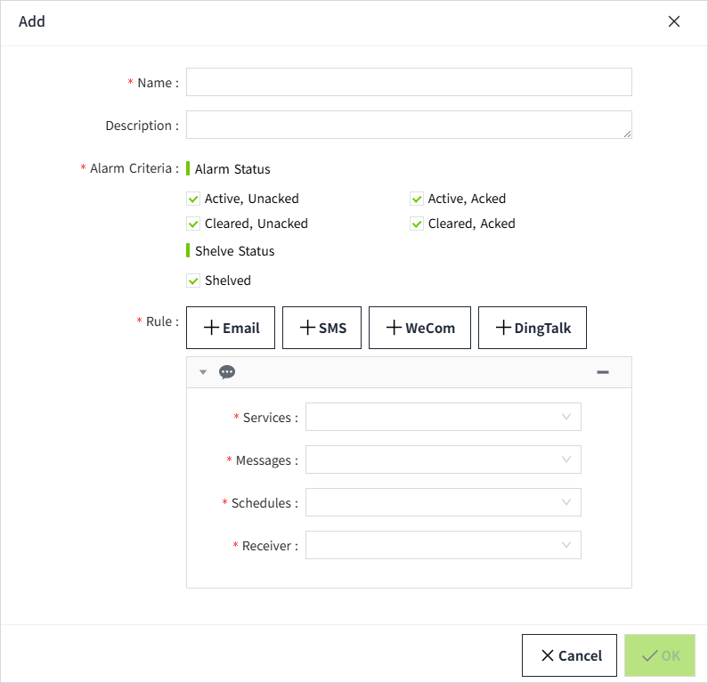

# SMS(Ali Cloud)

Used to configure the SMS sending service for alarm notifications.

## Create SMS (Ali Cloud) Service

1. Click "**Alarming**" -> **"Alarm Notifications**" -> "**Services**" to open the "**Services**" list page.
    
2. Click the "Add" button. In the new pop-up window, select "SMS(Ali Cloud)".
    
3. Click "Next" to enter the detailed configuration window. 
    
4. Once the setup is complete, click the **"Confirm"** button.

 **Properties**

| **Name**         | **Description**                                                                                                                                                 |
|------------------|-----------------------------------------------------------------------------------------------------------------------------------------------------------------|
| Name             | Notification service name.                                                                                                                                      |
| Description      | Notification service description.                                                                                                                               |
| AccessKey ID     | Alibaba Cloud Service Access Key ID (applied from Alibaba Cloud).                                                                                               |
| AccessKey Secret | Alibaba Cloud Service Access Key Secret (applied from Alibaba Cloud).                                                                                           |
| Endpoint         | [SMS Service Region Address](https://www.alibabacloud.com/help/en/sms/developer-reference/api-dysmsapi-2018-05-01-endpoint?spm=a2c63.p38356.0.0.8c161f14S5wtmC) |

## References

 [FAQ about AccessKey pairs - Resource Access Management - Alibaba Cloud Documentation Center](https://www.alibabacloud.com/help/en/ram/support/faq-about-accesskey-pairs?spm=a3c0i.29367734.6737026690.1.39e77d3fRXBxcz)

 [Endpoints - Short Message Service - Alibaba Cloud Documentation Center](https://www.alibabacloud.com/help/en/sms/developer-reference/api-dysmsapi-2018-05-01-endpoint?spm=a2c63.p38356.0.0.8c161f14S5wtmC)

## How to use the Ali Cloud Notification Service

1. Click on **"Alarming" -> "Alarm Notifications" -> "Rules"** to enter the notification rules list page.
2. Click the **"New"** button in the upper right corner of the list.
3. In the pop-up window, click the **'+SMS'** button to add a new SMS notification rule.In the notification service dropdown, select the previously created notification service.

    
