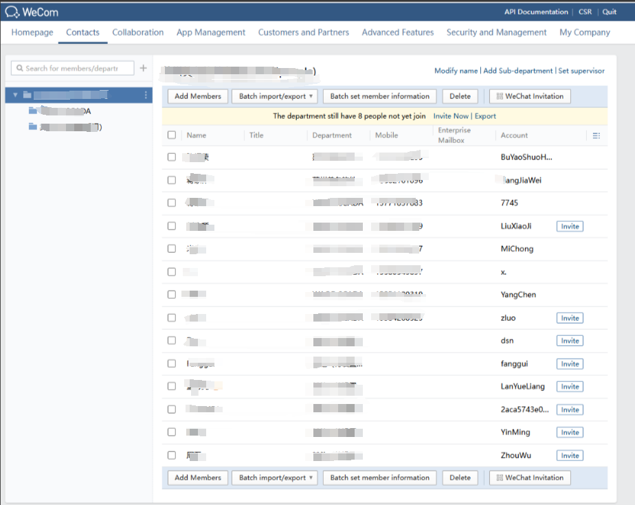
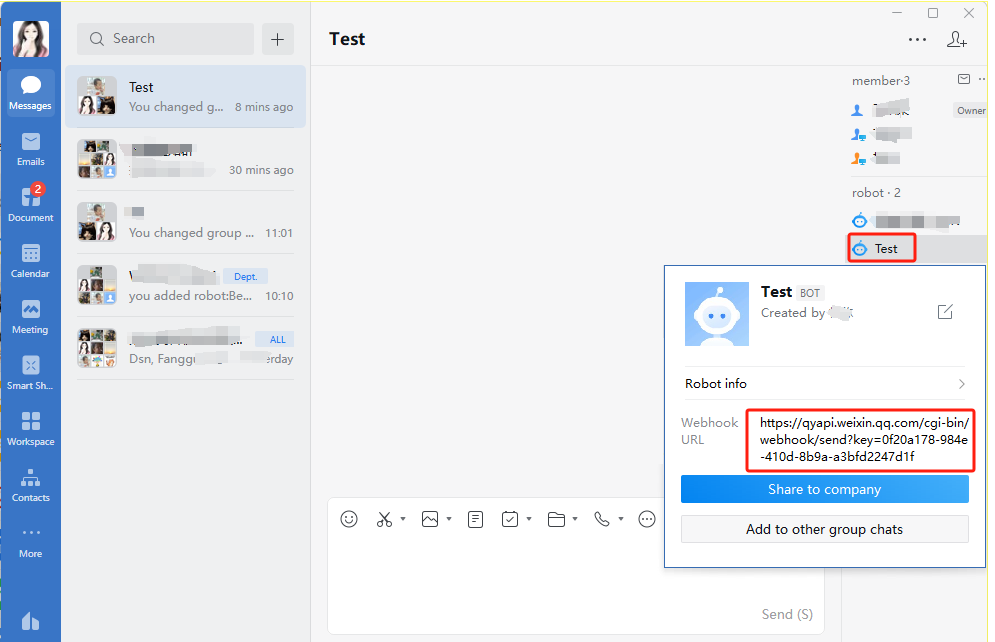
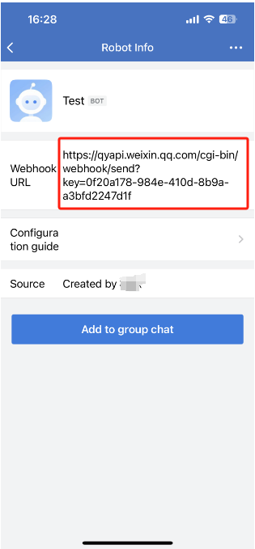
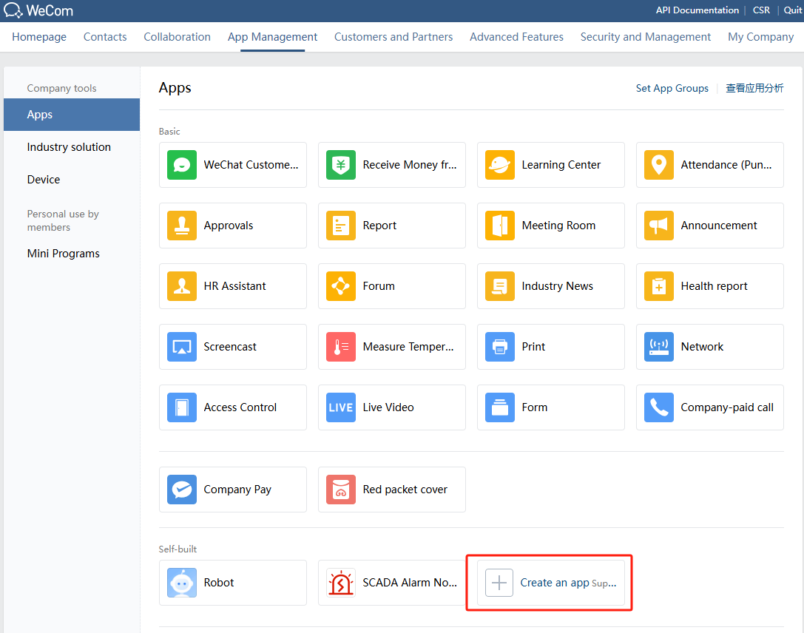
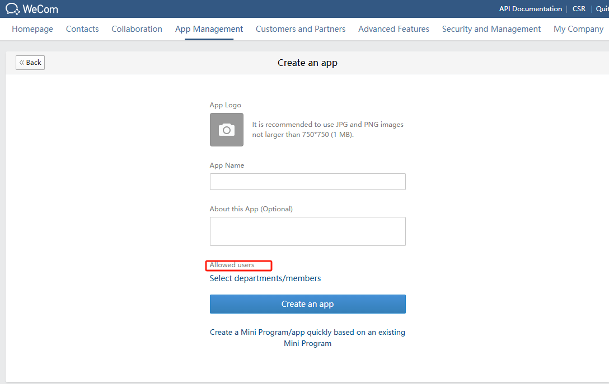
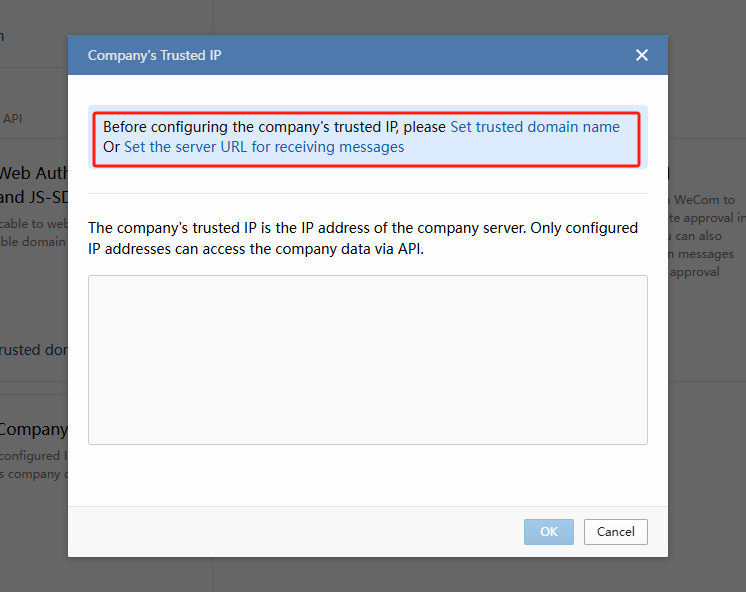
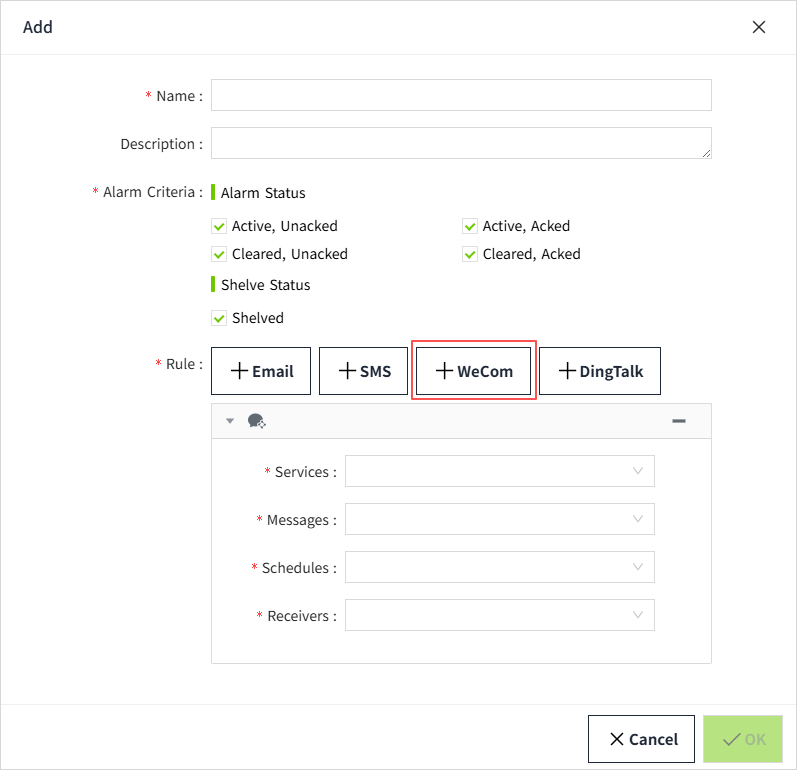

# WeCom

Used to configure sending alarm notifications via WeCom to specific groups or user accounts.

## Create WeCom Service

1. Click "**Alarming**" -> "**Alarm Notifications**" -> "**Services**" to open the “**Services**” list page.

2. Click the "Add" button. In the new pop-up window, select "WeCom".

3. Click "Next" to enter the detailed configuration window. 

In the “Send To” field, **WeCom Group** is selected by default. To send notifications to individual users, check the **WeCom Account** option. You may select both simultaneously.

4. Once the settings are complete, click the 'OK' button to add this configuration data.

**Properties**

| **Name**      |**Description** |
|---------------|----------------|
| Name          | Notification service name. |
| Description   | Notification service description.|
| Send To       | You can configure recipients as either WeCom groups or individual WeCom accounts. After selecting the type, add the corresponding information in the section below.    - **Group Name:** You may enter multiple group names, separated by “&”.   - **Webhook URL:** Notifications are sent via each group robot’s unique webhook URL. A single robot can be added to multiple group chats—when an alarm is triggered, the robot will push the notification to every group it belongs to, regardless of whether that group’s name was explicitly listed in the configuration. |
| WeCom Group   | When “Send To” is set to “WeCom Group,” display this configuration section, which is used to specify the WeCom groups that should receive alarm notifications.    - **Group Name:** The exact name of the WeCom group (should match the group name in WeCom).  - **Group Robot Webhook URL:** The HTTP endpoint automatically generated when a robot is configured in the wecom group. Use this URL to send notifications to the group.  Webhook URL usually take the form：*https://qyapi.weixin.qq.com/cgi-bin/webhook/send?key=......*  - `qyapi.weixin.qq.com`：API domain names open to the public by WeCom - `/cgi-bin/webhook/send`：Fixed Path for Bot Message Push - `key=…`：Unique identity credentials for each bot, automatically generated when the bot is created |
| WeCom Account | When “Send To” is set to “WeCom Account,” display this configuration section. It is used to specify the WeCom accounts that should receive alarm notifications.  If you want to send notifications to individual users, you must first create an **app** under WeCom management sysytem → App Management, and use that application to send the notifications.      **AgentId**    The unique identity of the  WeCom app.  In the  WeCom management system → “App Management” page, click your app, and you can see “AgentId” in the application detail page.     **Secret**   Use with Company ID and AgentId for authentication when calling API.  In the  WeCom management system → “App Management” page，click your app, and you can see “Secret” in the application detail page.       **Company ID**  The unique identity of the  WeCom organization.  Visible in the  WeCom management systemd → “My Company” page.      **Accounts**     Set the WeCom account to receive alarm notifications. The account should be the same as the account in the WeCom management system → “Contacts”.  If you want to add an account by importing, you only need to export the account in the  WeCom management system.    | 

## How to add a group robot

**Desktop**

1. Click the settings button of an  WeCom group and select “Add Group Robot”.

2. Create a robot

3. Save the robot

Mobile

1. Enter an  WeCom group and click on the Settings button in the upper right corner

2. Click on it to go to the **Chat Information** page, where you can click on the **Group Robot.**

3. In the group robot window, click the “Add” button in the upper right corner of the page and follow the steps to add a robot.

#### How to view group robot Webhook URL

**Desktop**

Within a WeCom group, click on a group bot to view the Webhook URL for that bot.

**Mobile**

In the  WeCom group, click the Settings button in the upper right corner to enter the **Chat Information **page.

On the **Chat Information** page, click Group Robot to enter the list of group bots.

In the list, click Group Robot to view it.

| **Note: Only group robots that created by yourself can view their Webhook URL.** |
|----------------------------------------------------------------------------------|

#### How to create an app

1. Log in to the  WeCom management  system (  [https://work.weixin.qq.com/wework_admin/frame#apps](https://work.weixin.qq.com/wework_admin/frame#apps) )，Click **Create an app** on the “App Management” page.

2. Create an app**.**

**Note: The "Allowed users**" **must be set to select the departments or members that need to receive alarm notifications.**

3. Once the application is created, click the **Settings** button of the “Company's Trusted IP”  at the bottom of the application page.

 Set trusted domain name or Set the server URL for receiving messages

4. After setting up the trusted domain name, configure the company's trusted IP

5. Complete the configuration.

## How to use the Email Notification Service

In the alarm notification rules, you will select the notification service.

1. Click on **"Alarming" -> "Alarm Notifications" -> "Rules"** to enter the notification rules list page.
2. Click the **"New"** button in the upper right corner of the list.
3. In the pop-up window, click the **'+WeCom'** button to add a new Email notification rule.In the notification service dropdown, select the previously created notification service.

