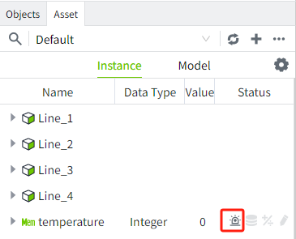
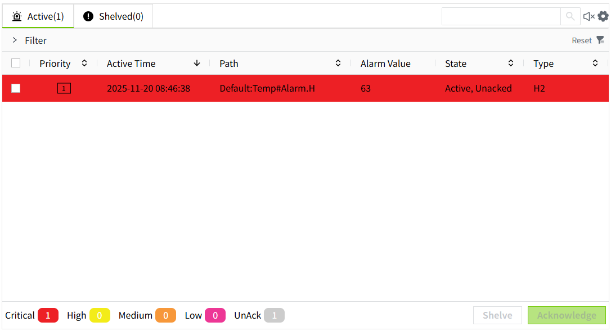

# Alarming

Alarms are used to monitor and notify the system of abnormal conditions. Configured on a tag, a new alarm is generated if the latest value of the tag meets the set alarm conditions.

## **Alarm Types**

The following alarm types are supported:

- Limit alarms: Alarms are generated when the value of the tag meets the set limit conditions. VC Hub has eight built-in limit values, four high limits and four low limits.  You can set several limit conditions at the same time. If a tag value meets more than one limit, an alarm is triggered for each limit.

Example: The high limit value of temperature is 20, the hh limit value of temperature is 40, and the current value of tag is 50, then the tag will generate 2 limit alarms, one alarm for the high limit and one alarm for the hh limit.

- Rate of Change Alarm: An alarm is generated when the rate of change of the tag value exceeds the set rate of change.
- Equivalent Alarm: Generates an alarm when the tag value is equal to the preset alarm value.
- Boolean Alarm: Generates an alarm when the state of a Boolean quantity changes. For example, an alarm is generated when it changes from true to false.

## **Alarm Priority**

VC Hub has four built-in alarm levels. Alarms can be categorized by alarm level for quick recognition and response.

- Critical
- High
- Medium
- Low 

## **Alarm Status**

Alarm status consists of Active and Acknowledged.

- Active, Unacked
- Active, Acked
- Cleared, Unacked
- Cleared, Acked

###### **Active Status**

All alarms start in the "Active" state and end in the "Cleared" state.

- Active: The alarm is currently active.
- Cleared: Returns from an alarm state to a normal value and no longer meets the set alarm conditions.

#### **Acknowledged Status**

You can acknowledge an alarm that has been generated. Acknowledgement is simply a sign that the relevant person is aware of the alarm and will deal with it.

- Unacked: The alarm has not been marked as "Acknowledged".

- Acked: The alarm has been marked as "Acknowledged".

#### **Alarm Acknowledgement Method**

Automation: If an alarm is generated and then returns to normal, the system will automatically acknowledge the alarm. The alarm disappears from the real-time alarm control after auto acknowledgement. However, you can also manually acknowledge an automatically acknowledged alarm at any time before the alarm returns to normal.

Manual (Requires Confirmation): After an alarm is generated, it must be manually acknowledged and the acknowledgement information needs to be entered when the alarm is acknowledged.

Manual (No Confirmation): After the alarm is generated, it must be manually acknowledged manually and no acknowledgement information needs to be entered.

| Note: Alarms that require manual acknowledgement will not disappear from the real-time alarm control until they are acknowledged, even if the current alarm value has returned to normal. |
|-------------------------------------------------------------------------------------------------------------------------------------------------------------------------------------------|

## **Shelve Alarm**

Shelving alarm can be used to temporarily ignore an alarm for a period, such as a maintenance period.

Shelving alarm ignore alarms under the selected alarm path to prevent them from creating new alarms. Shelving according to the alarm path, for multiple alarms with the same path, check one of them to shelve, all other alarms with the same path will be shelved together and will only be shown as one data in the shelve list.

Each shelved alarm needs to have a shelving time set. At the end of the shelving period, the latest value of the alarm will be determined, thereby displaying the alarm status of the alarm.

In addition, the shelved alarms will disappear from the "real-time" list of the real-time alarm control and appear in the "shelved" list.** **

## **Alarm Deadband**

Alarm deadband is a tolerance for the measurement value after it reaches the alarm condition, to prevent unnecessary alarm messages from being generated due to small fluctuations of the measurement value near the threshold value.

The deadband configuration only adds restrictions on the side of the alarm recovery, but not on the alarm generation.

For example, if you set a limit alarm of >=50, and the deadband is set to 1, then the alarm will be generated as long as it is >=50, but it will not disappear until <50-1. Of course, if the direction of the alarm is reversed, and a limit alarm is set for <=50, and the deadband is set to 1, then the alarm will be generated as soon as it is <=50, but the alarm will not disappear until it is >50+1.

####  **Alarm Delay**

The role of alarm delay is mainly for transient fluctuation or noise after the value of the tag reaches the alarm condition, to prevent the alarm from being only momentary and not continuous, so you need to wait for a while.

All types of alarms have delayed alarm configurations, including switching type alarms.

Delayed alarm configurations are categorized into activation delays and recovery delays in seconds.

Activation delay means that when an alarm condition is met, instead of generating the alarm immediately, this alarm is generated only after a certain period if the alarm still meets the conditions for generation. Conversely, recovery delay means that when the alarm reaches the recovery condition, the alarm is not resumed immediately, but you need to wait for a certain period to arrive, and if the alarm still meets the recovery condition, then the alarm will be resumed.

## **Configuring Alarms**

Configure alarms on tags. See "Management->Assets and Tags->Tag->Tag Properties->Alarm" for details.

When alarm configuration is enabled on a tag, the corresponding chart will be displayed in the tag tree, so you can quickly identify which tags have alarm configuration enabled.

**View Real-Time Alarm Data**

You can use the **Realtime Alarm** control to view alarm data. 

**View Historical Alarm Data**

You can view alarm data using the **Historical Alarm** control.

