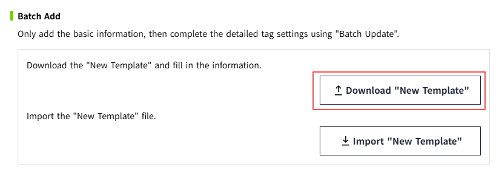
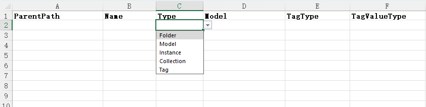

# Batch Add

In the **Instance** and **Model** tabs, only basic information is added initially. The detailed configuration of tags is then completed through **Batch Update**.

## Download "New Template"

In the **Instance** or **Model** tab, click the **More** button and then select **Batch Operation**.

    
    

In the **Batch Operation** popup, click **Download "New Template"** to download a blank batch addition excel template in the browser. Users can fill in the required information in the template.

    

#### "New Template" Introduction

The batch addition Excel template contains two sheets: **Sheet0** and **Important Notes**.

- **Sheet0** is used for adding new data.
- **Important Notes** provides instructions on how to use the template to create data.

The fields in the **model and instance new templates** are the same, with the only difference being the available types:

- In the **instance new template**, the available types are: **Folder, Instance, Tag**.
- In the **model new template**, the available types are: **Folder, Model, Instance, Collection, Tag**.

In the **"Important Notes"** sheet, users can find descriptions and examples for each column in **Sheet0** to assist them in filling out the template correctly.

**New Template description of model**

**New Template description of instance**

## Import "New Template"

After editing the template, click the **Import "New Template"** button to import the newly added information.

