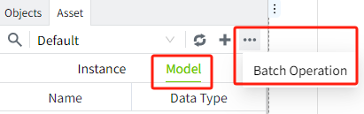
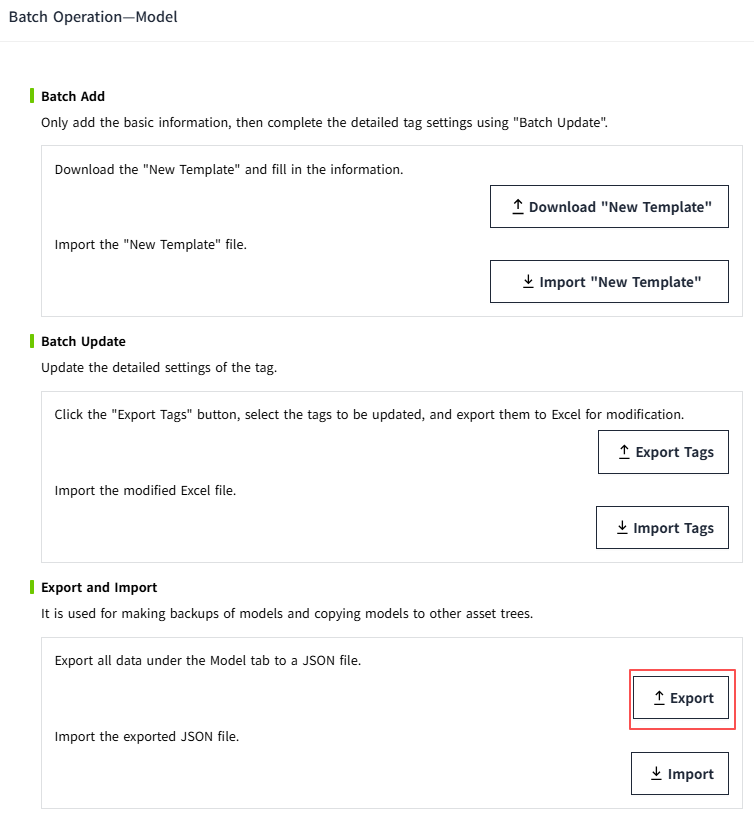
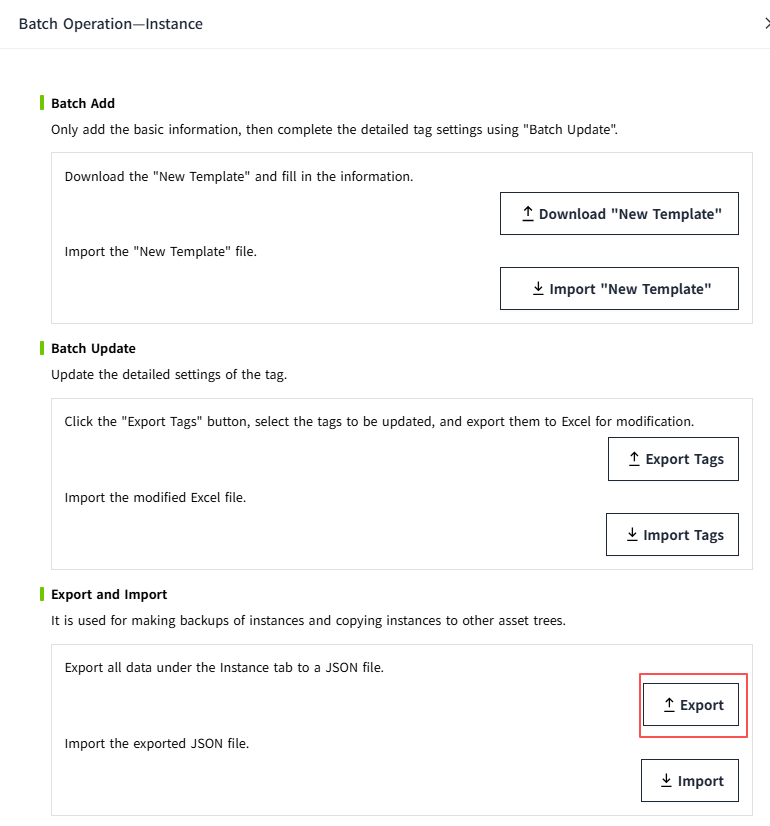

# Export and Import

Used for backing up models or instances, and for copying models or instances to other asset trees.

## **Export**

Export all data under the model or instance tab to a JSON file.

**Export Model**

In the Model tab, after clicking the Export button, the models in the current asset will be exported as a JSON file.

**Export  Instance**

In the Instance tab, after clicking the Export button, the instances in the current asset will be exported as a JSON file.

## **Import**

Import the exported JSON file.

**Import Model**

In the Model tab, click the Batch Operation button.

In the pop-up window, click the "Import" button.

**Import Instance**

In the Instance tab, click the Batch Operation button.

In the pop-up window, click the "Import" button.

**Notes:**

1. After clicking the More button, the user can choose to import a JSON file that was previously exported. The imported file must match the current tab (Model or Instance); otherwise, an error message will be displayed. 
    
2. When importing instance data separately, ensure that the corresponding model objects exist in the current tree; otherwise, the import will fail.
