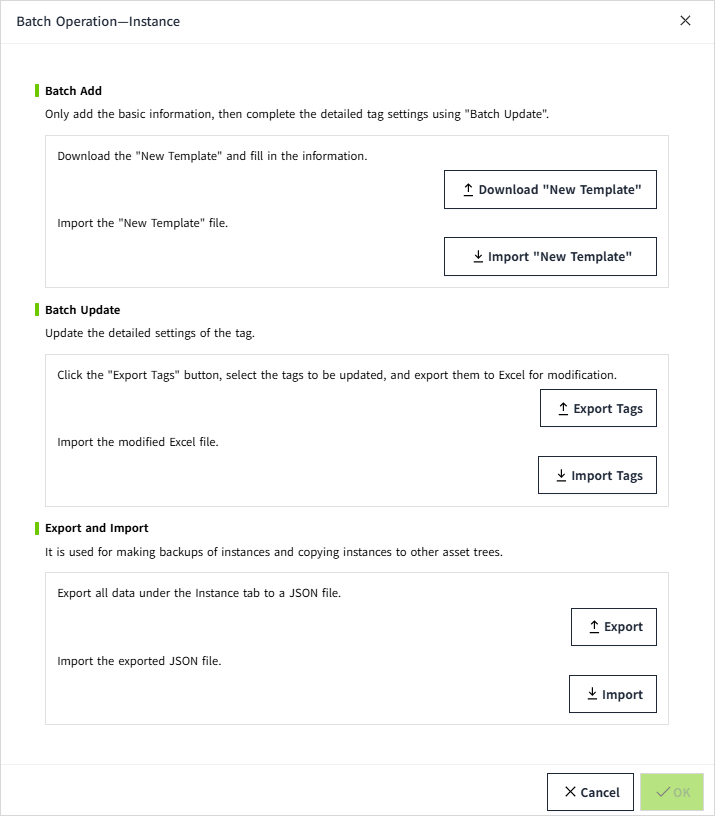

# Batch Operation

When the same or similar operations need to be performed on multiple tags, Especially when working with large amounts of data or performing system configurations, batch operations can significantly improve efficiency while reducing the potential for errors associated with manual tasks.

**Example Scenarios:**

- **Batch Creation of Tags**: When there is a need to create multiple tags at once, batch operations can simplify the process. For example, when adding new equipment, you may need to create a set of similar tags for each piece of equipment.
- **Batch Data Source Binding**: When multiple tags need to be bound to the same data source or different but similar paths, batch operations can quickly complete these settings.
- **Batch Update of Tag Properties**: When several tags require uniform changes to their properties, such as modifying their tag group, alarm settings, etc., batch operations can save the effort of modifying each one individually.
- **Batch Import/Export of Tags**: During system migration, backup, or initialization, batch importing or exporting of tag configuration files might be necessary.

Users can click the "More" button in the Asset window to perform batch operations on "Model" and ”Instance” tabs.

## Model

Select the "Model" tab and click the batch operation button to perform batch operations on models. It supports export, import, batch creation, and batch update.

Batch operation popup:

## Instance

When the "Instance" tab is selected and the batch operation button is clicked, batch operations on instances can be performed. The batch operation functions for instances support not only export and import but also batch add and batch update.

## Function Description

#### Batch Add

It only adds basic information, with detailed tag settings to be completed later through the "Batch Update" function.

#### Batch Update

Updates the detailed settings of the tag.

#### Export and Import

Used for making backups of models and instances, or copying instances to other asset trees.

