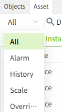
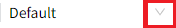
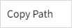
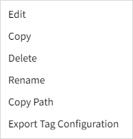
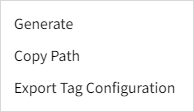
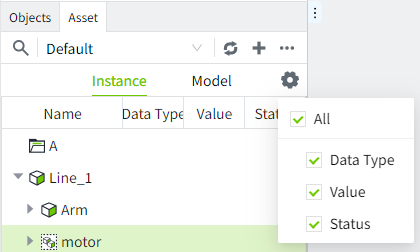

# Asset Tree

Within the editor, click on the Assets window to switch to the asset tree list. All tag information is created and maintained in the Assets window. Click the Expand icon to view the subordinate elements, and click the Collapse icon to collapse all child elements under the node.

Icon description of the node type：

| **Icon**                                                                                                                                                                                                                              | **Description** |
|---------------------------------------------------------------------------------------------------------------------------------------------------------------------------------------------------------------------------------------|-----------------|
| | Folder          |
| | Model           |
| | Instance        |
| | Set             |
|  | I/O Tag         |
| | Memory Tag      |
|  | Expression Tag  |
|  | Attribute       |

## **Toolbar** 

| Icon |Description |
|----------------------------------|-----------------------------------------|
|  | When this icon is clicked, the top toolbar converts to a query box.     After entering the search keyword in the query box, the list below will filter out all nodes with this keyword in their name.   Nodes at different levels will be displayed flat in the list.     Click on the left side of the "All" behind the drop-down button to display the filter conditions, you can filter by conditions.     |
|  | The asset drop-down box allows you to toggle the assets in the current project at will                                                                                                                                                               |
|  | The Refresh button, when clicked, reloads the list in the Asset Selection box on the left, and the data in the Asset Tree list below.  |
| | Add button, when clicked it will bring up the Add menu, in which you can select what you need to add. The data added here will be displayed in the root node.  Instances and Models tabs, different categories for additions.    **Instance tab**        **Model tab**      |---------------------------------------------------------------------------------------------------------------------------------------------------------------------------------------------------------------------------------------------------------|------------------------------------------------------------------------------------------------------------------------------------------------------------------------------------------------------------------------------------------------------| |
|  | Click and select the export and import operations.                                                                                                                                                                                                                                                                                                                                                                                                                                                                                                                                                                                                                                                                                                                                                                                                                                                                                                                                                                                                                                                                                                                                                                                                                   |
| | Set the columns that are displayed in the asset tree.  Instances and Models tabs, the columns that can be displayed are different.   **Instance tab**      **Model tab**     |----------------------------------------------------------------------------------------------------------------------------------------------------------------------------------------------------------------------------------------------------------|-------------------------------------------------------------------------------------------------------------------------------------------------------------------------------------------------------------------------------------------------------|                                                                                        |

## Batch Operation

The user can click the "More" button in the upper right corner of the editor and select "Batch Operation".

## **Right-click Menu**

You can right-click on individual nodes in the asset tree to perform various operations. Different types of nodes will have different right-click menus.

#### **Model tab**

###### **Folder right-click menu**

- Add Folder: Click on 'Add Folder' to open the folder creation window.
- Add Model: Clickon "Add Model" to open the model creation window.
- Copy: Click the Copy button, the paste button on the top of the list will become clickable, and the paste option will be displayed in the context menu of all folders. You can paste the contents of the current folder and all its children into the target path.
- Paste: When a copy operation has been performed on a folder or model, the paste button is displayed in the right-click menu of the folder.
- Delete: Click the Delete button to bring up the Delete confirmation window. Click the OK button in the window to delete the node and all its children.
- Rename: Click on this button to change the current node to edit status. The renamed folder cannot be renamed with other nodes under the current hierarchy. It should be noted that after renaming a folder, the paths of the child nodes under it will be changed.
- Copy Path: Click to copy the path of the current node. After copying, you can paste the path directly into the text input box.

###### **Model right-click menu**

- Add Memory Tag: Click it to bring up the Add Memory Tag window.
- Add I/O Tag: Click to bring up the Add I/O Tag window.
- Add Expression Tag: Click to bring up the Add Expression Tag window.
- Add Instance: Click it to bring up the Add Instance window.
- Add Set: Click it to bring up the Add Set window.
- Edit: Click it to bring up the editing window of the model. All contents are supported to be modified.
- Copy: Click the Copy button, the Paste button on the top of the list becomes clickable, and the Paste option is displayed in the context menu of all folders. The model can only be copied and pasted under the folder or the model root node.
- Delete: Click the Delete button to bring up the delete confirmation window. Click OK button in the window to delete the node and all its children.
- Rename: After clicking this button, the current node will be changed to edit status and you can rename the model. The renamed model cannot be renamed with other nodes under the current hierarchy. It should be noted that after renaming, the paths of the child nodes under it will be changed.
- Copy Path: Click to copy the path of the current node. After copying, you can paste the path directly into the text input box.

###### **Right-click menu for tags under the model**

- Edit: Click it to bring up the edit window of the tag. The content is the same as the Add window. In the editing window, the name and data type cannot be modified, while others can be modified.
- Delete: Click the Delete button to bring up the Delete Confirmation window. Click OK button to delete the tag.
- Rename: After clicking the button, the node will change to edit status and you can rename the tag. The renamed tag cannot be renamed with other nodes under the current hierarchy. It should be noted that the path of the tag will be changed after renaming.
- Copy Path: Click to copy the path of the current node. After copying, you can paste the path directly into the text input box.

###### **Right-click menu for set under model**

- Delete: Click the Delete button to bring up the Delete Confirmation window. Click the OK button in the window to delete the node.
- Rename: After clicking, the node changes to edit status and you can rename the set. The renamed name cannot be renamed with other nodes under the current hierarchy. It should be noted that the path of the set will be changed after renaming.
- Copy Path: Click to copy the path of the current node. After copying, you can paste the path directly into the text input box.

###### **Right-click menu for instances under model**

- Edit: Click it to bring up the edit window of the tag. The content is the same as the Add window. All attributes can be modified. When the model is changed, the content of the customized attributes will be changed accordingly.
- Delete: Click the Delete button to bring up the Delete Confirmation window. Click OK button in the window to delete the instance and its children nodes.
- Rename: Click on this node to change to edit status, you can rename the instance. The renamed instance cannot be renamed with other nodes under the current hierarchy. It should be noted that the path of the instance will be changed after renaming.
- Copy Path: Click to copy the path of the current node. After copying, you can paste the path directly into the text input box.

######  **Right-click menu for tags under instance**

- Edit: Click it to bring up the edit window of the tag. The content is the same as the Add window. In the editing window, the name and data type can not be modified, while others can be modified.
- Copy Path: click it to copy the path of the current node. After copying, you can paste the path directly into the text input box.

###### **Right-click menu for set under instance**

- Copy Path: Copy the path of the current node after clicking. After copying, you can paste the path directly into the text input box.

#### **Instance tab**

###### **Folder right-click menu**

- Add Folder: Click it to bring up the Add Folder window.
- Add Instance: Click it to bring up the Add Instance window.
- Add Memory Tag: Click it to bring up the Add Memory Tag window.
- Add I/O Tag: Click to bring up the Add I/O Tag window.
- Add Expression Tag: Click it to bring up the Add Expression Tag window.
- Copy: Click the Copy button, the Paste button above the list becomes clickable, and the Paste option is displayed in the context menu of all folders. You can paste the contents of the current folder and all its sub-nodes to the target path.
- Paste: When a copy operation is performed on any node under the Instance tab, the Paste button is displayed in the right-click menu of the folder.
- Delete: Click the Delete button to bring up the Delete confirmation window. Clicking the OK button in the window deletes the node and all its children.
- Rename: Clicking on the node changes the node to edit status and allows you to rename the folder. The renamed folder cannot be renamed with other nodes under the current hierarchy. It should be noted that after renaming the folder, the paths of the child nodes under it will be changed.
- Copy Path: Click to copy the path of the current node. After copying, you can paste the path directly into the text input box.
- Export Tag Configuration: Click this button to export the configuration information of all tags under the current node. Each configuration item is divided into one sheet, for example, one sheet for basic attributes, one sheet for events, and one sheet for alarms, including limit alarms, equal alarms, rate of change alarms, and switch alarms.

###### **Instance right-click menu**

- Edit: Click it to bring up the edit window of the tag. The content is the same as the Add window. All attributes can be modified. When the model is changed, the content of the customized attributes will be changed accordingly. 
- Copy: Click the Copy button, the Paste button above the list becomes clickable and the Paste option is displayed in the context menu of all folders. You can paste the contents of the current folder and all its sub-nodes under the target path.
- Paste: When a copy operation is performed on any node under the Instance tab, the Paste button is displayed in the right-click menu of the folder.
- Delete: Click the Delete button to bring up the Delete confirmation window. Clicking the OK button in the window deletes the node and all its children.
- Rename: After clicking, the node changes to edit status and you can rename the instance. The renamed instance cannot be renamed with other nodes under the current hierarchy. It should be noted that after renaming the instance, the paths of the child nodes under it will be changed.
- Copy Path: Click to copy the path of the current node. After copying, you can paste the path directly into the text input box.
- Export Tag Configuration: Click this button to export the configuration information of all tags under the current node. Each configuration item is divided into one sheet, for example, one sheet for basic attributes, one sheet for events, and one sheet for alarms, including limit alarms, equal alarms, rate of change alarms, and switch alarms.

###### **Right-click menus for tags not under an instance**

- Edit: Click it to bring up the edit window of the tag. The content is the same as the Add window. In the editing window, the name and data type cannot be modified, but others can be modified.
- Copy: Click Copy button to paste the current tag into the instance root node or folder. The name of the pasted tag remains unchanged. If there is a file with the same name in the current hierarchy, the suffix of the new tag name after pasting will be automatically added 1. For example, if the name of the copied tag is A, and there already exists a node with the name A under the current node that needs to be pasted, the name of the tag after pasting will be displayed as A1.
- Delete: Click the Delete button to bring up the Delete Confirmation window. Click OK button in the window to delete the tag.
- Rename: After clicking, the node becomes editable and can be renamed. The renamed name cannot be renamed with other nodes under the current hierarchy.
- Copy Path: Click to copy the path of the current node. After copying, you can paste the path directly into the text input box.
- Export Tag Configuration: Click this button to export the configuration information of all tags under the current node. Each configuration item is divided into one sheet, for example, one sheet for basic attributes, one sheet for events, and one sheet for alarms, including limit alarms, equal alarms, rate of change alarms, and switch alarms.

###### **Right-click menu for tag under instances**

- Edit: Click it to bring up the edit window of the tag. The content is the same as the Add window. In the editing window, the name and data type can not be modified, while others can be modified.
- Copy Path: click it to copy the path of the current node. After copying, you can paste the path directly into the text input box.
- Export Tag Configuration: click it to export the configuration information of all tags under the current node. Each configuration item is divided into one sheet, for example, one sheet for basic attributes, one sheet for events, and one sheet for alarms, including limit alarms, equal alarms, rate of change alarms, and switch alarms.

###### **Right-click menu for instances under instances**

- Edit: Click it to bring up the edit window of the tag. The content is the same as the Add window. In the editing window, the name and data type can not be modified, while others can be modified.
- Copy Path: click it to copy the path of the current node. After copying, you can paste the path directly into the text input box.
- Export Tag Configuration: click it to export the configuration information of all tags under the current node. Each configuration item is divided into one sheet, for example, one sheet for basic attributes, one sheet for events, and one sheet for alarms, including limit alarms, equal alarms, rate of change alarms, and switch alarms.

###### **Right-click menu for sets under instances** 

- Generate: Click on it to bring up the editing window for the collection. Set the name of the prefix to be generated and the quantity. The quantity only supports inputting positive integers.
- Copy Path: Click it to copy the path of the current node. After copying, you can paste the path directly into the text input box.
- Export Tag Configuration: click to export the configuration information of all tags under the current node. Each configuration item is divided into one sheet, for example, one sheet for basic attributes, one sheet for events, and one sheet for alarms, including limit alarms, equal alarms, rate of change alarms, and switch alarms.

###### **Right-click menu for instances under sets**

- Edit: Click it to bring up the edit window.
- Delete: Click the Delete button to bring up the Delete Confirmation window. Click the OK button in the window to delete the data.
- Copy Path: Click to copy the path of the current node. After copying, you can paste the path directly into the text input box.
- Export Tag Configuration: Click this button to export the configuration information of all tags under the current node. Each configuration item is divided into one sheet, for example, one sheet for basic attributes, one sheet for events, and one sheet for alarms, including limit alarms, equal alarms, rate of change alarms, and switch alarms.

## **Shortcuts**

#### Double-click the node to open the edit window

Double-click on the Tag, Model, and Instance nodes in the asset tree to open the corresponding edit window.

#### Double-click to change value

Double click on the value of a tag in the asset tree, the value will be changed to edit status, you can modify the value of the tag, input the value and then press the Enter key or click on the area outside the input box to complete the saving of the value.

Only tags which enabled  "Writable" support double-clicking to write values.

In addition to the tag values that support double-click modification, the alarm information of the tag also supports double-click modification of the value of the limit alarm and the value of the equal value alarm.

#### **Shortcut Keys**

The Asset Tree supports the following shortcut key operations:

- Ctrl+c: Copy
- Ctrl+v: Paste
- Del: Delete
- Enter: Enter the query content and press enter to execute the query operation.

#### **Multi-select Delete**

Support pressing Ctrl key to select multiple nodes and delete them together.

Select nodes of any level to delete together. If the parent node is selected, the child nodes will be deleted together.

Attribute nodes are not supported to be selected individually and then deleted.

## **Tag Identification**

Tag configuration can be visualized in the asset tree.

We can click on the Settings icon and check the "Status" box to display the status column.

The status column of a tag will visualize the status of the tag's partial configuration. Dark icons represent configured and light icons represent unconfigured.

The status icons are described below:

| **Icon**                                                                                                                                                                                                                              | **Description**                                                                           |
|---------------------------------------------------------------------------------------------------------------------------------------------------------------------------------------------------------------------------------------|-------------------------------------------------------------------------------------------|
|  | This icon is displayed when the tag has alarm configuration turned on.                    |
|  | This icon is displayed when history storage is enabled for the tag.                       |
|  | This icon is displayed when range conversion is enabled for the tag.                      |
|  | This icon is displayed when the tag is configured with any of the rewrite configurations. |

