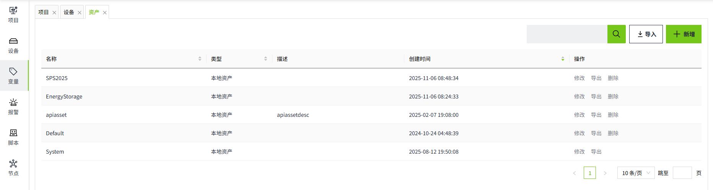

# 资产

WAGO VC Hub中可以有任意数量的资产，用户可以将变量创建到任意资产中进行维护，资产可以看作是变量的容器，每个资产中的变量相互隔离，变量依托于资产存在于系统中。

在两个WAGO VC Hub节点间，通过组网建立连接，使用远程资产，便可以互相查看到对方节点某个资产中的变量信息。

所有的变量都存在于资产中，并具有实时值。此外，资产可以绑定历史库，历史库用于存储和查询变量的历史数据。

#### 资产类型

有两种类型的资产可供选择：本地资产、远程资产。

###### 本地资产

本地资产为当前WAGO VC Hub节点所有，当前节点拥有本地资产所有配置权限。每个新的工程中，都会自动创建一个名为“Default”的本地资产，用户可以根据需要创建任意数量的资产。

**配置项**

| **配置** | **描述**                                                                                                                                                              |
|----------|-----------------------------------------------------------------------------------------------------------------------------------------------------------------------|
| 名称     | 资产的名称，名称不可重复，必填项。                                                                                                                                       |
| 描述     | 资产描述信息，可选填。                                                                                                                                                  |
| 类型     | 资产的类型，分为本地资产和远程资产，在资产创建后，类型不可更改。                                                                                                          |
| 历史库   | 在资产类型为本地资产时可配置，可绑定系统中已存在的历史库。  选中的历史库会存储该资产下变量的实时值历史数据，在后续对该资产下变量进行历史相关读写时，都将通过该历史库进行。 |

###### 远程资产

远程资产可配置组网中远端节点的资产名，通过该绑定信息，访问其它节点的变量。

远程资产的工作原理是通过组网网络，将读取请求转发到对端节点上，对端收到请求后，在通过网络将结果返回。

目前，远程资产仅拥有读取远端节点中资产数据的权限，任何更新操作，只可在本地资产中实现。

**配置项**

| **配置**     | **描述**                                                                                                                                 |
|--------------|------------------------------------------------------------------------------------------------------------------------------------------|
| 名称         | 资产的名称，名称不可重复，必填项。                                                                                                          |
| 描述         | 资产描述信息，可选填。                                                                                                                     |
| 类型         | 资产的类型，分为本地资产和远程资产。在资产创建后，类型不可更改。                                                                             |
| 远程节点     | 在资产类型为远程资产时可配置。选择和当前节点形成组网的其他节点的节点名称。                                                                 |
| 远程资产名   | 在资产类型为远程资产时可配置。显示已选的远程节点下的所有资产，选择某个远程资产名后，会将该远程资产名下的所有信息显示在当前创建的资产名称下。 |
| 显示高级属性 | 默认不勾选，勾选后显示“历史库”配置。  说明：勾选和不勾选，只是表示是否显示历史库配置，并不代表启用和禁用。                                     |
| 历史库       | 选择一个本地的历史库。当所选的"远程资产名"的"远端历史库"恰好存储在当前节点下时，可以在此处直接选择当前节点下的历史库，提升查询性能。         |

#### 如何使用

点击“变量“->"资产"菜单，即可进入资产管理页面。

###### 查询

在进入到资产管理页面后，用户可以查看到当前**工程下**所有的资产，默认以**创建时间**倒序排列，用户可以根据需要，自定义排序。

用户可以通过右上角输入框，对资产名称进行模糊查询。

###### 新增

用户点击右上角”新增”按钮，填入资产信息后，可新增资产。

###### 修改

用户点击资产列表任意资产右侧”修改”按钮，修改资产信息。资产一旦被创建后，它的**资产类型**不可被修改。

###### 删除

用户可点击资产列表中任意资产右侧的“删除”按钮，对选中资产进行删除，点击后会弹出提示框，用户点击确认后，即可删除，注意，当资产被删除后，资产下的所有模型、实例、变量将一起被删除。

###### 导出

用户可点击资产列表任意资产右侧的“导出“按钮，导出选中资产中资产配置及其下所有**模型**、**实例**、**变量**信息为**Json**文件。

**远程资产**导出时，只会导出资产配置信息。

注意，在对该**Json**文件中的内容不是特别理解的情况下，不建议对其进行修改。

######## 导出*Json*示例

###### 导入

通过页面右上角的”导入”按钮，用户可以将**Json**文件再次导入到系统，如当前系统中存在重名的资产，则会提示用户修改名称。