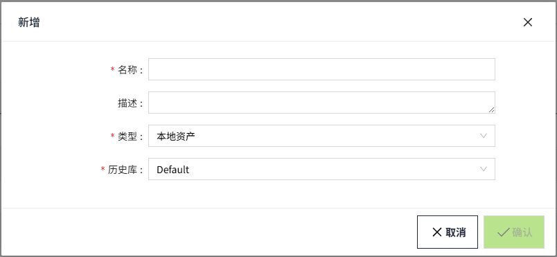
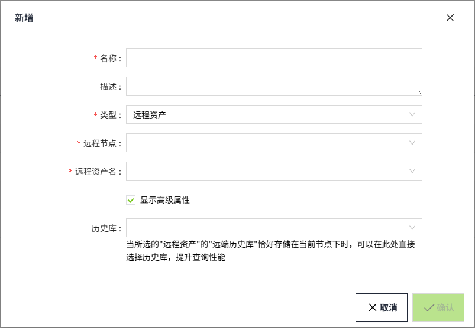

# Asset

 There can be any number of assets in VC Hub, and the user can create tags to be maintained in any asset. Assets can be viewed as containers for tags, and the tags in each asset are isolated from each other, and the tags are dependent on the asset for their existence in the system. 

 By connecting two VC Hub nodes through a network and using a remote asset, you can view the tag information in an asset of the other node.

 All tags are present in the asset and have real-time values. In addition, the asset can be bound to a history database, which is used to store and query the historical data of the tags.

## **Asset Types**

There are two types of assets to choose from : local assets, and remote assets.

#### **Local Assets**

 Local assets are owned by the current VC Hub node, which has all configuration rights for local assets. A local asset named "Default" is automatically created for each new workspace, and the user can create as many assets as needed.

**Configuration items**

| **Configuration** | **Description**                                                                                                                                                                                                                                                                                                                                               |
|-------------------|---------------------------------------------------------------------------------------------------------------------------------------------------------------------------------------------------------------------------------------------------------------------------------------------------------------------------------------------------------------|
| Name              | The name of the asset, the name cannot be repeated, required.                                                                                                                                                                                                                                                                                                 |
| Description       | Description of the asset,optional.                                                                                                                                                                                                                                                                                                                            |
| Type              | The type of the asset,categorized into local and remote assets, the type cannot be changed after the asset is created.                                                                                                                                                                                                                                        |
| History Storage   | When the asset type is set to 'local asset', it can be configured to bind to an existing historical database in the system.   The selected historical database will store the real-time historical data of tags under this asset. Subsequent historical-related reads and writes of tags under this asset will be performed through this historical database. |

#### **Remote Assets**

 Remote assets can be configured with the asset name of a remote node in the group network, and through this binding information, access to the tags of other nodes.

 Remote asset works by forwarding the read request to the remote node through the network, and the remote node receives the request and returns the result through the network.
 Currently, the remote asset only has the permission to read the asset data in the remote node, and any update operation can only be realized in the local asset.

**Configuration items**

| Configuration            | Description                                                                                                                                                                                                                                                                              |
|--------------------------|------------------------------------------------------------------------------------------------------------------------------------------------------------------------------------------------------------------------------------------------------------------------------------------|
| Name                     | The name of the asset, the name is not repeatable and required.                                                                                                                                                                                                                          |
| Description              | Description of the asset,optional.                                                                                                                                                                                                                                                       |
| Type                     | The type of the asset,categorized into local and remote assets, the type cannot be changed after the asset is created.                                                                                                                                                                   |
| R emote N ode            | Configurable when the asset type is remote asset. Select the node name of other nodes that form a network with the current node.                                                                                                                                                         |
| Remote Asset N ame       | Configurable when the asset type is Remote Asset. Displays all assets under the selected remote node.When a remote asset name is selected, all information under that remote asset name is displayed under the currently created asset name.                                             |
| Show Advances Properties | By default, this option is not selected. When selected, the "History Database" configuration is displayed.  **Note:** Selecting or not selecting this option only controls the visibility of the history database configuration and does not indicate whether it is enabled or disabled. |
| History Database         | Select a local history database. If the "remote history database" of the selected "remote asset" is stored on the current node, you can directly choose the history database here to enhance query performance.                                                                          |

## **How to use**

 Click "**Tags** "->"**Asset** "menu to enter the asset management page.

#### **Query**

 After  entering the asset m anagement page, users can view all the assets under the current workspace, which are sorted in reverse chronological order by default,and users can customize the sorting according to their needs.

 Users can do fuzzy query on the asset name through the input box in the upper right corner.

#### **Add**

 Users can add new assets by clicking the "Add" button in the upper right corner and filling in the asset information.

#### **Edit**

 Users can modify the asset information by clicking the "Modify" button on the right side of any asset in the asset list. Once an asset is created, its asset type cannot be modified.

#### **Delete**

 Users can click the "Delete" button on the right side of any asset in the asset list to delete the selected asset. After clicking the button, a prompt box will pop up, and users can click OK to delete the asset. Note that when the asset is deleted, all models, instances and tags under the asset will be deleted together.

#### **Export**

 Users can click the "Export" button on the right side of any asset in the asset list to export the asset configuration and all models, instances and tagsunder the selected asset to a Json file.

 When exporting remote assets, only the asset configuration information will be exported.

 Note that it is not recommended to modify the Json file if you don't understand its contents.

#### **Import**

 With  the "Import" button on the top right corner of the page, users can import the Json file into the system again. If there is a renamed asset in the current system, users will be prompted to change the name.

  

