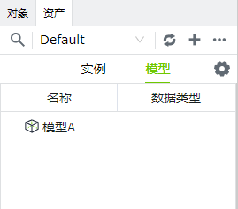
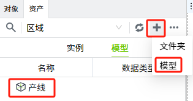
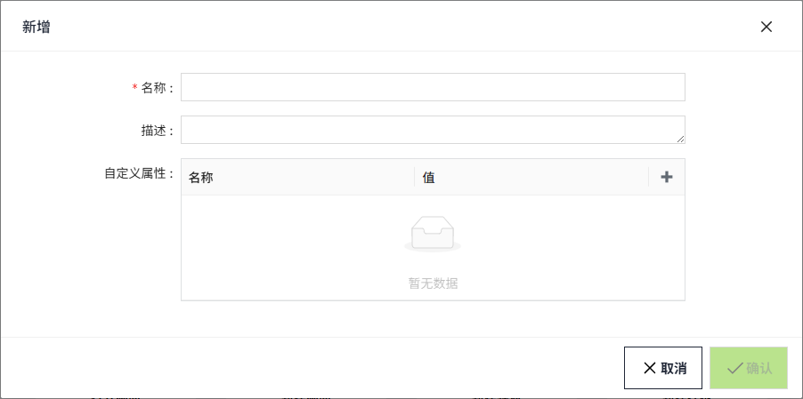
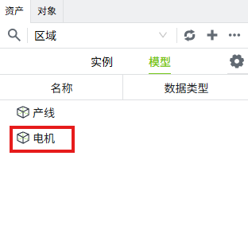
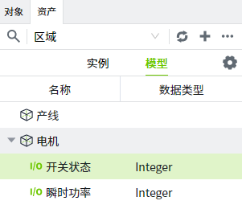
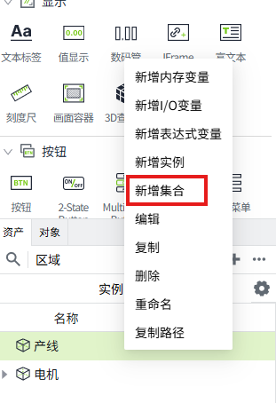
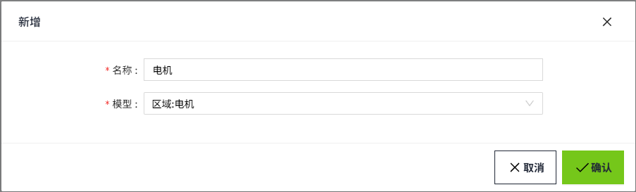
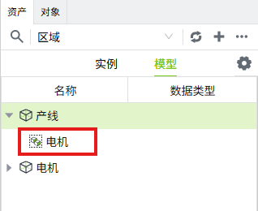
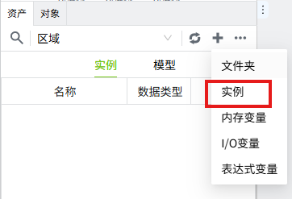

# 模型和实例

WAGO VC Hub中的模型和实例提供了面向对象的数据设计能力。通过定义模型并生成一个或多个实例，可以快速构建复杂的组态画面。所有实例都会继承模型中的数据配置更改，从而显著减少了数据模型组态的工作量。

在WAGO VC Hub中，模型中的变量不会执行任何操作，可以将模型认为是设备模板。我们可以将模型实例化，实例化后的数据会进行数据推送和订阅。

#### 模型和实例下可以包含哪些类型数据

模型和实例下还包括模型实例、集合和变量。

一个完整的模型通常包含许多复杂的组件，这些组件通过子集进行构建。在将模型引用并创建为实例时，该实例会将模型下的所有子集都引用过来。在模型中对这些子集的配置进行修改也会影响到对应的实例。

以下是对几种子集的简要介绍：

- **模型实例：** 可以在模型下创建一个实例引用另一个模型。
- **集合：** 在创建模型时，例如，在不同产线中使用的电机数量不同但其他配置相同的情况下，可以在产线模型下创建一个电机集合。在模型中，集合只是声明存在，而在模型实例化为产线实例时，可以在电机集合中生成任意数量的电机实例。这样，用户可以在仅定义一种产线模型的前提下，实例化出多个存在差异的产线实例。
- **变量：**可以直接在模型下创建变量。

#### 如何使用

用户可以在[known-link]中管理模型和实例，如下图所示，分为模型和实例两个选项卡，用户可以在模型和实例各自的选项卡列表中管理它们。

###### 示例

下面我们来构建一个完整的车间模型作为例子，来帮助理解。

**应用场景**

厂区里有一个生产车间，车间中有3条产线，每条产线都由不同数量的电机组成。现假设1号产线有3台电机、2号产线有1台电机，3号产线有2台电机。

电机需要监控的数据：开关状态、瞬时功率。

**实操步骤**

1. 在”模型“页签下，点击右上角“➕”，在下拉框中选择模型，创建一个名为”**产线**“的模型。

2. 重复以上步骤，再创建一个名为”**电机**“的模型。

3. 在电机上右击鼠标，创建I/O变量，分别为：开关状态、瞬时功率。

4. 因为每条产线的电机数量不一样，所以我们将电机作为模型的集合。在产线模型上右击鼠标，在弹出的菜单中选择”新增集合“。

5. 在新增集合窗口，名称设置为电机，模型选择电机。

6. 在产线下可以看到电机的所有信息，电机作为了产线的子节点。

7. 切换到”实例“选项卡，点击右侧的”➕“按钮，在弹出的菜单中选择”实例“。

8. 在新增弹窗中，名称设置为产线，模型选择”产线“，在批量实例中点击”生成“，在弹窗中设置批量实例的数量为3，起始序号设置为1。

9. 设置完成，点击确认按钮，在实例列表中可以看到实例化后的3条产线信息。

10. 针对每条产线，生成对应的电机数量。在电机上右击，在弹出的菜单中选择”生成“。

11. 设置名称前缀和数量。以产线1为例，有3台电机，所以我们将数量设置为3。

12. 设置完成，电机确认按钮，在产线1实例下，可以看到3台电机。每台电机下都包含开关状态和瞬时功率这2个变量。

13. 重复上述步骤，完成产线2和产线3的操作。这样就通过一个产线模型，实例化了3条产线，且每条产线具有不同数量的电机。

###### 扩展场景

- 场景1：车间新增了1条产线，与前3条产线结构相同，我们只需要在实例选项卡，再创建一个产线实例即可。

- 场景2： 实际作业中，需要移除所有电机开关状态的数据读取，切换到**模型**选项卡下，选择模型页签下“电机“模型的”开关状态“变量，右击删除。

那么在**实例**选项卡下，所有引用了”电机“模型的实例下的”开关状态“变量都将被删除。

- 场景3： 需要为每个产线增加”机械臂“设备。

只需在**模型**选项卡中创建一个名为”机械臂“的模型，在模型下添加名为"轴距"的I/O变量，然后在”产线“模型下，实例该”机械臂“模型。

在**实例**选项卡下，会发现产线1、产线2、产线3下，都会显示”机械臂“实例，且实例下显示"轴距"变量。

#### 配置项

###### 模型

| **配置** | **描述**                                                  |
|----------|-----------------------------------------------------------|
| 名称     | 模型的名称，必填项，同级节点中名称唯一、不可重复。            |
| 描述     | 模型的描述信息，可选填。                                    |
| 参数     | 模型额外的配置，用户可自定义添加删除，如”电机“模型中的型号。 |

###### 实例

| **配置** | **描述**                                                                                                                                                       |
|----------|----------------------------------------------------------------------------------------------------------------------------------------------------------------|
| 名称     | 实例的名称，必填项，同级节点中名称唯一、不可重复。                                                                                                                 |
| 引用     | 该实例直接引用对象的路径。在创建一个实例时，引用路径必然是选择当前资产中存在一个模型，而当涉及多层引用的情况下，引用路径不会指向根模型，而是对应直接关联关系的实例。 |
| 描述     | 实例的描述信息，可选填。                                                                                                                                         |
| 参数     | 实例额外的配置，用户可自定义添加删除，在选择引用对象后，会自动加载引用对象中的参数，实例只可更新引用参数的值，不可修改其名称和类型。                                 |

###### 集合

| **配置** | **描述**                                       |
|----------|------------------------------------------------|
| 名称     | 集合的名称，必填项，同级节点中名称唯一、不可重复。 |
| 引用     | 该集合直接引用对象的路径。                      |

