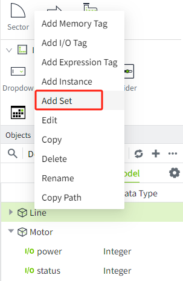
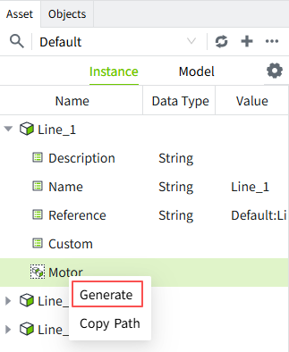
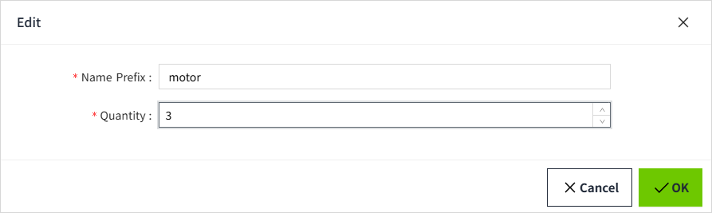
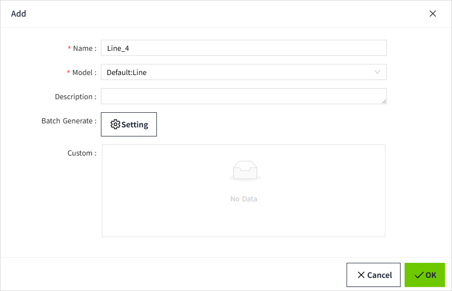
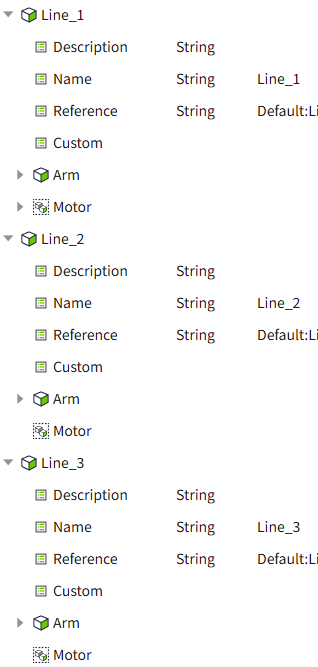

# Models and Instances

Models and instances in VC Hub provide object-oriented data design capabilities. By defining a model and generating one or more instances, complex configuration screens can be built quickly. All instances inherit the data configuration changes in the model, which significantly reduces the amount of work involved in data model configuration.

In VC Hub, tags in the model do not perform any operations and the model can be thought of as a device template. We can instantiate the model and the instantiated data will be subject to data push and subscription.

## **What types of data can be included under models and instances**

Model instances, sets and tags are also included under models and instances.  

A complete model usually contains many complex components that are built through subsets. When a model is referenced and created as an instance, the instance references all the subsets under the model. Changes made to the configuration of these subsets in the model will also affect the corresponding instance.

The following is a brief description of several subsets:

- **Model instances**: An instance can be created under a model to reference another model.
- **Sets**: When creating a model, for example, where the number of motors(modelA) used in different production lines is different but the other configurations are the same, a set of motors can be created under the production line model. In the model, the set is simply declared to exist, while any number of motor instances can be generated in the motor set when the model is instantiated as a production line instance. In this way, the user can instantiate multiple instances of a production line with differences while defining only one production line model.
- **Tags**: Tags can be created directly under the model.

## **How to use**

Users can manage models and instances in the Asset Tree, which is divided into two tabs as shown in the figure below, and users can manage them in their respective tab lists.

#### **Example**

Below we build a complete workshop model as an example to help understanding. 

**Application Scenario**

There is a production plant in a factory with 3 production lines, each line consists of a different number of motors. Assume that line 1 has 3 motors, line 2 has 1 motor, and line 3 has 2 motors.

The data to be monitored for the motors: switching status, instantaneous power.

**Steps**

1. Under the "Models" tab, click "➕" in the upper right corner, select the model in the drop-down box, and create a model named "Line.

2. Repeat the above steps to create another model named "Motor".

3. Right-click on the motor to create two I/O tags : status, power. 

4. Since the number of motor is different for each Line, we use the motor as a set in the model. Right-click on the Line model and select "Add Set" in the popup menu.

5. In the add window, the name is set to motor and Default:Motor is selected in Model. 

6. You can see all the information about the motor under the Line, and the motor acts as a sub-node of the Line.

7. Switch to the "Instance" tab, click the "➕" button on the right, and select "Instance" in the pop-up menu. 

8. In the Add pop-up window, set the name to Line, select "Line" for model,  In the batch generate, click "Generate." In the popup, set the batch instance quantity to 3 and the starting index to 1.

Click the ”OK“ button of ”Setting“ window.

9. Setting is complete, click the OK button, you can see the information of 3 Line after instantiation in the instance list. 

10. For each Line, generate the corresponding number of motors. Right-click on the model and select "Generate" in the pop-up menu. 

11. Set the name prefix and quantity. As an example, Line 1 has 3 motor, so we set the quantity to 3.

12. The setup is complete, click the OK button, and under the Line 1 instance, you can see 3 motors. The 2 tags status and power are included under each motor. 

13. Repeat the above steps to complete Line 2 and Line 3. This instantiates 3 Lines, each with a different number of motor, from a single Line model.

#### **Extended Scenarios**

- Scenario 1: A new Line is added to the scene, with the same structure as the previous 3 Line, we just need to create another Line instance in the Instances tab. 

- Scenario 2: In the actual operation, you need to remove all the data readings of the status, switch to the Model tab, select the "status" tag of the "motor" model under the Model tab, and right-click to delete it.

Then, under the Instances tab, the " status" tag will be deleted from all instances that refer to the "motor" model. 

- Scenario 3: You need to add an "Arm" device to each Line. 

Simply create a model named "Arm" in the **Model tab**, add an I/O tag named "Distance" under the model, and then under the Line model, instance the " Arm" model. "model.

Under the **Instances tab**, you will see that under Line 1, Line 2, and Line 3, instances of the Arm are displayed, and the Distance tag is displayed under the instances.

## **Configuration items**

#### **Model**

| **Configuration** | **Description**                                                                                                            |
|-------------------|----------------------------------------------------------------------------------------------------------------------------|
| Name              | Name of the model, required. The name of the model, mandatory, unique and non-repeatable among nodes of the same level.    |
| Description       | Description of the model, optional.                                                                                        |
| Parameter         | Additional configurations of the model, user-defined additions and deletions, e.g., the model number in the "Motor" model. |

#### **Instance**

| **Configuration** | **Description**                                                                                                                                                                                                                                                                                                              |
|-------------------|------------------------------------------------------------------------------------------------------------------------------------------------------------------------------------------------------------------------------------------------------------------------------------------------------------------------------|
| Name              | The name of the instance, mandatory, unique and non-repeatable among nodes of the same level.                                                                                                                                                                                                                                |
| Reference         | The path of the instance that directly references the object. When an instance is created, the reference path must be a model that exists in the current asset, and when multiple layers are involved, the reference path will not point to the root model, but to the instance that corresponds to the direct relationship. |
| Description       | The description of the instance, optional.                                                                                                                                                                                                                                                                                   |
| Parameter         | Extra configuration of the instance, user can customize add and delete, after selecting the reference object, the parameters in the reference object will be loaded automatically, the instance can only update the value of the reference parameter, not modify its name and type.                                          |

#### **Set**

| **Configuration** | **Description**                                                                              |
|-------------------|----------------------------------------------------------------------------------------------|
| Name              | The name of the set, required, unique and non-repeatable name among nodes of the same level. |
| Reference         | This set directly references the path to the object.                                         |

