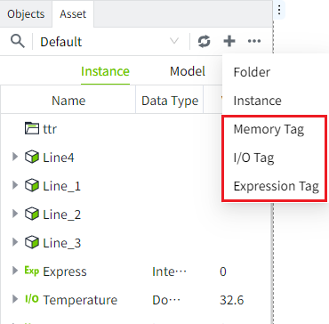
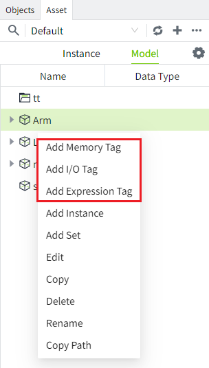
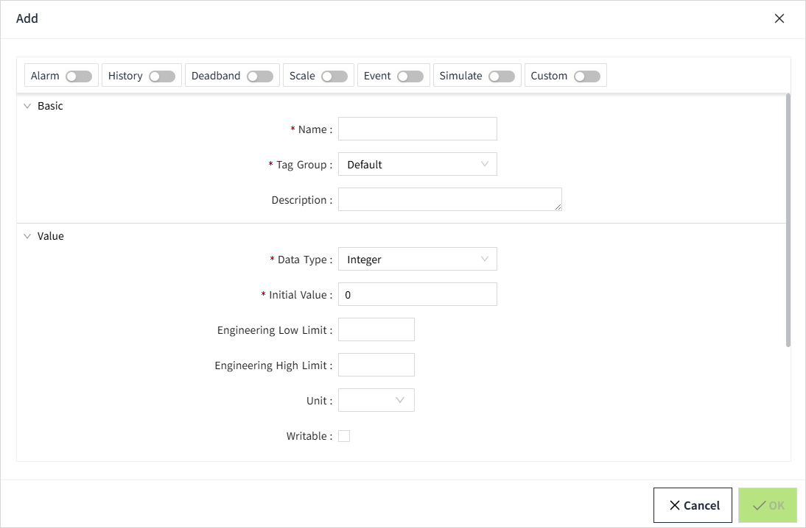
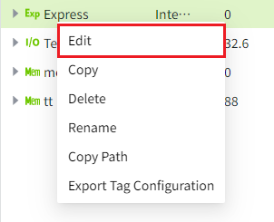
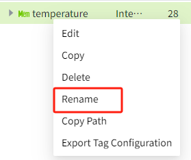
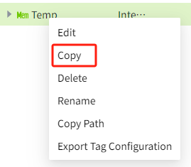

# Creating Tags

Tags can only be created in the Asset window.

You can create tags in two different ways:

- In the menu at the top of the asset tree, click the Add icon and select the type of tag you want to create from the expanded menu. What you add here will be displayed in the root node, e.g. "Temperature" in the image below. 

- In the Asset window, right-click on a catalog under the Instances tab or a model under the Models tab, and select the type of tag you want to create from the pop-up menu. The new tag will be displayed under the corresponding catalog or model as its child node.

| |  |
|---------------------------------------------------------------------------------------------------------------------------------------------------------------------------------------------------------------------------------------|---------------------------------------------------------------------------------------------------------------------------------------------------------------------------------------------------------------------------------------|

## **Add new tag**

1. Select the tag you want to add, such as a memory tag, and the Add popup window will be opened as below. On the Add popup window, only "Basic Information" and "Value" are displayed by default, and all other configurations are not enabled. You can turn on the corresponding configurations at the top of the popup window, and then the corresponding configurations will be displayed on the Add popup window as shown below.

2.  Set each configuration item, click the **"** **OK** **"** button at the bottom right corner after setting, the tag will be displayed in the asset window. 

**Note:** If you configure a configuration item (e.g. history) and then close it and save the tag, the next time you enable the configuration on the tag, it will automatically display the last configured content. 

## **Edit Tag**

1. You can right-click on the tag and click "Edit" button in the popup menu, or double-click on the tag to open the edit window.

The name and data type are not support edit by default. After clicking the Edit button behind the name, the name becomes editable. 

2.  Click the **"** **OK** **"** button at the bottom right corner to finish editing.

## **Rename Tag**

1. To rename a tag, right-click on the label and select the Rename option; you can also double-click on the tag to rename it.

2. The cursor will now blink inside the tag name and you can type in the new name.

## **Copy and paste tag**

1. To copy a tag, right-click on the tag and select the Copy option.

2. The copied tag can be pasted.

Tags copied under the Instance tab can only be pasted into the directory of the Instance tab; tags copied under the Model tab can only be pasted under Model.

Just right-click on the corresponding file and select Paste.

