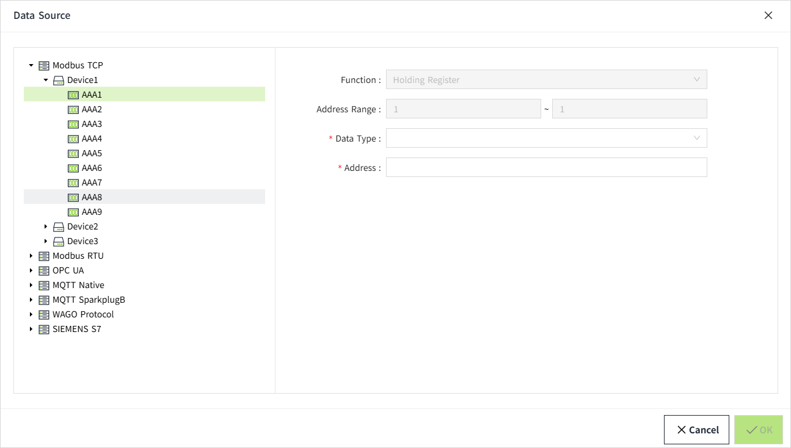

# I/O Tag Binding Data Source

I/O tags can be bound to data sources. You can either bind a fixed data source path directly or use a parameterized method to bind a dynamic path.

## Direct Binding

1. In the I/O tag add and edit window, click the data source binding button to open the data source binding popup.
    
2. In the popup, select a device, configure the parameters, and then click the "OK" button to complete the binding, as shown in the image below.
    
3. After completing the binding, you can see the specific data source path information in the tag's add and edit window, as shown in the red box in the image below.
    

**Notes**：  
1. Binding to different data sources will display different data source path parameters. 
2. In the data source text box, the left side of the "=" represents the parameter name, and the right side represents the parameter value. You can modify the parameter value, but it is not recommended to modify the parameter name, as changing the parameter name will invalidate the binding path. 
3. Please ensure that the content on both sides of the "=" in the data source input field matches the case of the fields on the configuration page. Otherwise, the data source binding may fail. It is recommended not to modify the parameter name on the left side of the "=". 
Example: Data Source Parameter Field: 
 
Configuration Page Field: 
 |

#### Data Source Binding Path Parameters

| **DataSource Type** | **Paremeters**                                                                                               |
|---------------------|--------------------------------------------------------------------------------------------------------------|
| **OPC UA**          | - DataSourceType - Path - NodeId - DisplayName - DeviceName - GroupName - DataType - IndexOfArrayStr         |
| **Modbus TCP**      | - DataSourceType - DeviceName - FrameName - DataType - Address - Bit (Only Bool tag displays this parameter) |
| **Modbus RTU**      | - DataSourceType - DeviceName - FrameName - DataType - Address - Bit (Only Bool tag displays this parameter) |
| **MQTT Native**     | - DataSourceType - Tag - Address - DataType - DeviceName - GroupName - NodeName                              |
| **MQTT SparkplugB** | - DataSourceType - Tag - Address - DataType - DeviceName - GroupName - NodeName                              |
| **SIEMENS S7**      | - DataSourceType - DeviceName - Area - DbNumber - DataType - BitOffset - CharLength - AddressOffset          |
| **WAGO Protocol**   | - DataSourceType - Path - Tag - DataType - DeviceName                                                        |

## Parameterized Binding

I/O tags created under a model or instance support parameterized binding. After the data source text box, a settings button will be displayed. From the settings popup, you can select the parameters that need to be replaced.

#### Example

The factory has 10 motors, each with the same tags. The only difference is that each motor is connected to a different data source. We want Motor 1 to connect to Device 1, Motor 2 to connect to Device 2, and so on, up to Motor 10 connecting to Device 10.

For batch creation of devices, please refer to the following section.

- Batch operation of Modbus TCP Devices
- Batch operation of Modbus RTU Devices
- Batch operation of OPC UA Devices 
- Batch operation of MQTT Native Devices
- Batch operation of MQTT SparkplugB Devices
- Batch operation of SIEMENS S7 Devices
- Batch operation of WAGO Protocol Devices

1. In the **"Devices" -> Modbus TCP list**, batch create 10 Modbus TCP devices with names from **Device1** to **Device10**. Only the **DeviceName** and **Host** will differ, while other configurations remain the same.
2. On the **"Models"** tab, create a new model called **"Motor"**, which includes one custom parameter, **"No"**, representing the motor number.
    
3. Right-click on the **"Motor"** model and create an I/O tag named **"Power"**.
    
4. After binding a data source to the tag, click the settings button for the data source parameters. This will display the list of custom parameters for the tag's associated model, **"Motor"**.
    
    You can replace the parameter values with the model's custom property, which are referenced using `{}`. When creating an instance, the custom property values will replace the parameters in the path.
    
5. After the tag is created, switch to the **"Instance"** tab. Create a folder named **"Motor"** and then add instances under this folder using the **"Motor"** model.
    
6. In the **Add** window, select the **Motor** model. Click the **"Batch Generate"** setting button, set the **"Quantity"** to 10, and set the **"Starting Index"** to 1.
    
7. Next, we will set the custom parameter **No** for each instance. We will bind **Motor** **_** **1** to **Device1**, set the **No** value of all **Motor** **_** **1** instances to 1, and so on for the other instances.
    For example:
    - **Motor** **_** **1** -> Device1, **No** = 1
    - **Motor** **_** **2** -> Device2, **No** = 2
    - And so on, until **Motor** **_** **10** -> **Device10**, **No** = 10.
    
8. Once the settings are complete, click the **"OK"** button. This will generate 10 instances under the **Motor** directory. Each instance will contain the same tag: **Power**.
    
9. You can use a label control to bind the "Text" property to the tag's **DataSource** property and view the path. This allows you to dynamically display the data source path associated with the tag.
    
10. The final result achieves batch binding of tags. All tags of Motor 1 are bound to Device 1, all tags of Motor 2 are bound to Device 2, and so on, with all tags of Motor 10 bound to Device 10.
