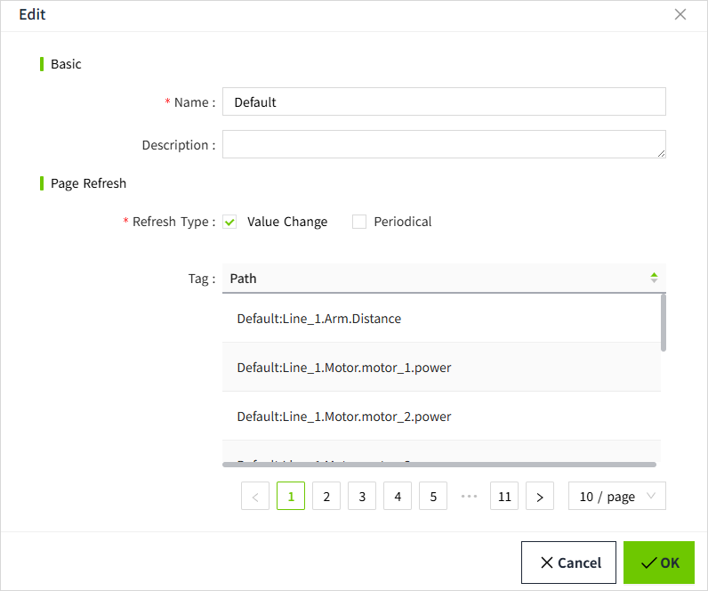

# Tag Group

The primary purpose of tag groups is to organize tags into groups, allowing the tags within each group to be pushed to the real-time display at a consistent refresh rate. This mechanism is designed to enhance the performance of the system's real-time pages by reducing the frequency at which the client processes tag values. By decreasing the frequency of server-client interactions, especially when the client has limited performance capabilities, this helps prevent page crashes due to excessive refresh operations.

In VC Hub, a default tag group named "Default" is automatically created by the system. This group is configured to enable both value change and periodic push, with the periodic frequency set to 500ms.

When creating a tag, you need to assign it to an already existing tag group.

## **Refresh Types**

Two types of refresh are supported: value change and periodical.

#### **Value Change**

The tag value is pushed to the page whenever it changes.

#### **Periodical**

The tag value is pushed to the page at regular intervals, based on the set period.

## **How to Use**

You can manage tag groups on the "Tags" -> "Tag Group" page.  The built-in tag group cannot be deleted.

## **Query**

By default,tag groups are sorted in descending order based on creation time. 

Users can customize the sorting as needed. The search box in the upper right corner allows users to perform a fuzzy search based on the tag group name.

## **Add**

Users can add a new tag group by clicking the "Add" button in the upper right corner and filling in the tag group information in the pop-up window. 

| **Name**     | **Description**                                                                                                                       |
|--------------|---------------------------------------------------------------------------------------------------------------------------------------|
| Name         | The name of the tag group, the name can not be repeated. The tag will be associated with this name when it is bound to the tag group. |
| Description  | Description information of the tag group, optional.                                                                                   |
| Refresh Type | Controls how the tag is pushed to the screen, categorized into value change and periodical.                                           |

## **Edit**

You can modify the information of the tag group by clicking the "Edit" button of any data in the tag group list. In the Edit popup window of the tag group, the paths of all the tags that use this tag group will be displayed.

Note: If you change the name of a tag group, the information of the tag group will be lost for the tags that have already been used in the group, so please be careful to change the name of the tag group.

## **Delete**

Click the Delete button of the tag group to delete the tag group. 

Note: When the tag group is deleted, the tag group information of the tags bound to the tag group will be lost, so please be careful when deleting the tag group.

