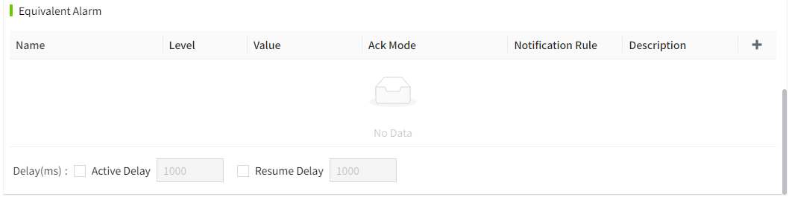

# Alarm

Alarms are used to alert and warn the system of abnormal operating conditions or out of preset ranges.

VC Hub contains four alarm categories:

- Limit Alarms: Alarms are triggered if the value of a tag exceeds or falls below the value specified in the configuration.
- Equivalent Alarms: An alarm is triggered if the tag value is equal to the value specified in the configuration.
- Rate-of-Change Alarms: Triggers an alarm if the rate of change of the value of the tag is greater than or equal to the value specified in the configuration during the change cycle.
- Switch Alarm: The alarm is triggered when the Bool value changes.

Different data types can set different categories of alarms.

| Data Type | Limit Alarm | Equivalent Alarm | Rate-of-Change Alarm | Switch Alarm |
|-----------|-------------|------------------|----------------------|--------------|
| Integer   | √           | √                | √                    | X            |
| Double    | √           | √                | √                    | X            |
| Bool      | X           | X                | X                    | √            |
| String    | X           | √                | X                    | X            |
| DateTime  | X           | X                | X                    | X            |

## **How to enable**

In the Add or Edit popup window of the tag, there is an alarm switch at the top, turn it on and set the alarm.

#### **Limit Alarm**

Support 8 limit alarms. H4, H3, H2, H, L,  L2, L3, L4. By default all types are in unchecked state. After checking a row, the row is in editable state. Multiple types can be selected.

| **Name**          | **Description**                                                                                                                                                                                                                                                                                                                                                                                                                                                                                                                                               |
|-------------------|---------------------------------------------------------------------------------------------------------------------------------------------------------------------------------------------------------------------------------------------------------------------------------------------------------------------------------------------------------------------------------------------------------------------------------------------------------------------------------------------------------------------------------------------------------------|
| Name              | Set the name of this alarm.                                                                                                                                                                                                                                                                                                                                                                                                                                                                                                                                   |
| Level             | The level of the alarm. Contains 4 levels: Critical High, Medium, and Low.                                                                                                                                                                                                                                                                                                                                                                                                                                                                                    |
| Limit             | A preset value. The alarm occurs when the value of the tag is higher or lower than this value.                                                                                                                                                                                                                                                                                                                                                                                                                                                                |
| Deadband          | A preset value. A range set to avoid sending alarm messages frequently when an abnormal condition occurs in the equipment or system. Within this range, even if the tag value exceeds the preset upper or lower limit, the system does not trigger the alarm immediately, but waits until the deadband is exceeded.                                                                                                                                                                                                                                           |
| Ack Mode          | Sets the acknowledgement mode of the alarm. Contains: Automatic, Manual (Require Confirmation), and Manual (No Confirmation).  Selecting Automatic, the system automatically acknowledges the alarm when it resumes;  Select Manual (Require Confirmation), no matter the alarm is recovered or not, you need to acknowledge manually and fill in the acknowledgement information;  Select Manual (No Confirmation) to require manual acknowledgement regardless of whether the alarm is restored or not, without filling in the acknowledgement information. |
| Notification Rule | Optional. Choose from the data in the "Alarming" -> "Alarm Notifications" -> "Rules" list. After selecting a notification rule, when the alarm occurs, notifications will be sent to the corresponding users according to the chosen notification rule.                                                                                                                                                                                                                                                                                                       |
| Description       | A description of the alarm.                                                                                                                                                                                                                                                                                                                                                                                                                                                                                                                                   |
| Inclusive         | Contains both Open Interval and Closed Interval, with Closed Interval selected by default. When Closed Interval is selected, >= is displayed in front of the limit value; when Open Interval is selected, > is displayed in front of the limit value.                                                                                                                                                                                                                                                                                                         |
| Active Delay      | Unchecked by default. Used to set how long to wait before determining whether the current value is in alarm. The unit is ms.                                                                                                                                                                                                                                                                                                                                                                                                                                  |
| Resume Delay      | Unchecked by default. Used to set how long to wait before judging whether the current value is in recovery state. The unit is ms.                                                                                                                                                                                                                                                                                                                                                                                                                             |

**Note:**
 The alarm of each limit value is judged separately. For example, if the value of a tag is greater than both the high limit and the high 1 limit, the tag will display two alarms at the same time in the alarm control, one of type high and one of type high 1. 

#### **Equivalent Alarms**

Click the Add button to add data. Multiple rows can be added. After adding, you need to check the configuration to make it effective. Click Delete button to delete the configuration.

| **Name**          | **Description**                                                                                                                                                                                                                                                                                                                                                                                                                                                                                                                                               |
|-------------------|---------------------------------------------------------------------------------------------------------------------------------------------------------------------------------------------------------------------------------------------------------------------------------------------------------------------------------------------------------------------------------------------------------------------------------------------------------------------------------------------------------------------------------------------------------------|
| Name              | Set the name of this alarm.                                                                                                                                                                                                                                                                                                                                                                                                                                                                                                                                   |
| Level             | The level of the alarm. Contains 4 levels: Critical, High, Medium, and Low.                                                                                                                                                                                                                                                                                                                                                                                                                                                                                   |
| Value             | Triggers the alarm when the tag value is equal to this value.                                                                                                                                                                                                                                                                                                                                                                                                                                                                                                 |
| Ack Mode          | Sets the acknowledgement mode of the alarm. Contains: Automatic, Manual (Require Confirmation), and Manual (No Confirmation).  Selecting Automatic, the system automatically acknowledges the alarm when it resumes;  Select Manual (Require Confirmation), no matter the alarm is recovered or not, you need to acknowledge manually and fill in the acknowledgement information;  Select Manual (No Confirmation) to require manual acknowledgement regardless of whether the alarm is restored or not, without filling in the acknowledgement information. |
| Notification Rule | Optional. Choose from the data in the "Alarming" -> "Alarm Notifications" -> "Rules" list. After selecting a notification rule, when the alarm occurs, notifications will be sent to the corresponding users according to the chosen notification rule.                                                                                                                                                                                                                                                                                                       |
| Description       | Non-required. A description of the alarm.                                                                                                                                                                                                                                                                                                                                                                                                                                                                                                                     |
| Active Delay      | Unchecked by default. Used to set how long to wait before determining whether the current value is in alarm. The unit is ms.                                                                                                                                                                                                                                                                                                                                                                                                                                  |
| Resume Delay      | Unchecked by default. Used to set how long to wait before judging whether the current value is in recovery state. The unit is ms.                                                                                                                                                                                                                                                                                                                                                                                                                             |

#### Rate of Change Alarm

Click the Add button to add data. Multiple rows can be added. After adding, you need to check the row for the configuration to take effect. Click the Delete button to delete the configuration.

| **Name**          | **Description**                                                                                                                                                                                                                                                                                                                                                                                                                                                                                                                                                      |
|-------------------|----------------------------------------------------------------------------------------------------------------------------------------------------------------------------------------------------------------------------------------------------------------------------------------------------------------------------------------------------------------------------------------------------------------------------------------------------------------------------------------------------------------------------------------------------------------------|
| Name              | Set the name of this alarm.                                                                                                                                                                                                                                                                                                                                                                                                                                                                                                                                          |
| Level             | The level of the alarm. Contains 4 levels: Critical, High, Medium, and Low.                                                                                                                                                                                                                                                                                                                                                                                                                                                                                          |
| Change Rate(%)    | The **formula** for calculating the rate of change alarm is as follows:  **((current value of the tag - value of the last change of the tag) × 100 × (period value))/((time of the current change of the tag - time of the last change of the tag) × (maximum value of the tag - minimum value of the tag))**  If the period is seconds, the value is the filled-in period value; if the period is minutes, the value is the filled-in period value *60; the result unit of (time of the current change of the tag - time of the last change of the tag) is seconds. |
| Ack Mode          | Sets the acknowledgement mode of the alarm. Contains: Automatic, Manual (Require Confirmation), and Manual (No Confirmation).  Selecting Automatic, the system automatically acknowledges the alarm when it resumes;  Select Manual (Require Confirmation), no matter the alarm is recovered or not, you need to acknowledge manually and fill in the acknowledgement information;  Select Manual (No Confirmation) to require manual acknowledgement regardless of whether the alarm is restored or not, without filling in the acknowledgement information.        |
| Notification Rule | Optional. Choose from the data in the "Alarming" -> "Alarm Notifications" -> "Rules" list. After selecting a notification rule, when the alarm occurs, notifications will be sent to the corresponding users according to the chosen notification rule.                                                                                                                                                                                                                                                                                                              |
| Description       | Non-required. A description of the alarm.                                                                                                                                                                                                                                                                                                                                                                                                                                                                                                                            |
| Active Delay      | Unchecked by default. Used to set how long to wait before determining whether the current value is in alarm. The unit is ms.                                                                                                                                                                                                                                                                                                                                                                                                                                         |
| Resume Delay      | Unchecked by default. Used to set how long to wait before judging whether the current value is in recovery state. The unit is ms.                                                                                                                                                                                                                                                                                                                                                                                                                                    |

#### Discrete Alarm

| **Name**          | **Description**                                                                                                                                                                                                                                                                                                                                                                                                                                                                                                                                               |
|-------------------|---------------------------------------------------------------------------------------------------------------------------------------------------------------------------------------------------------------------------------------------------------------------------------------------------------------------------------------------------------------------------------------------------------------------------------------------------------------------------------------------------------------------------------------------------------------|
| Name              | Set the name of this alarm.                                                                                                                                                                                                                                                                                                                                                                                                                                                                                                                                   |
| Level             | The level of the alarm. Contains 4 levels: Critical, High, Medium, and Low.                                                                                                                                                                                                                                                                                                                                                                                                                                                                                   |
| Ack Mode          | Sets the acknowledgement mode of the alarm. Contains: Automatic, Manual (Require Confirmation), and Manual (No Confirmation).  Selecting Automatic, the system automatically acknowledges the alarm when it resumes;  Select Manual (Require Confirmation), no matter the alarm is recovered or not, you need to acknowledge manually and fill in the acknowledgement information;  Select Manual (No Confirmation) to require manual acknowledgement regardless of whether the alarm is restored or not, without filling in the acknowledgement information. |
| Notification Rule | Optional. Choose from the data in the "Alarming" -> "Alarm Notifications" -> "Rules" list. After selecting a notification rule, when the alarm occurs, notifications will be sent to the corresponding users according to the chosen notification rule.                                                                                                                                                                                                                                                                                                       |
| Description       | Non-required. A description of the alarm.                                                                                                                                                                                                                                                                                                                                                                                                                                                                                                                     |
| Active Delay      | Unchecked by default. Used to set how long to wait before determining whether the current value is in alarm. The unit is ms.                                                                                                                                                                                                                                                                                                                                                                                                                                  |
| Resume Delay      | Unchecked by default. Used to set how long to wait before judging whether the current value is in recovery state. The unit is ms.                                                                                                                                                                                                                                                                                                                                                                                                                             |

