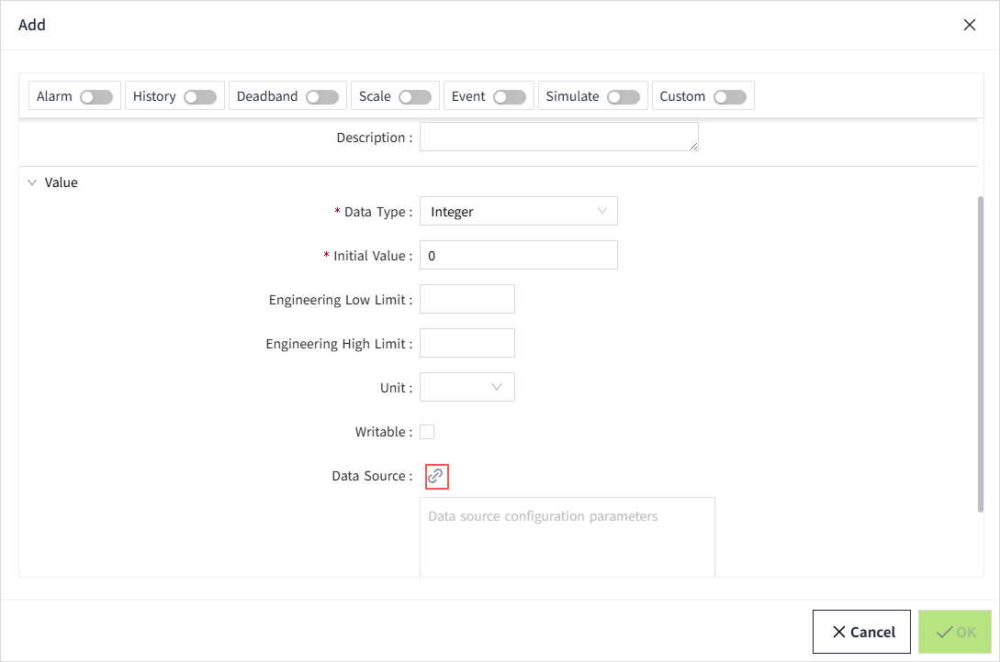
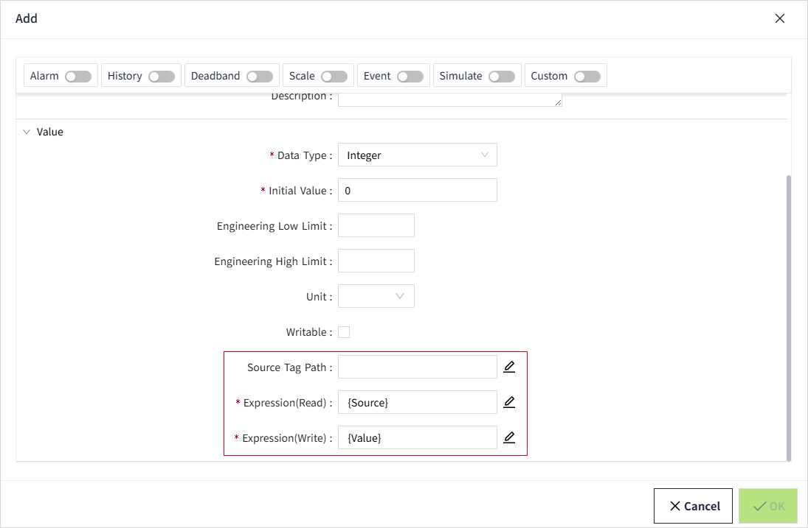

# Tag Type

The types of tag in VC Hub include:

- Memory Tag
- I/O Tag
- Expression Tag
- System Tag

Of these, memory tags, I/O tags, and expression tags are allowed to be created, while system tags are built-in and do not support creation.

The types of tags that can be created by the user have their own icons in the asset tree:

| Icon                                                                                                                                                                                                                                  | Tag Type       |
|---------------------------------------------------------------------------------------------------------------------------------------------------------------------------------------------------------------------------------------|----------------|
|  | Memory tag     |
|  | I/O tag        |
|  | Expression tag |

## **Memory Tag**

Memory tag are simple tags that are not polled or updated automatically. They remain the same value until some mechanism created by another user (perhaps a script or binding) changes their value.

## **I/O Tag**

Obtain their values by binding to an external device.

 I/O tags get their values by binding to a device through a data source property.

## **Expression Tag**

Calculates and determines its value by writing an expression.

Expression tags must have the **Data Source Path**, **Expression (Read)**, and **Expression (Write)** set.

| **Name**           | **Description**                                                                                                                                                                                       |
|--------------------|-------------------------------------------------------------------------------------------------------------------------------------------------------------------------------------------------------|
| Data Source Path   | You can enter the tag Path directly or select the tag. Only one tag can be filled in.                                                                                                                 |
| Expression (Read)  | The default display {Source}, {Source} represents the value of the source tag. You can use the new value obtained from the source tag by expression calculation as the value read by the current tag. |
| Expression (Write) | The default display {Value}, {Value} represents the original value of the source tag. This expression determines the value that should be written to the current tag.                                 |

**Example**

To convert degrees Fahrenheit to Celsius for display.

1. Create an expression tag with the name: Celsius_Temperature
2. Set the source tag, select the source tag "Fahrenheit_Temperature", the value of this tag is a Fahrenheit temperature.
3. Set the Expression (Read) to: ({Source} - 32) × 5/9
4. Set the Expression (Write) to: ({Value} × 9/5) + 32

