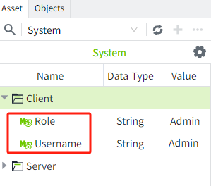

# System Tag

System tags are used to display current system related status information, such as alarm data, memory usage, performance indicators, etc. System tags cannot be deleted or modified.

You can view the detailed system tags by selecting the asset named "System" in the Asset window.

The system tags contain the Client and Server directories.

**Client**: The device that the user uses to log on to VC Hub, such as an office computer;

**Server**: The device on which VC Hub is installed.

The **Client** directory contains Username and Role. **Read-only**, not editable.

| **Name** | **Description**                             | **Data Type** |
|----------|---------------------------------------------|---------------|
| Username | The user name of the current login，e.g. Sam | String        |
| Role     | The role of the current login, e.g. Admin   | String        |

The Server folder contains the following tags:

The details are shown in the following table:

| **Name**                                                                                                                                                                                                   | **Description**                                                                                                                                                                                                                                                   | **Data Type** |
|------------------------------------------------------------------------------------------------------------------------------------------------------------------------------------------------------------|-------------------------------------------------------------------------------------------------------------------------------------------------------------------------------------------------------------------------------------------------------------------|---------------|
| CurrentDateTime                                                                                                                                                                                            | The time of the server where the current system is located.                                                                                                                                                                                                       | DateTime      |
| NodeName                                                                                                                                                                                                   | The node name of the current system.                                                                                                                                                                                                                              | String        |
| Timezone                                                                                                                                                                                                   | The time zone of the current server.                                                                                                                                                                                                                              | String        |
| **Alarm**                                                                                                                                                                                                  |                                                                                                                                                                                                                                                                   |               |
| ActiveAcked                                                                                                                                                                                                | The number of alarms that are currently active and acknowledged.                                                                                                                                                                                                  | Integer       |
| ActiveUnacked                                                                                                                                                                                              | The number of alarms that are currently active and unacknowledged.                                                                                                                                                                                                | Integer       |
| ClearAcked                                                                                                                                                                                                 | The number of alarms that are currently in the cleared, acknowledged state.                                                                                                                                                                                       | Integer       |
| ClearUnacked                                                                                                                                                                                               | The number of alarms that are currently in the cleared, unacknowledged state.                                                                                                                                                                                     | Integer       |
| **Devices**(One separate folder per device type. Each device is displayed as a separate folder under each device type folder, and 2 system tags are displayed under the device folder: Connected, Enabled.) |                                                                                                                                                                                                                                                                   |               |
| Connected                                                                                                                                                                                                  | The current connection status of the device, connected is shown as true, unconnected is shown as false.                                                                                                                                                           | Bool          |
| Enabled                                                                                                                                                                                                    | The current enabled state of the device is shown as true for enabled and false for disabled, and can be enabled and disabled in the “Enabled State” column of the device list.  MQTT Native and WAGO Protocol devices only have the Enabled tag.                  | Bool          |
| **Performance**                                                                                                                                                                                            |                                                                                                                                                                                                                                                                   |               |
| AvailableDiskSpace                                                                                                                                                                                         | The available space of the disk where the current system is located, the unit is M (megabytes), accurate to 1 decimal place. For example, 1200.5 means 1200.5M.                                                                                                   | Double        |
| CPUUtilization                                                                                                                                                                                             | CPU utilization of the current system, accurate to 3 decimal places. For example: 0.043, means 4.3%.                                                                                                                                                              | Double        |
| DiskUtilization                                                                                                                                                                                            | The disk utilization of the current system, accurate to 3 decimal places. For example, 0.028 means 2.8%.                                                                                                                                                          | Double        |
| MaxMemory                                                                                                                                                                                                  | The maximum operating memory of the server where the current system is located, in M (megabytes), accurate to 1 decimal place. For example, 15986, means 15986M.                                                                                                  | Double        |
| MemoryUsage                                                                                                                                                                                                | The memory used by the current system, in M, accurate to 1 decimal place. For example, 1899 means 1899M.                                                                                                                                                          | Double        |
| MemoryUtilization                                                                                                                                                                                          | The memory utilization of the current system, accurate to 3 decimal places. For example, 0.083 means 8.3%.                                                                                                                                                        | Double        |
| **Redundancy**                                                                                                                                                                                             |                                                                                                                                                                                                                                                                   |               |
| **CurrentNode**                                                                                                                                                                                           |                                                                                                                                                                                                                                                                   |               |
| IsActive                                                                                                                                                                                                   | Whether the current node is active.                                                                                                                                                                                                                               | Bool          |
| IsMaster                                                                                                                                                                                                   | Whether the current node is the master.                                                                                                                                                                                                                           | Bool          |
| Mode                                                                                                                                                                                                       | The operating mode of the current node. Contains: Independent, Redundancy, Master, Backup, Unknown.                                                                                                                                                               | String        |
| State                                                                                                                                                                                                      | The state of the current node.  If the current node is the master, the value of this state is one of Running, Standby, Connecting, Disconnected, Faulted, Other;  If the current node is a standby node, the value of this state is Standby_Cold or Standby_Warm. | String        |
| **PeerNode**                                                                                                                                                                                              |                                                                                                                                                                                                                                                                   |               |
| IsConnected                                                                                                                                                                                                | Whether to connect with other nodes to form redundancy.                                                                                                                                                                                                           | Bool          |
| NodeId                                                                                                                                                                                                     | The Id of the node to connect to.                                                                                                                                                                                                                                 | String        |

The system tags under the **Server** directory support editing. **Double-click** a tag or select **"Edit"** from the right-click menu to open the **edit window**.

