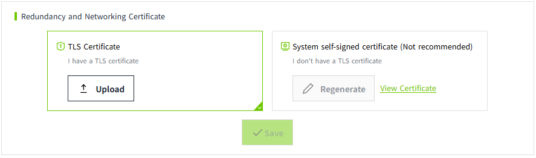

# Certificate Management

Used to centrally manage certificates. Each type of certificate is stored independently. Includes:

- **Web Server Certificate:** Used to configure secure communication between Web clients (such as browsers) and the VC Hub server.
- **Redundancy / Networking Certificate:** Used to configure secure communication between multiple VC Hub nodes in redundancy or networking mode.
- **MQTT Broker Certificate:** Used to configure secure communication between MQTT clients (such as field devices or VC Hub clients) and the MQTT Broker.

## Web Server Certificate

By default, the **TLS certificate** option is selected.

- If the user already has a TLS certificate, they can click the **Upload** button  to upload their own TLS certificate.
- If the user does not have a TLS certificate, they can select the **System self-signed certificate** option to use the built-in system certificate for secure communication.Clicking the **Regenerate** button will generate a new self-signed certificate.

Once the certificate is configured, click the "View" button to view the detailed information.

## **Redundancy and Networking Certificate**

By default, the **TLS Certificate** option is selected.

- If the user already has a TLS certificate, they can click the **Upload** button  to upload their own TLS certificate.
- If the user does not have a TLS certificate, they can select the **System self-signed certificate** option to use the built-in system certificate for secure communication.Clicking the **Regenerate** button will generate a new self-signed certificate.

Once the certificate is configured, click the "View" button to view the detailed information.

**Notes:** Before configuring redundancy or networking, you must first set the corresponding certificate here.

## MQTT Broker Certificate

By default, the **TLS Certificate** option is selected.

- If the user already has a TLS certificate, they can click the **Upload** button  to upload their own TLS certificate.
- If the user does not have a TLS certificate, they can choose **Create a self-signed Certificate.** A default self-signed certificate is built into the system, and the user can also click the **Create** button to generate a new self-signed certificate.

Once the certificate is configured, click the "View" button to view the detailed information.

**Notes:** Before enabling TLS for the MQTT Broker, you must first configure the certificate here.
