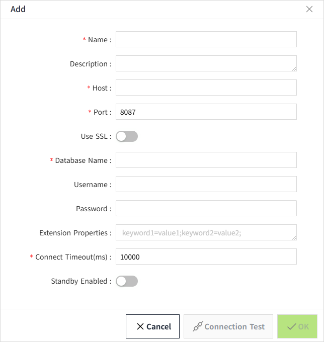

# Database Connection
## **Creating a Connection**

1.  On the "**Databases**" -> "**Database Connections**" screen, click the Add button.
    
2. In the following window, select the type of database you want to add. Click the "Next" button when you are done. 
    
3. Depending on the selected database type, different configuration screens will be displayed.
When MySQL, SQL Server, PostgreSQL is selected, the following configuration screen is displayed: 
    
    When InfluxDB is selected, the following configuration screen is displayed:
    
    When SQLite is selected, the following configuration screen is displayed:
    
4. Click **"OK"** button to save the data after setting is completed. 

**Configuration items**

| **Configuration Item** | **Description**                                                                                                                                                                                                                                                                                                                                                                                                                                                        |
|------------------------|------------------------------------------------------------------------------------------------------------------------------------------------------------------------------------------------------------------------------------------------------------------------------------------------------------------------------------------------------------------------------------------------------------------------------------------------------------------------|
| Name                   | The name of the database connection.                                                                                                                                                                                                                                                                                                                                                                                                                                   |
| Description            | Description of the configuration.                                                                                                                                                                                                                                                                                                                                                                                                                                      |
| Host                   | The address of the database. For example, if the SQL Server server address is 10.1.102.21:1433, then Host is 10.1.102.21.                                                                                                                                                                                                                                                                                                                                              |
| Port                   | The port of the database.  For example, if the SQL Server server address is wago-sz-scada:1433, then Port is 1433                                                                                                                                                                                                                                                                                                                                                      |
| Use SSL                | It is displayed when InfluxDB is selected.                                                                                                                                                                                                                                                                                                                                                                                                                             |
| Database Name          | When the type is MySQL, SQL Server, PostgreSQL, InfluxDB, it is the database name.  SQLite File Name When the type is SQLite, the SQLite file name (without the .db extension).                                                                                                                                                                                                                                                                                        |
| UserName               | It is displayed when MySQL, SQL Server, PostgreSQL, InfluxDB is selected. The user name to use when connecting to the database.                                                                                                                                                                                                                                                                                                                                        |
| Password               | It is displayed when MySQL, SQL Server, PostgreSQL, InfluxDB is selected. Password The password to use when connecting to the database.                                                                                                                                                                                                                                                                                                                                |
| Extension Properties   | Depending on the database to connect to, this box can be filled with different values. Each database has its own set of additional connection properties available, so you must refer to the database documentation to determine the properties that are valid here.                                                                                                                                                                                                   |
| Connection Timeout(ms) | The connection timeout time for the connection to the database.                                                                                                                                                                                                                                                                                                                                                                                                        |
| Standby Enabled        | Whether to enable a standby connection when the current connection is unavailable.                                                                                                                                                                                                                                                                                                                                                                                     |
| Standby Database       | The connection that is automatically used when this connection is unavailable.                                                                                                                                                                                                                                                                                                                                                                                         |
| Standby Mode           | Allows you to choose how to handle database connection failures and recovery.   **Standard**: When the current connection is unavailable, the standby connection is transferred, but when this connection is restored, the standby will continue to be used.   **Sticky**: When the current connection is unavailable, it will transfer to use the standby repository connection, but when this connection is restored, it will be resumed to use this connection again. |
| Maximum Query Points   | When selecting MySQL, SQL Server, PostgreSQL, or SQLite, this field is displayed. It is used to define the maximum number of data points that can be retrieved in a single query execution for a specific database.                                                                                                                                                                                                                                                    |
| Query Timeout(s)       | When selecting MySQL, SQL Server, PostgreSQL, or SQLite, this field is displayed. It is used to define the maximum duration for executing a data query on a specific database. If the query is not completed within the specified time, the system will automatically terminate it. This setting helps prevent performance bottlenecks or system slowdowns caused by prolonged query operations.                                                                       |

