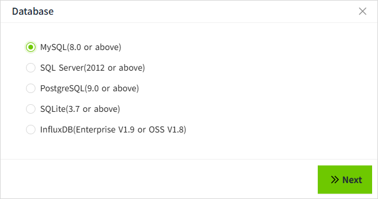
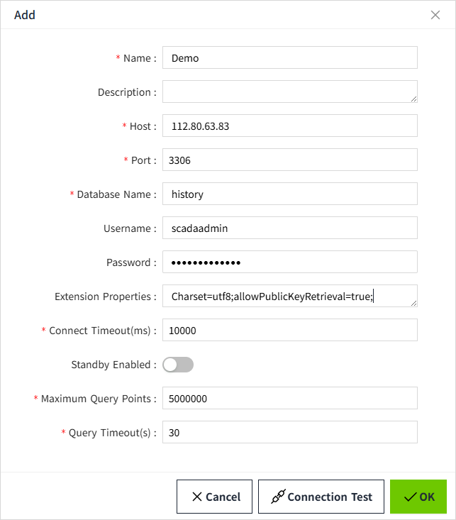

# MySQL

On this page we will demonstrate how to connect VC Hub to MySQL. 

1. On the "**Databases**" -> "**Database Connection**" page, click the "Add" button. 
    
2.  In the following window, select MySQL and click on the Next button.
    
3. Get the MySQL server connection string information, such as the following two formats

    User ID=scadaadmin;Password=admin@12345;Host=112.80.63.83,3306;Database=history;Charset=utf8;allowPublicKeyRetrieval=true;

    jdbc:mysql://112.80.63.83:3306/history?user=scadaadmin&password=admin@12345&Charset=utf8&allowPublicKeyRetrieval=true;

    Enter the following information in the configuration interface (Note: the following data is only an example, please fill in according to the actual situation).

    

     - Name: Demo
     - Host: 112.80.63.83
     - Port: 3306
     - Database Name: history
     - UserName: scadaadmin
     - Password: admin@12345  
     - Extension Properties: Charset=utf8;allowPublicKeyRetrieval=true;
     - Connection Timeout (ms): 10000
     - Maximum Query Points: 5000000
     - Query Timeout(s): 30

4.Click the **"OK"** button, the pop-up window will be closed and the database connection list will be displayed. The connection status of the data in the list is "Connected".
    

