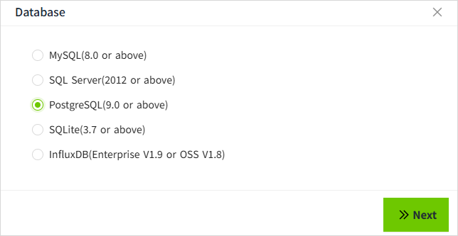

# PostgreSQL

On this page, we will demonstrate how to connect VC Hub to PostgreSQL.

1. On the "**Databases**" -> "**Database Connection**" page, click the Add button. 
    
2. In the following window, select PostgreSQL and click the Next button. 
    
3. Get the PostgreSQL server connection string information, such as the following two formats:

    User ID=postgres;Password=admin@12345;Host=10.20.1.231;Port=5432;Database=scada-history;Pooling=true;MaxPoolSize=100.

    jdbc:postgresql://10.20.1.231:5432/scada-history?user=postgres&password=admin@12345&Pooling=true&MaxPoolSize=100;

    Enter the following information in the configuration interface (Note: the following data is only an example, please fill in according to the actual situation).

    

     - Name: Demo
     - Host: 10.20.1.231
     - Port: 5432
     - Database Name: scada-history
     - Username: postgres
     - Password: admin@12345 
     - Extension Properties: Pooling=true;MaxPoolSize=100;
     - Connect Timeout(ms): 10000
     - Maximum Query Points：5000000
     - Query Timeout(s)：30

4. Click the **"OK"** button, the pop-up window closes and the list of database connections is displayed. The connection status of the data in the list is "Connected".
    

