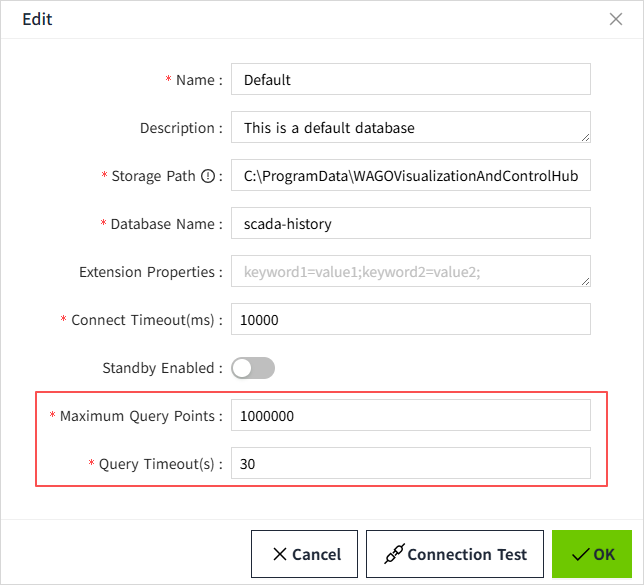

# Explanation of query exceptions

## 1.Explanation of program or database crash caused by database query

If you encounter database or application crashes during data query execution, such issues are typically caused by three core factors: ​**long query time**, ​**oversized result** and ​**inefficient query conditions or poor table design**. Understanding these causes and mastering self-troubleshooting methods can significantly improve system stability and query efficiency.

- **Long query time**: By configuring the query timeout for the corresponding database, the query can be automatically exited when the waiting time exceeds the configured time.
- **Oversized result**: By configuring the maximum number of query points for the corresponding database, the query can be automatically exited when the number of query results exceeds the configured maximum point.
- **Inefficient Query Conditions and Poor Table Design**: If query conditions fail to leverage indexes effectively, or table structures are poorly designed (e.g., lacking partitions or excessive normalization), the system may crash due to logical flaws even with sufficient hardware resources.

## 2. Explanation of predictable abnormal situations in the program

#### Parameter configuration

On the "Database" -> "Database Connections" page, click the "Edit" button for a specific entry to view its detailed configuration.

The default configuration for each database is as follows:

| **Database**   | **Max Query Points** | **Query Timeout(s)** |
|----------------|----------------------|----------------------|
| **MySQL**      | 5,000,000            | 30                   |
| **SQL Server** | 5,000,000            | 30                   |
| **PostgreSQL** | 5,000,000            | 30                   |
| **SQLite**     | 1,000,000            | 30                   |

## **Exception Scenarios**

#### Query Timeout

**Trigger Conditions:** The query time exceeds the timeout configured on the database.

**Resolution**

1. Optimize SQL queries (restrict time ranges, add indexes)
2. Adjust timeout configuration

#### Max Data Points Exceeded

**Trigger Conditions:** The amount of data returned by the query exceeds the maximum query point limit configured on the database.

**Resolution**

1. Use pagination queries (e.g., TOP, LIMIT clauses)
2. Narrow query scope (time range/filters)
3. Adjust maximum query point

#### Syntax Errors

**Trigger Conditions:** Invalid SQL statement structure

**Resolution**

Adjust the SQL query to fix any syntax errors.

#### Other Exceptions

Any exceptions during query or execution will be displayed as error messages. Analyze specific error codes/messages for root cause identification.