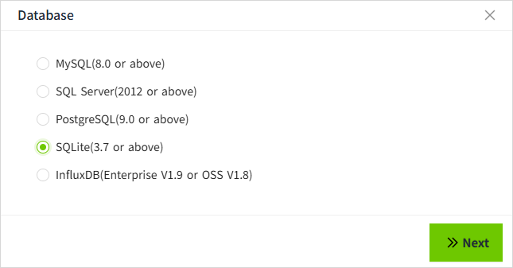
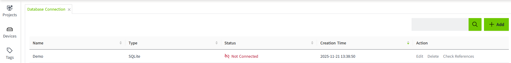

# SQLite

On this page, we will demonstrate how to connect VC Hub to SQLite.

1. On the "**Databases**" -> "**Database Connection**" page, click the "Add" button. 
    
2. In the following pop-up window, select SQLite and click the Next button.
    
3. Enter the following information in the configuration interface (Note: The following data is only an example, please fill in according to the actual situation).

    Since SQLite is an open source embedded relational database that implements a self-contained, serverless, configuration-less, transactional SQL database engine. It is a zero-configuration database.

    So creating a SQLite database connection means creating a SQLite file locally. So there is no need for Host, Port, Username, Password, etc. You just need to check where the SQLite file is stored.

    

     - Name: Demo
     - Database name: history
     - Connection timeout(ms): 10000
     - Maximum Query Points：1000000
     - Query Timeout(s)：30

    **Notes:** The database name is the name of the SQLite file without suffix. 

4. Click **"OK"** button, the popup window will be closed and the list of database connections will be displayed. The connection status of the data in the list is "Connected".
    

