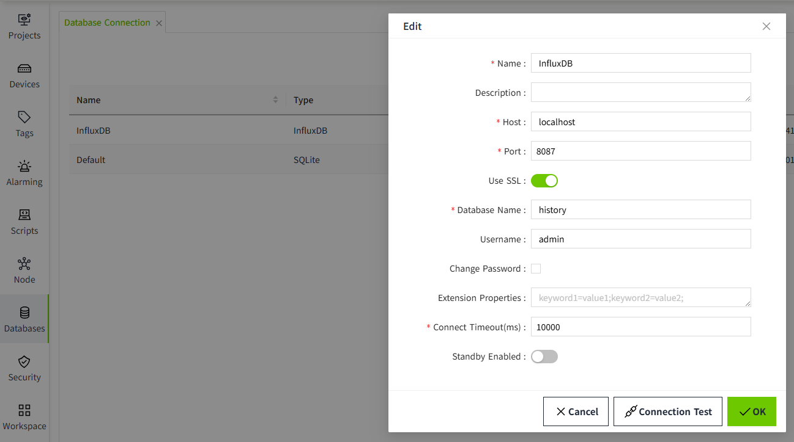

# Database Table Reference

VC Hub integrates multiple built-in systems that automatically query data without requiring manual construction of query logic or table structures. These systems autonomously create necessary tables in the database, insert relevant data, and provide appropriate querying methods.

Since historical data is stored within database tables, users have the option to manually access and query the data, enabling customized data views as needed.

**Important Note**
These tables follow specific structural definitions. Unintended modifications to table structures may lead to unpredictable issues. It is strongly advised not to alter or delete existing table structures.

Although direct manual querying of table data is technically possible, we recommend performing a full database backup prior to making any changes or executing operations. Please note that any risks resulting from modifications to data or table structure will be the responsibility of the user.

VC Hub supports both traditional relational databases and the time-series database InfluxDB. As a result, table structure definitions vary depending on the type of database in use.

- Relational databases share a unified set of table definitions.
- InfluxDB employs a separate and distinct schema structure.

## Introduce

Before introducing the table structures, it is essential to understand the relevant foundational configurations. These preliminary settings serve as the groundwork for proper database operation and ensure seamless integration with VC Hub’s data management systems.

## Node 

VC Hub includes a node configuration feature, where the node name is by default set to the server’s hostname. Users may modify this name to suit their operational needs.

The node primarily serves as a unique identifier, enabling other VC Hub instances within the network to easily recognize and communicate with it. When historical data is stored, the system also records the name of the node responsible for the data storage process.

## Asset

Within the **Asset** page, users can configure the repository for **Tag History**. When a tag associated with the asset is enabled for historical recording, the system will write data to the designated historical database either upon changes to the database or at predefined intervals.

## History Database

Within the **History Database** page, users can configure both the **storage medium** and **storage format** for tag history. This flexibility allows tailored data archiving solutions that align with system requirements and performance preferences.

## Database Connection

The VC Hub system currently supports five types of databases: **MySQL**, **SQL Server**, **PostgreSQL**, **SQLite**, and **InfluxDB**.

Users can configure the database connection by specifying the appropriate **connection URL**, **username**, and other relevant credentials. These configured databases are then utilized for storing **alarm history** and **tag history** data.

