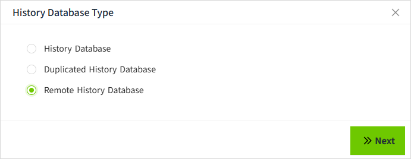

# Create a Remote History Database

1. On the "**Databases**" -> "**History Database**" screen, click the "Add" button.
    
2. In the following popup window, select the Remote History Database and click "Next" button. 
    
3. Fill in the configuration and click **"OK** **"** button to save.  
    

**Configuration Description**

| **Configuration Item** | **Description**  |
|--------------------------------------------|---------|
| Name                                       | Name of the history database.|
| Description                                | Description Information of the history database.|
| Remote Node Name                           | The remote node in the networking configuration.  |
| Remote Database                            | TThe name of the history database and duplicated history database created in the History Database List page in the remote node. |
| Allow Storage                              | Whether the history data of the local node can be stored in the configured remote node.                                         |
| Max Bundle Size(Unit: Thousand)            | The number of historical data to be sent in a single request to the remote history database.                                    |

