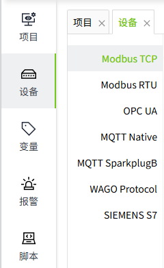
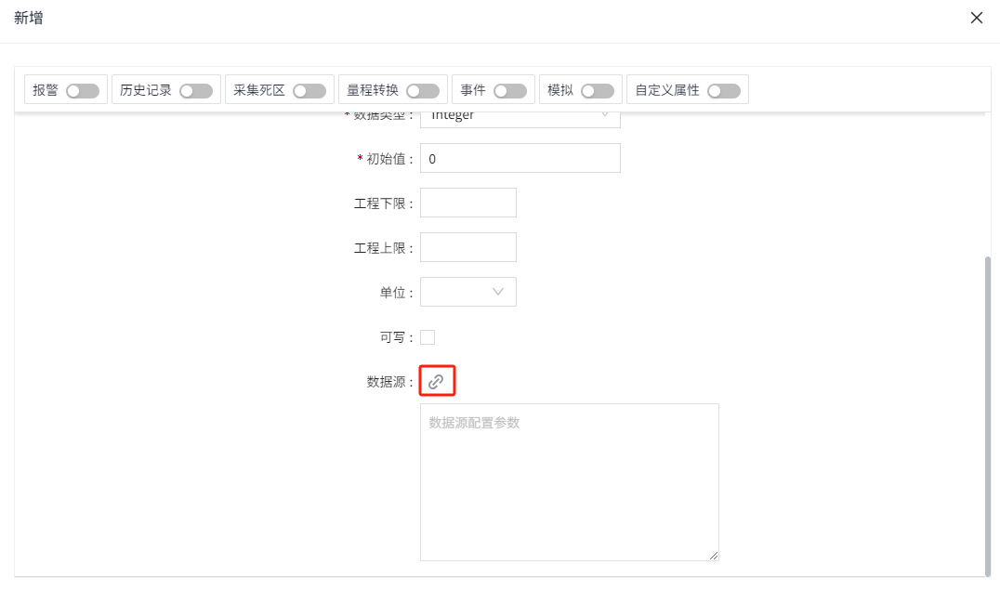

# 设备

WAGO VC Hub支持多种通讯协议，对于不同的硬件设施，只需为其配置相应的通信驱动程序即可。

要快速连接到您的一台设备，请点击WAGO VC Hub 的**“设备**”菜单，选择要添加的设备类型。

#### 支持的设备类型

- [known-link] 
- [known-link] 
- [known-link] 
- [known-link]
- [known-link]
- [known-link]
- [known-link]
- [known-link] 

#### 如何从我的 PLC 获取数据？

将数据从 PLC 接入 WAGO VC Hub 的过程分为两步：

1. 添加设备。
2. 在编辑器的资产窗口中添加I/O变量。请参阅[known-link]页面。
3. 为变量绑定数据源，在数据源中选择步骤1中添加的设备。请参阅[known-link]页面。

