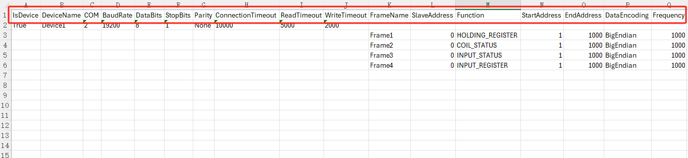

# Batch Operation of Modbus RTU Devices

In industrial settings, it is often necessary to create multiple devices in bulk. VC Hub enables this through its export and import functions.

**Note:** To quickly create devices, it is recommended to first manually add a device to the list. Then, export the device and use the exported fields as a reference to add new devices.

## Batch Addition

#### 1.Export Devices

Click the "Export" button in the upper right corner of the list to export all device information.

When exporting Modbus RTU devices, the exported file will include frame information.

**Example of an Exported File:**

<

- The content inside the red box represents the field information.
- If it is a device, the "IsDevice" field is set to **True**.
- Frame information is listed directly under the corresponding device. For example, in the image above, the device **"Device1"** has **4 frames** associated with it: **Frame1 to Frame4**.

#### 2.Adding Devices in Excel

Select the devices and frames, then drag the mouse to quickly copy.

If you want to keep a specific column unchanged, such as using the same frame name for all devices, you can first copy one device and manually set the frame name to be consistent. Then, select all and drag to copy.

For the **SlaveAddress**, as shown in the image above, if you want to keep the same slave address for each device, you need to manually modify this column. Select two sets of device data, then hold down the Ctrl key while dragging to copy.

The operations for the **StartAddress**, **EndAddress**, and **Frequency** are the same as for the **SlaveAddress**.

For the COM port, manually convert its format to a number. After that, during the creation process, the COM port can increment automatically.

#### 3.Import Devices

Click the "Import" button in the upper right corner of the list to import the exported content. After importing, the newly added devices will have their enabled status set to "Disabled" by default.

## Batch Modification

You can batch modify device information through the exported Excel. After making changes in the Excel, import it back. During the import, the data will be updated based on the name.

- If the device name in the Excel matches the name in the Modbus RTU list, the data in the Excel for that entry will be used to update the data.
- If the device name and frame in the Excel match the entries in the Modbus RTU list, the data in the Excel for that entry will also be used to update the data.
- If the device name or frame name in the Excel does not exist in the Modbus RTU list, the device and frame will be added to the list.
- If a device in the Modbus RTU list does not exist in the imported file, the data for that device will remain unaffected in the list.

## Batch Deletion

After selecting the devices to be deleted, click the **Delete** button at the top of the list to perform batch deletion.

Notes:

- Devices that are **Enabled** cannot be deleted.
- Only devices on the current page can be deleted; cross-page deletion is not supported.
- When a device is deleted, its associated frames will also be deleted.
