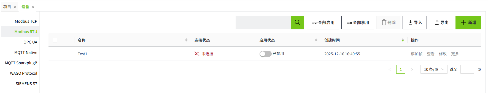
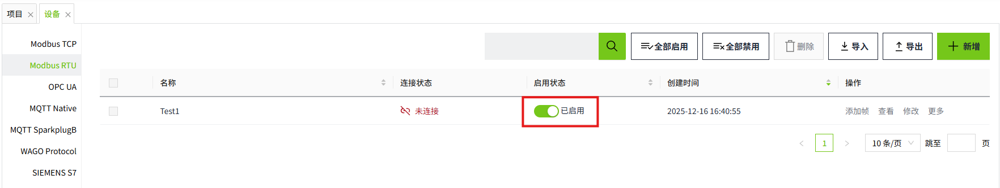
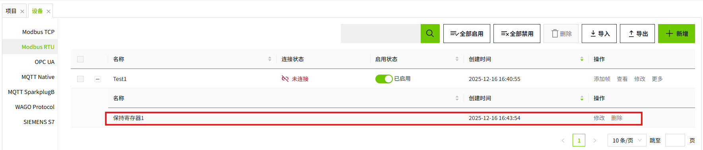
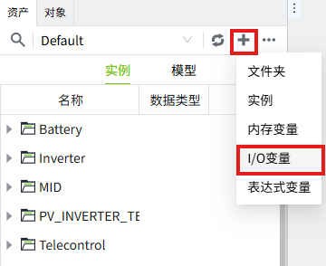
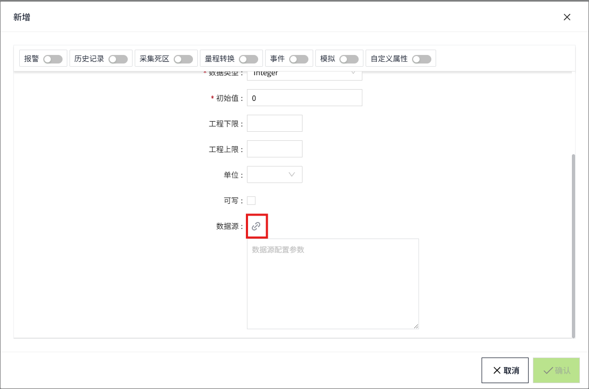
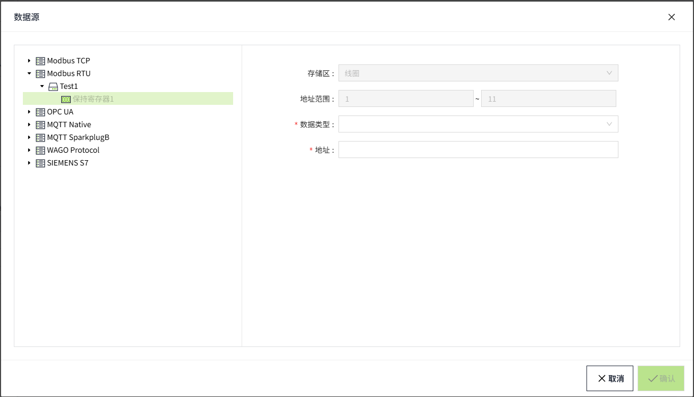

# Modbus RTU

The Modbus RTU driver in VC Hub communicates data with devices (typically PLCs, sensors or other industrial devices) via the COM port. The driver handles the underlying details of the Modbus RTU communication protocol and ensures that reliable serial data interaction between devices is possible.

## **Connecting to a Modbus RTU Device**

1. On the "**Devices**" -> "**Modbus RTU**" page, click the "**Add**" button.
2. On the Add screen, leave the default values and enter the following information in the following fields (Note: The following data is only an example, please fill in the fields according to the actual situation).
      Name: test1
      COM: 2
      Baud Rate: 9600
      Data Bits: 8
      Stop Bits: 1 bit
      Parity: None
      Connection Timeout (ms): 10000
      Read Data Timeout (ms): 5000
      Write Data Timeout (ms): 2000
3. Click the "**OK**" button. The data will be displayed in the device list page of Modbus RTU.
   
4. Click the Enable button in the Enable Status column to enable the device.
   
   **Configuration Fields**
   | **Name**              | **Description**        |
   |-------------------------|-----------------------------|
   | Name                    | The name of the device connection.                    |
   | COM                     | The COM port (name of the serial port) of the device. |
   | Baud Rate               | The baud rate of the device.                          |
   | Data Bits               | The data bits of the device.                          |
   | Stop Bits               | The stop bit of the device.                           |
   | Parity                  | The parity of the device.                             |
   | Connection Timeout (ms) | Connection timeout of the device in milliseconds.     |
   | Read Data Timeout (ms)  | Read data timeout of the device in milliseconds       |
   |Write Data Timeout (ms) | The device's write data timeout in milliseconds.      |
5. Click on the "**Add Frame**" button on the created device to add a frame to the current device.
   **Frame**: The frame is the same as a data frame in the Modbus protocol, it is the basic unit of data transmission, it is used to record the slave address, storage area, start and end address, data encoding format and frequency of data acquisition for data communication, and the I/O tags can be bound to the frame in the VC Hub program.
6. In the Add Frame screen, leave the default values and enter the following information in the following fields (Note: The following data is only an example, please fill in the fields according to the actual situation).
   Name: HoldingRegister1
   Slave Address: 1
   Function: Holding Register
   Start Address: 1
   Endind Address: 11
   Data Encoding: Big Endian
   Frequency (ms): 1000
7. Click the "**OK**" button. The data will be displayed under the previously created device.
   
   **Configuration Fields**
   | **Name**    | **Description**                  |
   |----------------|---------------------------------------|
   | Name           | Name of the frame connection.      |
   | Slave Address  | Slave address of the frame.     |
   | Function       | The memory area of the frame.   |
   | Start Address  | The start address of the frame.    |
   | Ending Address | The end address of the frame.      |
   | Data Encoding  | The data encoding method of the frame.   |
   | Frequency (ms) | The frequency of data acquisition in milliseconds. (Displayed only when the memory area is an input register, hold register) |

**Note:**

1. In the device list, The **Enabled Status** indicates whether the device has been enabled or not, unenabled devices will not connect and enabled devices will try to connect; the **Connection Status** indicates whether the device has successfully established a communication connection with the system.
2. **Enable All** and **Disable All**are to enable or disable all data in the list.
3. The data code is not required when the function is a **coil status** and **input status**.
4. Connections are not shared between all devices.

## **Tag Binding**

Bind a tag to the data of a Modbus RTU device.

1. Create an I/O tag.
   
2. On the add window, click the binding button of data source.
   
3. In the pop-up data source window, select the frame under the created Modbus RTU device and enter the following information in the following fields (Note: The following data is only an example, please fill in according to the actual situation).
   Function: Holding Register
   Address Range: 1 ~ 11
   Data Type: UINT16
   Address: 1
   Bit: 1
   
   **Configuration Fields**
   | **Function**    |     |
   |--------------------------|------------------------|
   | **Name**                 | **Description**   |
   | Coil Status              | Used to store switching-type data, usually indicating the binary switching state (ON/OFF). Corresponds to function codes 01 and 05. |
   | Input Status             | Used to store read-only switching-type data, usually representing the binary input state. Corresponds to function code 02.          |
   | Input register           | Used to store read-only 16-bit register data. Corresponds to function code 04.                                                      |
   | Holding Register         | Holding register is used to store 16-bit register data that can be read and written. Corresponds to function codes 03, 06, and 16.  |
   | Address Range            | The start address and end address of the frame.    |
   | **Supported Data Types** |           |
   | **Name**                 | **Description**        |
   | INT16                    | This data type is displayed when the data type of the tag is Integer.                                                               |
   | INT32                    | This data type is displayed when the data type of the tag is Integer.                                                               |
   | INT64                    | This data type is displayed when the data type of the tag is Integer.                                                               |
   | INT8                     | This data type is displayed when the data type of the tag is Integer.                                                               |
   | UINT16                   | This data type is displayed when the data type of the tag is Integer or Bool.                                                       |
   | UINT32                   | This data type is displayed when the data type of the tag is Integer.                                                               |
   | UINT64                   | This data type is displayed when the data type of the tag is Integer.                                                               |
   | UINT8                    | This data type is displayed when the data type of the tag is Integer.                                                               |
   | DOUBLE                   | This data type is displayed when the data type of the tag is Double.                                                                |
   | FLOAT32                  | This data type is displayed when the data type of the tag is Double.                                                                |
   | **Address**              | The address of the storage area.                                                                                                    |
   | **Bit**                  | The bit of the address of the storage area. This field is displayed when the tag's data type is Bool.                               |

