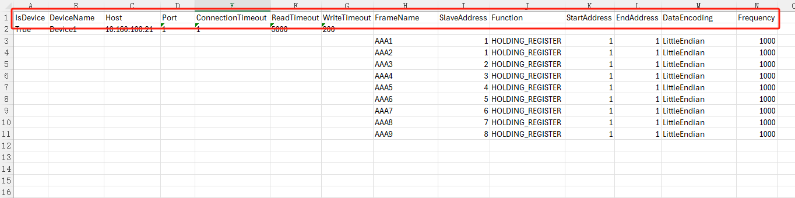
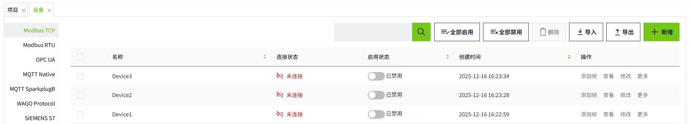
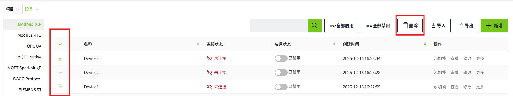

# 批量操作Modbus TCP设备

在工业现场，往往需要批量创建设备。WAGO VC Hub通过**导出和导入**功能来实现这一功能。

**说明：**要想实现快速创建设备，建议先在列表中手动新增一条设备信息，之后将该设备进行导出，根据导出的字段信息添加新的设备。

#### 批量新增

###### 1.导出设备

点击列表右上角的“导出”按钮，可以将列表中的所有设备信息进行导出。

导出Modbus TCP设备时，会包含帧的信息一起导出。

导出文件示例：

- 红框中内容为字段信息。
- 如果是设备，则“IsDevice”字段为True。
- 帧信息紧跟在对应的设备下面。例如上图的设备“Device1”下，存在9个帧，AAA1~AAA9。

###### 2.在Excel中新增设备

选中设备和帧，拉动鼠标，完成快速复制。

如果某一列想保持不变，例如所有设备都使用同样的帧名称，可以先复制一个设备，手动将帧名称改为一致。之后再全选进行拖动复制。

对于从站地址，例如上图所示，如果想保持每个设备的从站地址一致，需手动对这列进行修改。选择两组设备数据后，按住Ctrl键进行拖动复制。

开始地址，结束地址，频率的操作，同从站地址。

###### 3.导入设备

点击列表右上角的“导入”按钮，可以将导出的内容进行导入。导入后，新增的设备的启用状态默认为“已禁用”。

#### 批量修改

可以通过导出的excel，对设备信息进行批量修改。修改后将excel导入，导入时，将按照名称进行数据更新。

- Excel中的设备名称和Modbus TCP列表中的名称一致，则使用excel中的该条配置进行数据更新。
- Excel中的设备名称和设备下的帧，与Modbus TCP列表中的一致，则使用excel中的该条配置进行数据更新。
- Excel中的设备名称或者帧名称在Modbus TCP列表中不存在，则在列表中新增该设备和帧。
- Modbus TCP列表中的设备，不存在于导入文件中，则导入后，列表中的该数据不受影响。

#### 批量删除

勾选需要删除的设备后，点击列表上方的删除按钮进行批量删除。

**说明：**

1. 已启用状态的设备不允许删除
2. 只能对当前页的数据进行删除，不支持跨页删除
3. 删除设备时，会连同帧一起删除