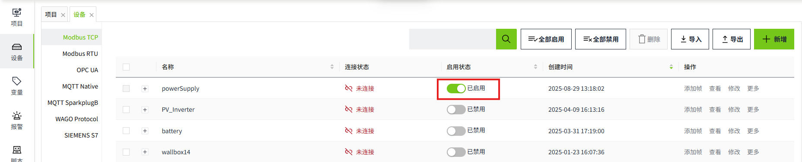
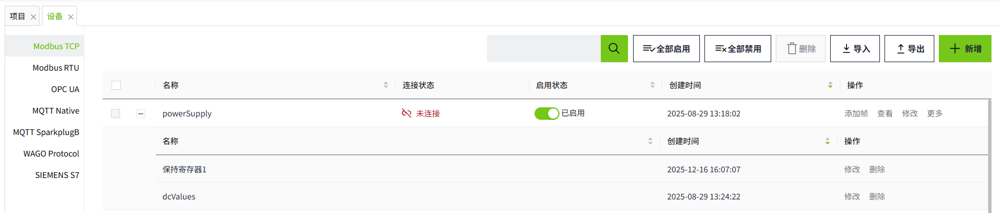
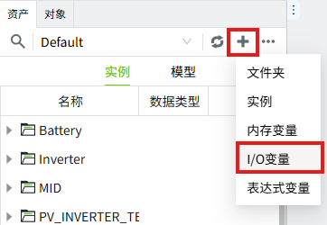
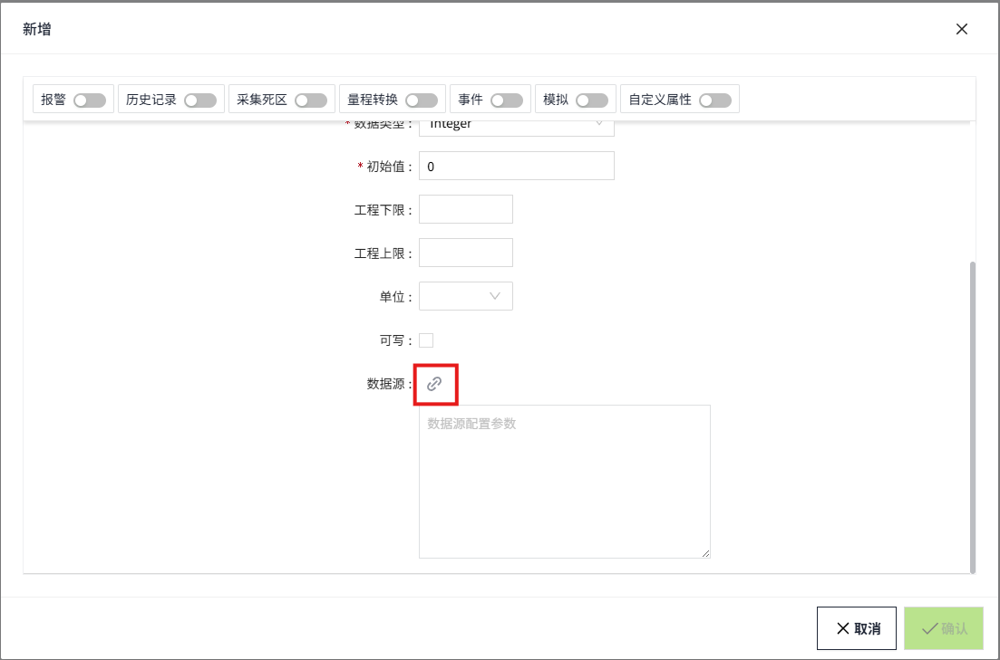
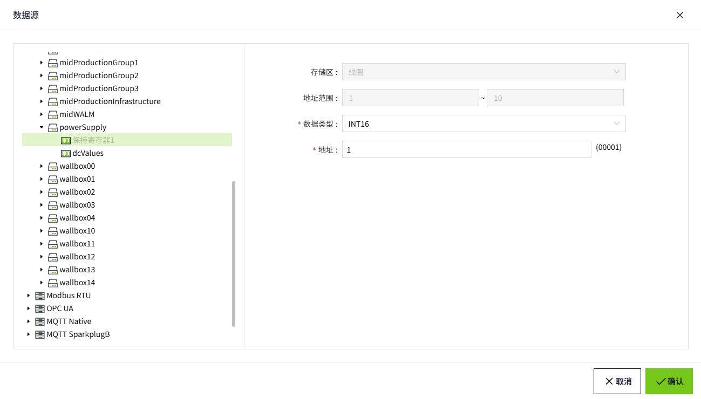

# Modbus TCP

The Modbus TCP driver in VC Hub communicates data with devices (typically PLCs, sensors or other industrial devices) via the TCP/IP network communication protocol. The driver handles the underlying details of the Modbus TCP protocol and ensures reliable data interaction between devices.

## **Connecting to a Modbus TCP device**

1. On the "**Devices**" -> "**Modbus TCP**" page, click the "**Add**" button.
2. On the Add page, leave the default values and enter the following information in the following fields (Note: The following data is only an example, please fill in the fields according to the actual situation).
    - Device Name: Test1
    - Address: 10.160.100.33
    - Port: 502
    - Connection timeout (ms): 10000
    - Read data timeout(ms): 5000
    - Write Data Timeout (ms): 2000
3. Click the **"OK"** button. The data will be displayed in the device list page of Modbus TCP.
   
4. Click the Enable button in the Enable Status column to enable the device.
   
**Configuration Fields**

| **Name**                | **Description**                                   |
|-------------------------|-----------------------------------------------------|
| Device Name             | The name of the device connection.                  |
| Address                 | The domain name or IP address of the device.        |
| Port                    | Port number of the device, default 502.             |
| Connection Timeout (ms) | Connection timeout for the device, in milliseconds. |
| Read Data Timeout (ms)  | Read data timeout for the device, in milliseconds.  |
| Write Data Timeout (ms) | The device's write data timeout in milli.seconds    |

5.In the action bar of the created device, click on the "**Add Frame**" button to add a frame to the current device.

   **Frame**: The frame is the same as a data frame in the Modbus protocol, it is the basic unit of data transmission, it is used to record the slave address, storage area, start and end address, data encoding format and frequency of data acquisition for data communication, and the I/O tags can be bound to the frame in the VC Hub program.

6.In the Add Frame page, leave the default values and enter the following information in the following fields 
   **Note:** The following data is only an example, please fill in the fields according to the actual situation).
- Name: HoldingRegister1
- Slave Address: 1
- Function: Holding register
- Start Address: 1
- Ending Address: 10
- Data Encoding: Big Endian
- Frequency (ms): 1000

7.Click the **"OK"** button. The data will be displayed under the previously created device.
   

**Configuration Fields**

| **Name**     | **Description**                                                                                                              |
|----------------|------------------------------------------------------------------------------------------------------------------------------|
| Name           | Name of the frame.                                                                                                           |
| Slave Address  | Slave address of the frame.                                                                                                  |
| Function       | The memory area of the frame.                                                                                                |
| Start Address  | The start address of the frame.                                                                                              |
| Ending Address | The end address of the frame.                                                                                                |
| Data Encoding  | The data encoding method of the frame                                                                                        |
| Frequency (ms) | The frequency of data acquisition in milliseconds. (Displayed only when the memory area is an input register, hold register) |

**Note**

1. In the device list, The **Enabled Status** indicates whether the device has been enabled or not, unenabled devices will not connect and enabled devices will try to connect; the **Connection Status** indicates whether the device has successfully established a communication connection with the system.
2. **Enable All** and **Disable All** are to enable or disable all data in the list.
3. The data code is not required when the storage area is a single coil and discrete volume input.
4. Connections are not shared between all devices.

## **Tag Binding**

Binds tags to the data from a ModbusTCP device.

1. Create an I/O tag. 
   
2. On the edit screen of the tag, click the binding button of the data source. 
   
3. In the Data Source pop-up window, select the frame under the created ModbusTCP device and enter the following information in the following fields (Note: The following data is only an example, please fill in according to the actual situation).
    - Function: Holding register
    - Address Range: 1 ~ 10
    - Data Type: UINT16
    - Address: 1
4. Click the "OK" button to complete the binding.
   

**Configuration Fields**

| **Function**             |                                                                                                                                     |
|--------------------------|-------------------------------------------------------------------------------------------------------------------------------------|
| **Name**                 | **Description**                                                                                                                     |
| Coil Status              | Used to store switching-type data, usually indicating the binary switching state (ON/OFF). Corresponds to function codes 01 and 05. |
| Input Status             | Used to store read-only switching-type data, usually representing the binary input state. Corresponds to function code 02.          |
| Input Register           | Used to store read-only 16-bit register data. Corresponds to function code 04.                                                      |
| Holding Register         | Holding register is used to store 16-bit register data that can be read and written. Corresponds to function codes 03, 06, and 16.  |
| **Address Range**        | The start address and end address of the frame.                                                                                     |
| **Supported Data Types** |                                                                                                                                     |
| **Name**                 | **Description**                                                                                                                     |
| INT16                    | This data type is displayed when the data type of the tag is Integer.                                                               |
| INT32                    | This data type is displayed when the data type of the tag is Integer.                                                               |
| INT64                    | This data type is displayed when the data type of the tag is Integer.                                                               |
| INT8                     | This data type is displayed when the data type of the tag is Integer.                                                               |
| UINT16                   | This data type is displayed when the data type of the tag is Integer or Bool.                                                       |
| UINT32                   | This data type is displayed when the data type of the tag is Integer.                                                               |
| UINT64                   | This data type is displayed when the data type of the tag is Integer.                                                               |
| UINT8                    | This data type is displayed when the data type of the tag is Integer.                                                               |
| DOUBLE                   | This data type is displayed when the data type of the tag is Double.                                                                |
| FLOAT32                  | This data type is displayed when the data type of the tag is Double.                                                                |
| **Address**              | The address of the storage area.                                                                                                    |
| **Bit**                  | The bit of the address of the storage area. This field is displayed when the tag's data type is Bool.                               |

