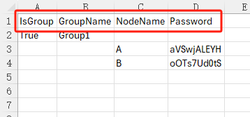
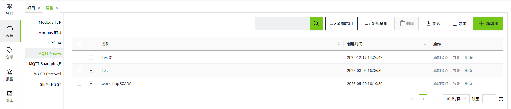

# Batch Operation of MQTT Native Devices

In industrial settings, it is often necessary to create multiple devices in bulk. VC Hub enables this through its export and import functions.

**Note:** To quickly create devices, it is recommended to first manually add a device to the list. Then, export the device and use the exported fields as a reference to add new devices.

## Batch Addition

#### 1.Export Devices

Click the "Export" button in the upper right corner of the list to export all device information.

When exporting MQTT Native devices, the exported file will include node information.

**Example of an Exported File:**

- The content inside the red box represents the field information.
- If it is a group, the "IsGroup" field is set to **True**.
- Node information is listed directly under the corresponding group. For example, in the image above, the group **"Group1"** has 2 nodes,  **A and B**.

#### 2.Adding Devices in Excel

Select the groups and nodes, then drag the mouse to quickly copy.

#### 3.Import Devices

Click the "Import" button in the upper right corner of the list to import the exported content. After importing, the newly added devices will have their enabled status set to "Disabled" by default.

## Batch Modification

You can batch modify device information through the exported Excel. After making changes in the Excel, import it back. During the import, the data will be updated based on the name.

- If the group name in the Excel matches the name in the MQTT Native list, the data in the Excel for that entry will be used to update the data.
- If the group name and node name in the Excel match the entries in the MQTT Native list, the data in the Excel for that entry will also be used to update the data.
- If the group name or node name in the Excel does not exist in the MQTT Native list, the group and node will be added to the list.
- If a group in the MQTT Native list does not exist in the imported file, the data for that group will remain unaffected in the list.

## Batch Deletion

After selecting the devices to be deleted, click the **Delete** button at the top of the list to perform batch deletion.

Notes:

- If there are **Enabled nodes** under the group, the group is not allowed to be deleted.
- Only groups on the current page can be deleted; cross-page deletion is not supported.
- When a group is deleted, its associated nodes will also be deleted.
