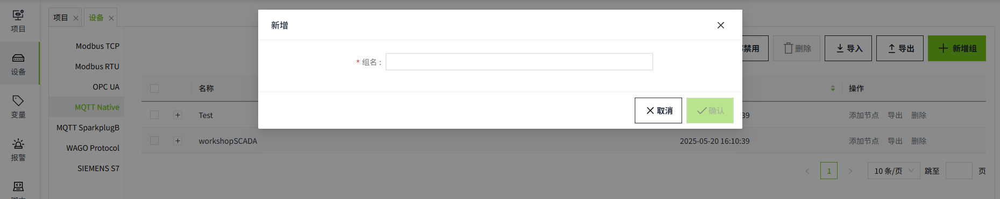
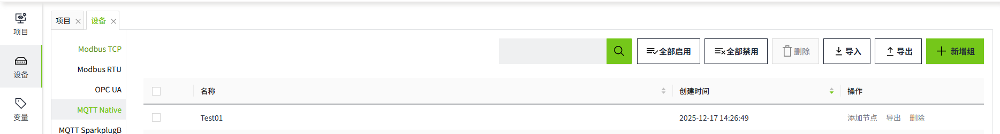
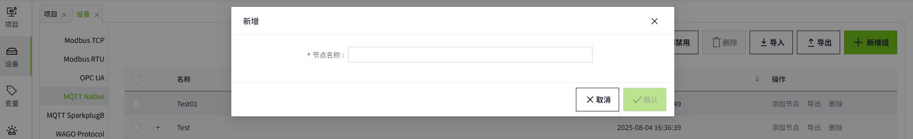
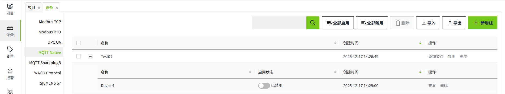
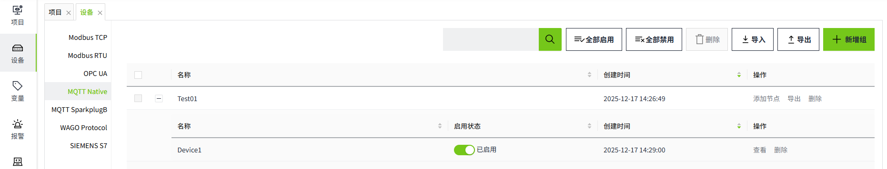
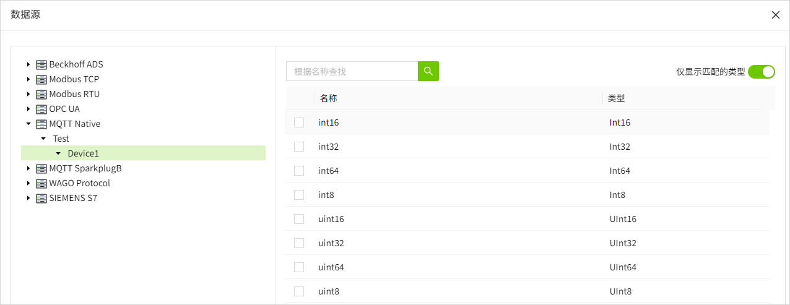

# MQTT Native

The MQTT Native driver in VC Hub is designed and developed based on the MQTT protocol and supports the transmission of message information that satisfies the MQTT protocol. At the same time, the system comes with an MQTT Broker, which allows users to connect via the system-provided accounts and passwords and communicate with data via the MQTT Native driver.

## **Driver Connection to MQTT Broker**

1. On the "**Devices**" -> "**MQTT Native**" page, click the "Add Group" button.
     Groups: Groups are a way to organize devices into groups for easier management and operation.
2. Enter a **group name** in the Add page.
    
3. Click the "**OK**" button. The data will be displayed in the device list page of MQTT Native.
    
4. Click "**Add Node**" in the Operation column, enter the node name and add a new node for the current group.
**Node**: Node represents the entity of a specific device, and has a unique identifier, which is used to distinguish each device.
    
5. Click the "**OK**" button. The data will be displayed in the node list page of the current group. Please note that the Status column only indicates the start/stop status of the current node, not the connection status.
    
6. Click the Enable button in the  Enabled Status column to enable the node.
    

**Configuration Fields**

| **Name** | **Description**                                                                                             |
|-------------|-------------------------------------------------------------------------------------------------------------|
| Group Name  | Group name of the driver, unique in the driver list.               .                                        |
| Node Name   | Name of a node of the group, unique in the group.                                                           |
| Username    | The account number used to connect to a node, automatically generated by the system and cannot be modified. |
| Password    | Password used to connect with a node, automatically generated by the system, supports reset.                |

**Note:**

1. In the node list, The **Enabled Status** indicates whether the device has been enabled or not, unenabled devices will not connect and enabled devices will try to connect.
2. **Enable All** and **Disable All** are to enable or disable all data in the list.
3. Please keep the user name and password information in a safe place to avoid leakage to unauthorized personnel, and if leakage occurs, please reset the password in time.

## **Connecting to MQTT Broker**

Before using the MQTT Native driver, you need to connect to the system's MQTT Broker. please follow the steps below to connect:

1. Get account and password: Click the "View" button on the node to see the username and password provided by the system.
2. Configure Client: In your application or device, configure the MQTT client to connect to the system's MQTT Broker:
     - Broker Address: Fill in the address of the system MQTT Broker.
     - Broker Port: Fill in the port number of the system MQTT Broker. The default is 1884.
     - Client ID: Fill in a unique client identifier that identifies your connection on the MQTT Broker.
     - Username and Password: Use the account and password you obtained.
3. Connect to MQTT Broker: Use the MQTT client to connect to the system's MQTT Broker in your application or device. After confirming that the connection is successful, you can start transferring device data with the MQTT Native driver using the configured client.

## **Publishing and Subscribing to Device Data**

The MQTT Native driver is designed and developed based on the MQTT protocol. The Topic of the message sent by the MQTT client accessing the driver needs to follow the following structure:

Subject: Topic

**wsV1.0/group_name/message_type/node_name/[device_name]**

| **Elements** | **Description**                                     |
|---------------|----------------------------|
| ws1.0         | Root element for fixed content.  |
| group_name    | This element is a logical grouping identifier for the client, corresponding to the group name in the system, which can be grouped according to logical or practical usage requirements, such as distinguishing A/B workshops, a/b production lines, etc. This element can be any legal string, but cannot contain special characters, such as */+#, etc., and its content is as simple as possible. This element can be any legal string, but must not contain special characters, such as */+#, etc., and must be as short as possible. |
| message_type  | This element describes how the payload message should be handled. The system defines the following message_type:   1. **NBIRTH** - device point information, initializes all device information and point information under a Node  2. **NDATA** - point data, sends the point data under a device  3. **NCMD** - point command, writes back the point data under a device NCMD - Measurement point data, writes back measurement point data under a device.                                                                             |
| node_name     | This element is a client-unique identifier that corresponds to a node name in the system. This element can be any legal string, but must not contain special characters such as */+# and must be as short as possible.                                                                                                                                                                                                                                                                                                                   |
| device_name   | [Optional] This element is a device unique identifier, which can be any physical or logical device associated with the node. This element is optional and can be used by the client to send a message to the specified device. The device_name can be repeated across nodes and can be any legal character, but cannot contain special characters such as */+#, etc., and is as short as possible.                                                                                                                                       |

**message_type explanation**

1. **NBIRTH** - Transport Device Configuration Information
    **Topic:** wsV1.0/**{group_name}**/NBIRTH/**{node_name}**
    **Permission:** Write
    After successfully connecting to VC Hub, the client can push all device configuration information and measurement point configuration information under the current node_name to the system through this Topic.
2. **NDATA** - Transmission of measurement point data
    **Topic**：wsV1.0/**{group_name}**/NDATA/**{node_name}**/**[{device_name}]** 
    **Permission:** Write
    After successfully pushing the measurement point configuration information, the client can push the measurement point data to the system through this Topic.
3. **NCMD** - Return Measurement Point Data
    **Topic:** wsV1.0/**{group_name}**/NCMD/**{node_name}**/**[{device_name}]**  
    **Permission:** Read  
    Clients can subscribe to this Topic to receive data when they need and allow certain points to receive values from the system.

- Square brackets `[]` indicate that the path segment is **optional**.
- Curly braces `{}` indicate that the content is a **placeholder** (to be replaced with an actual value).
- Therefore, combining them as `[{group_name}]` means it is an "**optional placeholder**".

**payload Structure**

1. Topic: wsV1.0/group_name/NBIRTH/node_name

payload Structure:

| **Attribute** | **Type** | **Description**               |
|---------------|----------|-------------------------------|
| DeviceName    | String   | Device Name                   |
| Tags          | Sets     | Measurement Point Information |
| -Name         | String   | Name of measurement point     |
| -Description  | String   | Point Description             |
| -Address      | Ulong    | Point address/alias           |
| -DataType     | integer  | Point Data Type               |

**Name** can be the name of the test point or the path of the test point. When you need to group and categorize the test points, you can follow the following format, such as: "Name": "first/second/testTag", you can attribute the testTag test points to the second directory, and the second directory to the first directory. At the same time, second is attributed to the first directory.

The **DataType** set is as follows

| **Value** | **Type** | **Description**                         |
|-----------|----------|-----------------------------------------|
| 0         | Unknown  | Unknown data type                       |
| 1         | Int8     | 8-bit signed integer                    |
| 2         | Int16    | 16-bit signed integer                   |
| 3         | Int32    | 32-bit signed integer                   |
| 4         | Int64    | 64-bit signed integer                   |
| 5         | UInt8    | 8-bit unsigned integer                  |
| 6         | UInt16   | 16-bit unsigned integers                |
| 7         | UInt32   | 32-bit unsigned integers                |
| 8         | UInt64   | 32-bit unsigned integers                |
| 9         | Float    | Single precision floating point         |
| 10        | Double   | Double precision floating point numbers |
| 11        | Boolean  | Boolean                                 |
| 12        | String   | String                                  |
| 13        | DateTime | Date                                    |

Sample Message:

```json
[
    {
        "DeviceName": "Device1",
        "Tags": [
            {
                "Name": "Temp",
                "Description": "Temperature",
                "Address": 1,
                "Value": 35,
                "DataType": 1
            },
            {
                "Name": "Voltage",
                "Description": "Voltage",
                "Address": 2,
                "Value": 10,
                "DataType": 1
            }
        ]
    },
    {
        "DeviceName": "Device2",
        "Tags": [
            {
                "Name": "Temp",
                "Description": "Temperature",
                "Address": 1,
                "Value": 35,
                "DataType": 1
            },
            {
                "Name": "FolderA/Items/TagA",
                "Description": "TagA",
                "Address": 2,
                "Value": 35,
                "DataType": 1
            }
        ]
    }
]
```
2.Topic：wsV1.0/group_name/NDATA/node_name/[device_name]

payload Structure:

| **Attribute** | **Type** | **Description**             |
|---------------|----------|-----------------------------|
| Name          | String   | Measurement point name/path |
| Value         | String   | Measurement point value     |
| Timestamp     | Int      | Point timestamp             |

Sample Message:

```json
{
    "Tags": [
        {
            "Name": "Temp",
            "Value": 45,
            "Timestamp": 1687858118
        },
        {
            "Name": "Voltage",
            "Value": 10,
            "Timestamp": 1687858118
        }
    ]
}
```
Considering the bandwidth saving and improving the transmission performance, the timestamps of all measurement points can be represented by a separate attribute, prioritizing the use of the Timestamp of the measurement point, or the Timestamp of the top-level object if the Timestamp of the measurement point doesn't exist, as shown in the following example.

```json
{
	"Timestamp": 1687858118,
	"Tags": [{
			"Name": "Temp",
			"Value": 45
		},
		{
			"Name": "Voltage",
			"Value": 10
		}
	]
}
```
3.Subscribe Topic：wsV1.0/group_name/NCMD/node_name/[device_name]

Your received payload Structure:

| **Attribute** | **Type** | **Description**             |
|---------------|----------|-----------------------------|
| Name          | String   | Measurement point name/path |
| Value         | string   | Measurement point value     |

Sample Message:

```json
{"Name":"Voltage","Value":120}
```
 
## **Binding to tags**

Bind the tag to the client measurement point.

1. Create an I/O tag.<br>
    
2. On the add window, click the binding button of the data source.
    
3. Select the groups, nodes, devices and directories to be bound, and check the data types to match the measurement points.
    
4. Click the "**OK**" button to complete the configuration.

