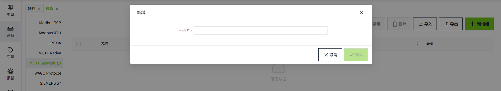
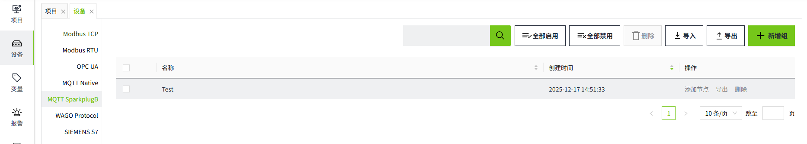
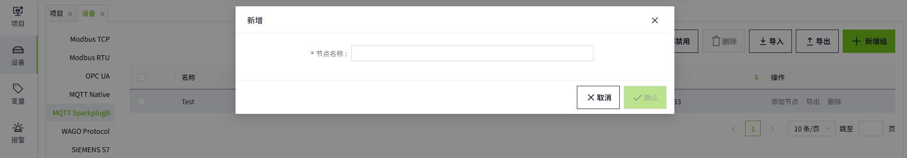
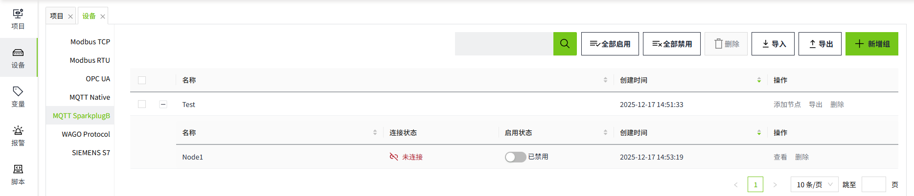
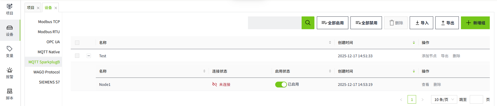
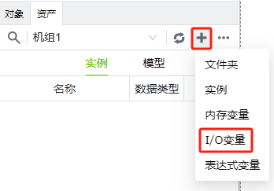
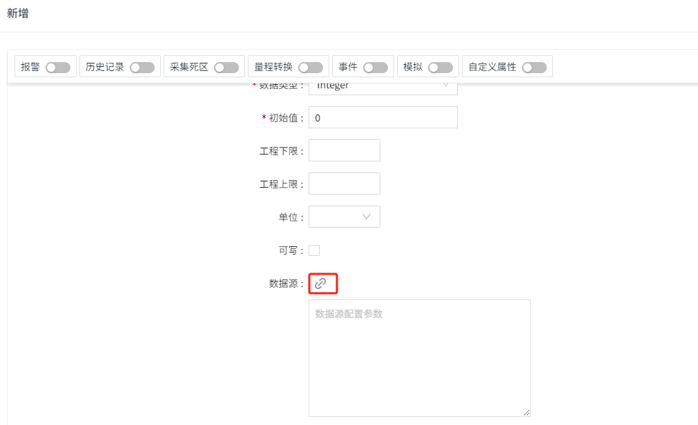
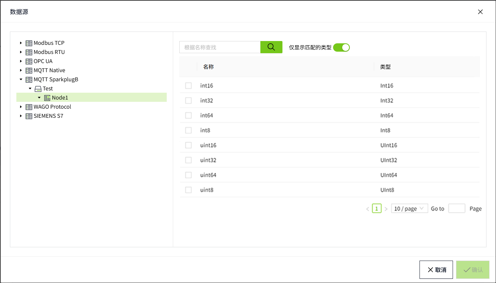

# MQTT SparkplugB

The MQTT SparkplugB driver in VC Hub is designed and developed based on the MQTT protocol and supports the transmission of message information that satisfies the SparkplugB protocol. At the same time, the system comes with an MQTT Broker, which allows the user to connect with the account and password provided by the system and communicate with the data via the MQTT SparkplugB driver.

## **Driver Connection to MQTT Broker**

1. On the "**Devices**" -> "**MQTT SparkplugB** page, click the "**Add Group**" button.
   Groups: Groups are a way to organize devices into groups for easier management and operation.
2. Enter a **group name** in the Add page. 
   
3. Click the **"OK"** button. The data will be displayed in the device list page of MQTT SparkplugB. 
   
4. Click "Add Node" in the Operation column, enter the node name and add a new node for the current group.
   **Node:** Node represents the entity of a specific device, and has a unique identifier, which is used to distinguish each device. 
   
5. Click the **"OK"** button. The data will be displayed in the node list page of the current group. Please note that the status column only indicates the start/stop status of the current node, not the connection status. 
   
6. Click the Enable button in the Enable Status column to enable the node.
   

**Configuration Fields**

| **Name**   | **Description**                                                                                                                   |
|------------|-----------------------------------------------------------------------------------------------------------------------------------|
| Group Name | The group name of the driver, unique in the driver list.                                                                          |
| Node Name  | Name of a node of the group, unique in the group.                                                                                 |
| Username   | The account number used to connect to a particular edge node (EoN), automatically generated by the system and cannot be modified. |
| Password   | Password used to connect with a certain edge node (EoN), automatically generated by the system, supports reset.                   |

**Note:**

1. In the node list, The **Enabled Status** indicates whether the device has been enabled or not, unenabled devices will not connect and enabled devices will try to connect; the **Connection Status** indicates whether the device has successfully established a communication connection with the system.
2. **Enable All** and **Disable All** are to enable or disable all data in the list.
3. Please keep the user name and password information in a safe place to avoid leakage to unauthorized personnel, and if leakage occurs, please reset the password in time.

Data types currently supported by the system:

| **Type** | **Description**                         |
|----------|-----------------------------------------|
| Int8     | 8-bit signed integer                    |
| Int16    | 16-bit signed integer                   |
| Int32    | 32-bit signed integer                   |
| Int64    | 64-bit signed integer                   |
| UInt8    | 8-bit unsigned integer                  |
| UInt16   | 16-bit unsigned integers                |
| UInt32   | 32-bit unsigned integers                |
| UInt64   | 32-bit unsigned integers                |
| Float    | Single precision floating point         |
| Double   | Double precision floating point numbers |
| Boolean  | Boolean                                 |
| String   | String                                  |
| Text     | Text; same as string                    |
| DateTime | Date                                    |

## **Connecting to the System MQTT Broker**

Before you can use the MQTT SparkplugB driver, you need to connect to the system's Sparkplug Application, follow the steps below to do so:

1. Get account and password: Click the "View" button on the node to see the username and password provided by the system.
2. Configure Client: In your application or device, configure the edge node (SparkplugB Node) to connect to the system's Sparkplug Application:
      - Broker Address: Fill in the address of the system MQTT Broker.
      - Broker Port: Fill in the port number of the system MQTT Broker. The default is 1883.
      - Client ID: Fill in a unique client identifier that identifies your connection on the system MQTT Broker.
      - Username and Password: Use the account and password you obtained in the system.
      - ScadaHostIdentifier: WagoScada
      - GroupName: corresponds to the group name in the driver list
      - NodeName: corresponds to the node name in the driver list group
3. Connecting to the MQTT Broker: Using an MQTT client that supports the SparkplugB protocol, connect to the system's MQTT Broker in your application or device, and after confirming that the connection is successful, you can start using the client to transfer device data with the MQTT SparkplugB driver.
4. The messaging follows the SparkplugB protocol, for more information please refer to the official documentation at [ https://www.eclipse.org/tahu/spec/sparkplug_spec.pdf]( https://www.eclipse.org/tahu/spec/sparkplug_spec.pdf) .

## **Binding to tags**

Bind a tag to a client measurement point.

1. Create an I/O tag 
   
2. On the edit screen of the tag, click the binding button of the data source.
   
3. Select the groups, nodes, devices, and directories to be bound, and check the measurement points with matching data types.
   
4. Click the "**OK**" button to complete the configuration.

