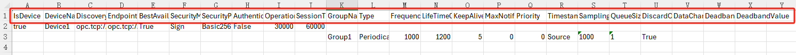
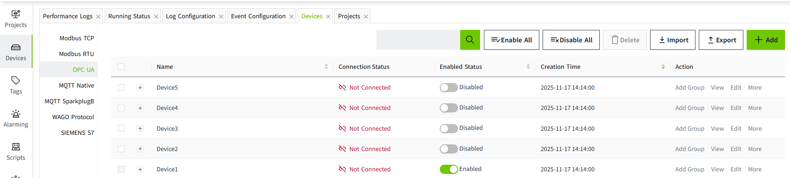
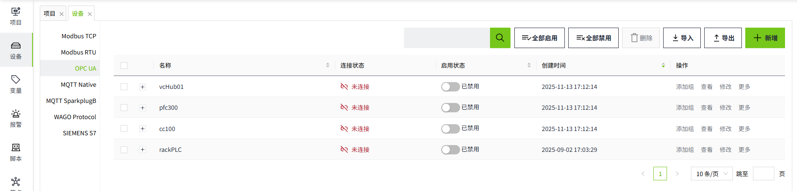

# Batch Operation of OPC UA Devices

In industrial settings, it is often necessary to create multiple devices in bulk. VC Hub enables this through its export and import functions.

**Note:** To quickly create devices, it is recommended to first manually add a device to the list. Then, export the device and use the exported fields as a reference to add new devices.

## Batch Addition

#### 1.Export Devices

Click the "Export" button in the upper right corner of the list to export all device information.

When exporting OPC UA devices, the exported file will include frame information.

**Example of an Exported File:**

- The content inside the red box represents the field information.
- If it is a device, the "IsDevice" field is set to **True**.
- Group information is listed directly under the corresponding device.For example, in the image above, the device **"Device1"** has 2 groups, D and P.

**Note**: If the OPC UA device uses a **username** and **password** for authentication, these two fields will not be included during export. After importing the device, you need to manually set the username and password for each device.

#### 2.Adding Devices in Excel

Select the devices and groups, then drag the mouse to quickly copy.

#### 3.Import Devices

Click the "Import" button in the upper right corner of the list to import the exported content. After importing, the newly added devices will have their enabled status set to "Disabled" by default.

## Batch Modification

You can batch modify device information through the exported Excel. After making changes in the Excel, import it back. During the import, the data will be updated based on the name.

- If the device name in the Excel matches the name in the OPC UA list, the data in the Excel for that entry will be used to update the data.
- If the device name and group in the Excel match the entries in the OPC UA list, the data in the Excel for that entry will also be used to update the data.
- If the device name or group name in the Excel does not exist in the OPC UA list, the device and group will be added to the list.
- If a device in the OPC UA list does not exist in the imported file, the data for that device will remain unaffected in the list.

## Batch Deletion

After selecting the devices to be deleted, click the **Delete** button at the top of the list to perform batch deletion.

Notes:

- Devices that are **Enabled** cannot be deleted.
- Only devices on the current page can be deleted; cross-page deletion is not supported.
- When a device is deleted, its associated groups will also be deleted.
