# OPC UA

Used for communication with the OPC UA server. Only UA TCP is supported,  UA HTTPS is currently not supported.

## **Connect to an OPC UA Server**

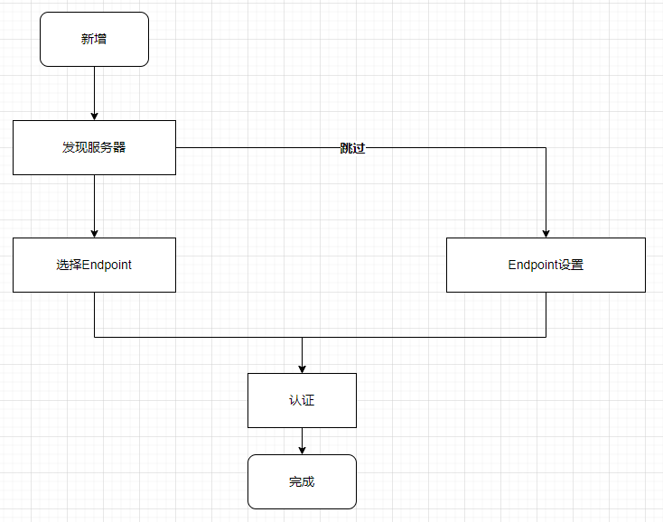

1. On the "**Devices**" ->" **OPC UA**" page, click the “**Add" **button ，open the " Server Discovery" popup.

2. On the "**Server Discovery**" page, after entering the Discovery URL, click the search button to display the list of all OPC UA servers under the current URL.

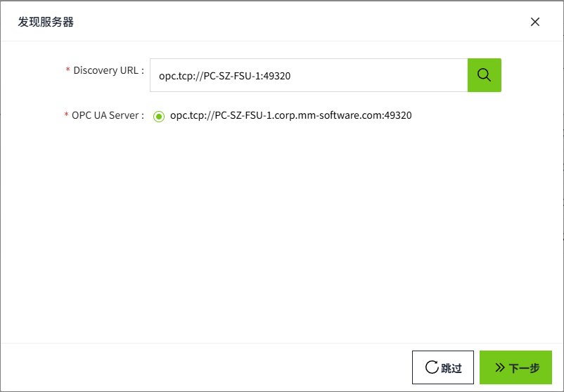

   **Note**: Click the "**Skip**" button to manually configure connection settings. This is especially useful when the server does not allow anonymous endpoint access but provides a separate discovery endpoint. 

3. Select a server and click "Next" to proceed to the "Select Endpoint" page. Choose a security policy and security mode. The default selection is **Best Available**. Selecting an entry means that the chosen security policy and security mode will be used to connect to the endpoint.

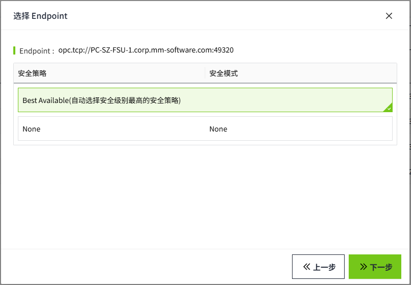

4. Click ​**Next** to proceed to the ​**Authentication** page, where you can enter the device **Name**.

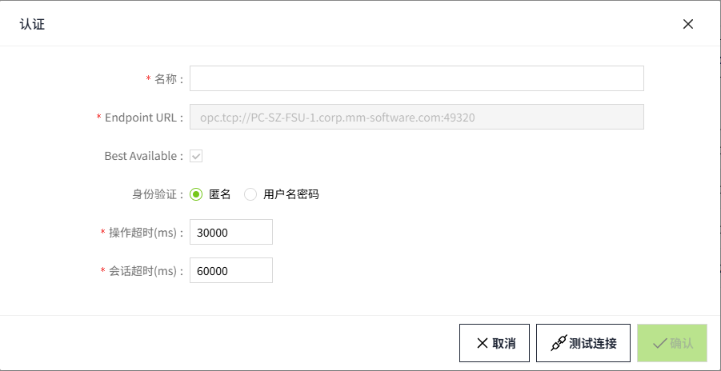

**Configuration Fields**

| **Name**            | **Description**                                                          |
|------------------------|--------------------------------------------------------------------------|
| Name                   | Name of the frame connection.                                            |
| Endpoint URL           | The address of the device connection.                                    |
| Best Available         | Use the highest level of security to connect.                            |
| Security Mode          | Protection level for communication with OPC UA servers.                  |
| Security Policy        | Specific algorithms and protocols for implementing secure communication. |
| Authentication         | Whether the device has authentication enabled.                           |
| -Username              | The username used for device authentication.                             |
| -Password              | The ​password used for device authentication.                            |
| Operation Timeout (ms) | The operation timeout time of the device in milliseconds.                |
| Session Timeout (ms)   | The session timeout time for the device in milliseconds.                 |

5. Click the **"OK"** button. The data will be displayed on the OPC UA list.

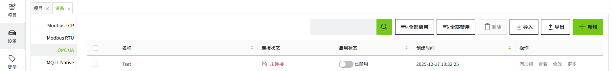

6. Click the Enable button  to enable the device.

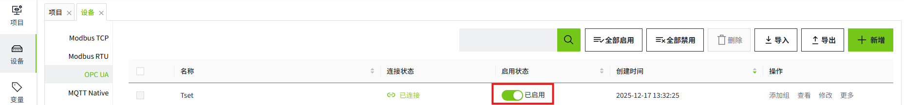

7. Click the "Add Group" button on the created device to open a new window and add a group to the current device.

Each group represents a subscription set, which can be created based on different subscription methods or intervals. The driver subscribes to and receives data according to the group's configuration.

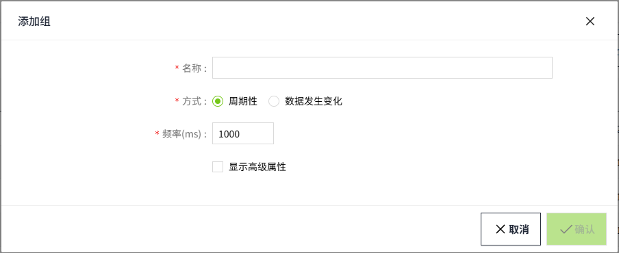

8. On the "Add Group" page, check **"Show Advanced Properties"** to access additional settings.

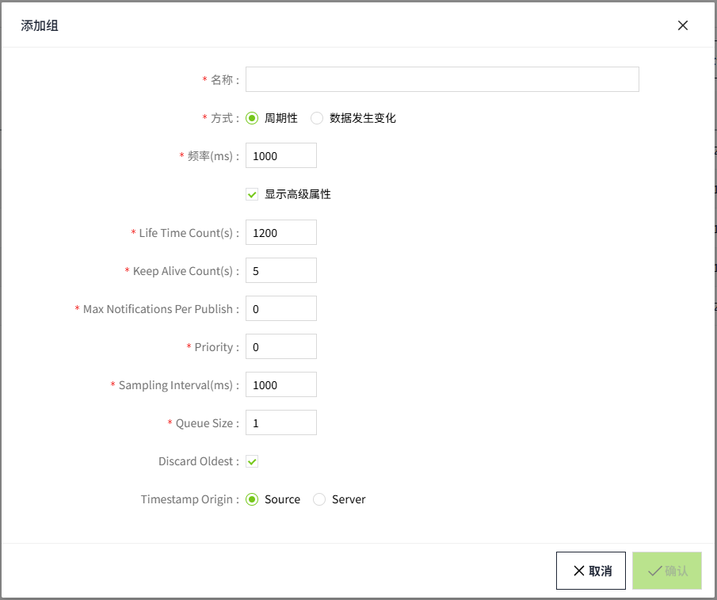

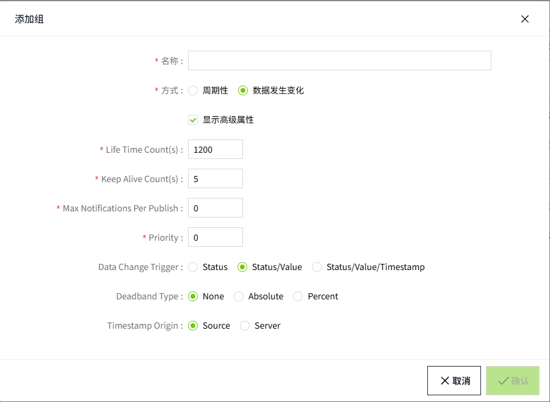

**Advanced Property Fields**

| **Name**                      | **Description**                                                                                                                                                                                                                        |
|-------------------------------|----------------------------------------------------------------------------------------------------------------------------------------------------------------------------------------------------------------------------------------|
| Life Time Count(s)            | Maintain the subscription in an active state for a default duration of 1200 seconds.                                                                                                                                                   |
| Keep Alive Count(s)           | Specifies the maximum time between Publish responses for a Subscription. If no notifications are available, an empty Publish response is returned in order to tell the Client that the Subscription is still alive. The default is 5s. |
| Max Notifications Per Publish | Specifies the maximum number of notifications that the Client wishes to receive in a single Publish response. A value of zero indicates that there is no limit.                                                                        |
| Priority                      | This setting defines the priority of the subscription relative to other subscriptions created by the client.A Client that does not require special priority settings should set this value to zero.                                    |
| Sampling Interval(ms)         | The sampling interval. The default is 1000ms.                                                                                                                                                                                          |
| Queue Size                    | The requested size of the MonitoredItem queue. The default is 1.                                                                                                                                                                       |
| Discard Oldest                | Specifies the discard policy when the queue is full and a new Notification is to be queued. The default is true.                                                                                                                       |
| Data Change Trigger           | Specifies the conditions under which a data change notification should be reported. The default is STATUS_VALUE.                                                                                                                       |
| Deadband Type                 | The type of deadband.                                                                                                                                                                                                                  |
| Deadband Value                | The value of deadband, if the range condition is not met, no data change notification will be triggered.                                                                                                                               |
| Timestamp Origin              | Specifies the Timestamp Attributes to be transmitted for MonitoredItems or Nodes in Read and HistoryRead. The default is 'Source'.                                                                                                     |

For more detailed information on advanced properties, please refer to the official documentation:   [https://reference.opcfoundation.org/](https://reference.opcfoundation.org/) 

9. Click the **"OK"** button. The data will be displayed under the previously created device.

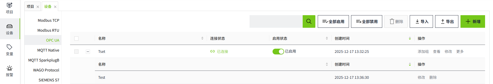

## **Note**

1. **Enable All** and **Disable All **are to enable or disable all data in the list.
2. The **MaxNodesPerBrowse** configuration item on the server side affects the loading performance of the driver node, and it is recommended to set this configuration item to a larger value when more measurement points are configured on the server side.
3. In the device list, The **Enabled Status** indicates whether the device has been enabled or not, unenabled devices will not connect and enabled devices will try to connect; the **Connection Status** indicates whether the device has successfully established a communication connection with the system.
## **Connection Example**

#### **Connecting with Kepware**

Configure the OPC client connection:

1. Follow the steps in the example above to create an OPC UA device and group. 
2. Click Test Connection.

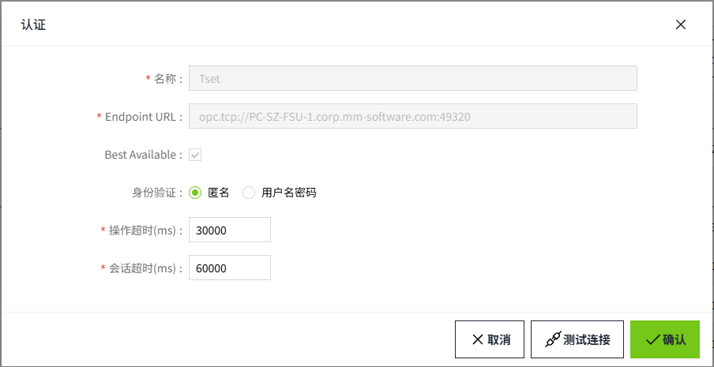

3. The connection will be displayed as "**Test Connection Failed**". This is usually correct and expected because KEPServerEX denies access to the OPC UA client that the system creates for the first time. Therefore it is only necessary to allow KEPServerEX to trust the OPC UA client created by the system. 
4. On the server where KEPServer is installed, right-click on the KEPServerEX icon on the desktop where KEPServerEX is installed and select "**OPC UA Configuration**" from the menu. As shown in the following figure, click the Trusted Clients tab:

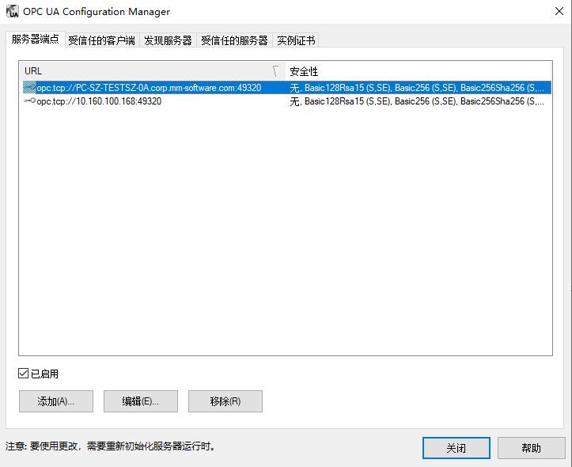

5. Click the Trusted Clients tab.

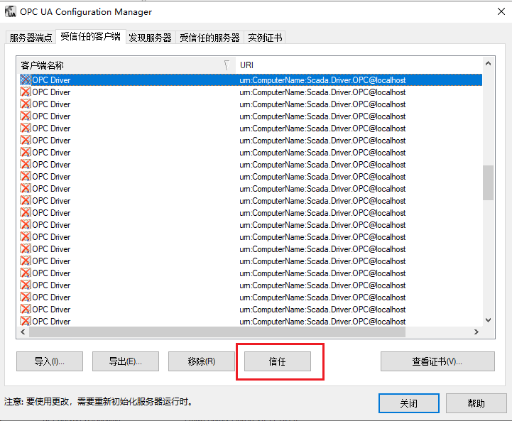

6. Click the corresponding OPC UA client for your system, click the** Trust **button, and then click Close. The OPC Server Connections page now displays the status of the Kepware to which you want to connect.
7. Right-click the KEPServerEX icon on the desktop where KEPServerEX is installed and select **Reinitialize** from the menu.
8. Re-click **Test Connection** to verify that the connection was successful.
9. Click **View** in the action bar to display information about the directories or nodes configured in the OPC UA server (Kepware).

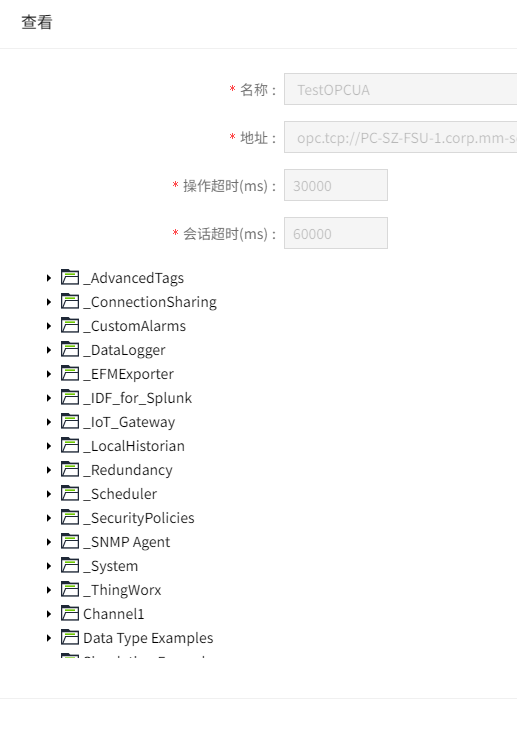

10. Click on any directory or node to display the relevant property information for the current directory or node on the right side.

#### **Connecting with Codesys**

Check OPC Port in Codesys:

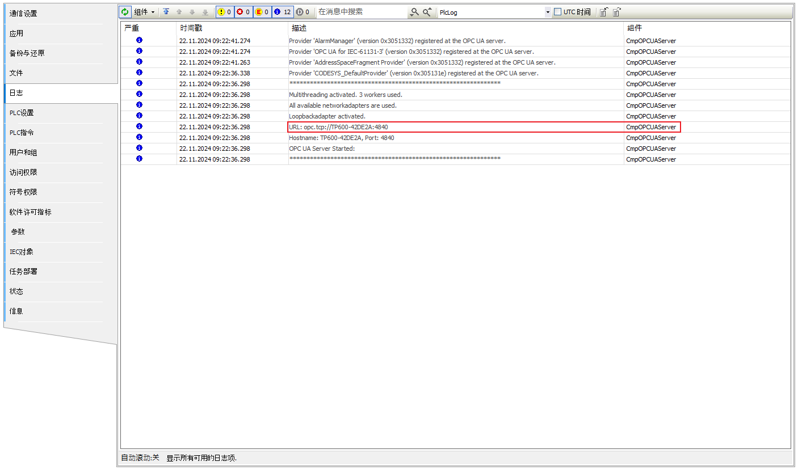

Configure the OPC client connection:

1. Follow the steps in the example above to create an OPC UA device and group. 
2. Click Test Connection.

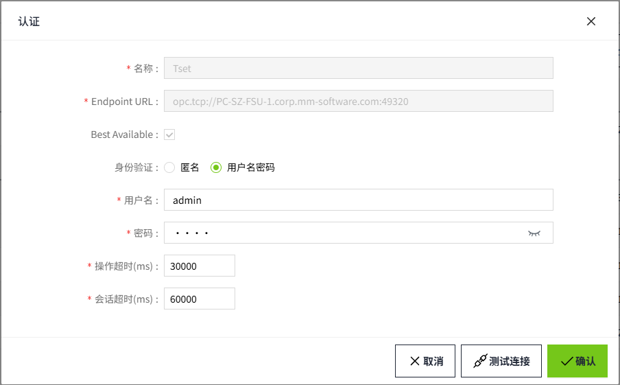

3. Trust WagoScada certificate in Codesys

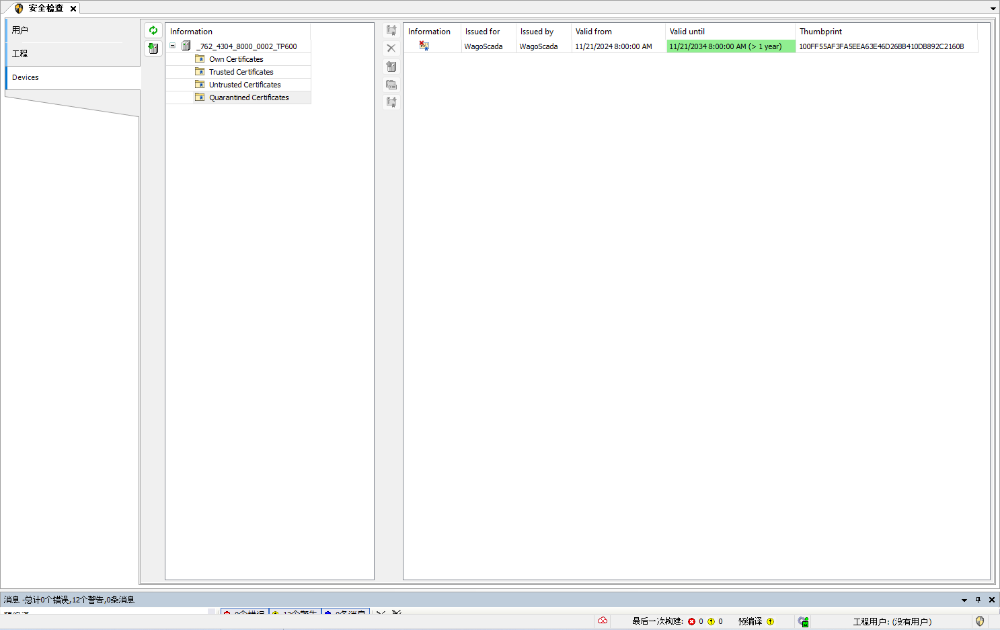

## **Binding to Tags**

Bind tags to data in the driver.

1. Create an I/O tag.

2. On the add window, click the binding button of the data source.

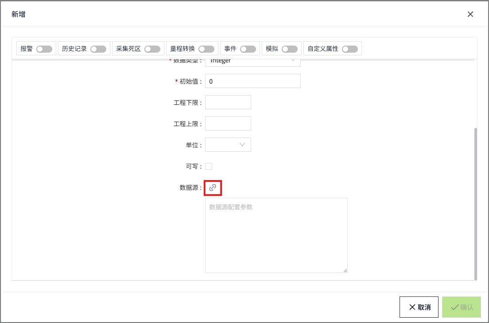

3. In the pop-up data source window, you will see the node tree of the OPC UA Server. This tree structure reflects the server's hierarchy, containing all available objects, directories, and nodes.
   1. Click the expand button ▶ next to a node name to expand the node and view its child nodes.
   2. Click on the node you wish to bind. Once selected, the node will be highlighted, and the right window will update to display the relevant property information for that node.
   3. If the selected node is an array, you can enter the desired index in the designated field on the right to access specific elements of the array. For example, entering 0 will access the first element of the array.
   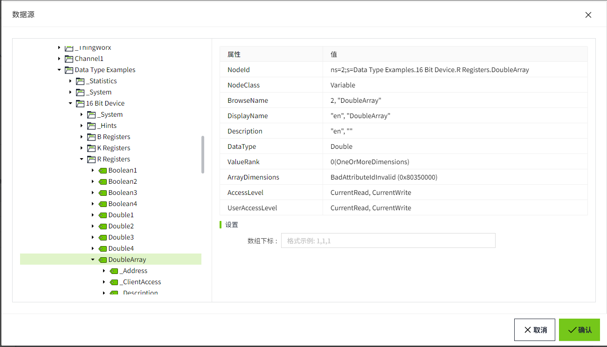
4. After completing the node selection and property editing, please ensure that you click the '**OK**' button on the interface to save your settings and binding information.
5. If you decide not to proceed with the current binding, you can click the **'Cancel'** button to discard the changes you've made.

**Important Note on Updating NodeId:**

If you manually or batch-update the **NodeId** property, you must also update the corresponding **Path** property accordingly — or re-select the node in the Data Source Binding window. Failure to do so may cause the node displayed in the UI to become inconsistent with the actual bound node.

**Supported Data Types**

| **DataType**      | **Suggested Tag DataType**                    | **Read/Write** | **Description**                                                                                |
|-------------------|-----------------------------------------------|----------------|-----------------------------------------------------------------------------------------|
| Null              | [any]                                         | R              | **any:** Any data type.  Not a universal data type, usually occurs when an error occurs |
| Byte              | Integer                                       | R/W            |                                                                                         |
| SByte             | Integer                                       | R/W            |                                                                                         |
| Int16             | Integer                                       | R/W            |                                                                                         |
| Int32             | Integer                                       | R/W            |                                                                                         |
| Int64             | Integer                                       | R/W            |                                                                                         |
| UInt16            | Integer                                       | R/W            |                                                                                         |
| UInt32            | Integer                                       | R/W            |                                                                                         |
| UInt64            | Integer                                       | R/W            | The current maximum supported value is 9,223,372,036,854,775,807.                       |
| Float             | Double                                        | R/W            |                                                                                         |
| Double            | Double                                        | R/W            |                                                                                         |
| String            | String                                        | R/W            |                                                                                         |
| Boolean           | Bool                                          | R/W            |                                                                                         |
| DateTime          | DateTime                                      | R/W            |                                                                                         |
| Guid              | String                                        | R              |                                                                                         |
| ByteString        | String                                        | R              |                                                                                         |
| XmlElement        | String                                        | R              |                                                                                         |
| NodeId            | String                                        | R              |                                                                                         |
| ExpandedNodeId    | String                                        | R              |                                                                                         |
| StatusCode        | String                                        | R              |                                                                                         |
| QualifiedName     | String                                        | R              |                                                                                         |
| LocalizedText     | String                                        | R              |                                                                                         |
| ExtensionObject   | String                                        | R              |                                                                                         |
| DataValue         | [any]                                         | R              |                                                                                         |
| Variant           | [any]                                         | R              |                                                                                         |
| Number            | Double                                        | R/W            |                                                                                         |
| Integer           | Integer                                       | R/W            |                                                                                         |
| UInteger          | Integer                                       | R/W            |                                                                                         |
| Enumeration       | Integer                                       | R/W            |                                                                                         |
| Array[**Simple**] | *Select based on the type of array elements.* | R/W            | **Simple:** Basic data types such as Int16, String, etc.                                |
| Array[**Struct**] | String                                        | R              | **Struct:** Structure.                                                                  |

