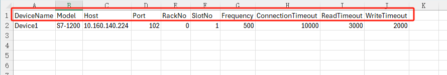
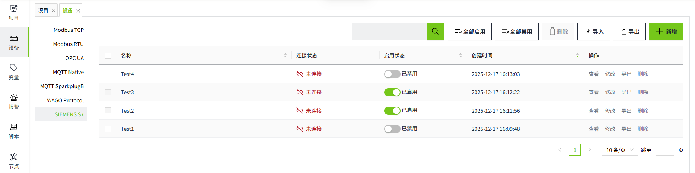
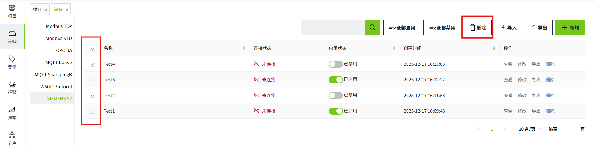

# 批量操作SIEMENS S7设备

在工业现场，往往需要批量创建设备。WAGO VC Hub通过**导出和导入**功能来实现这一功能。

**说明：**要想实现快速创建设备，建议先在列表中手动新增一条设备信息，之后将该设备进行导出，根据导出的字段信息添加新的设备。

#### 批量新增

###### 1.导出设备

点击列表右上角的“导出”按钮，可以将列表中的所有设备信息进行导出。

导出文件示例：

- 红框中内容为字段信息。

###### 2.在Excel中新增设备

选中设备，拉动鼠标，完成快速复制。设备名称会递增。

型号在批量创建的时候，数值不需要递增。将其填充方式改为填充单元格即可。

###### 3.导入设备

点击列表右上角的“导入”按钮，可以将导出的内容进行导入。导入后，新增的设备的启用状态默认为“已禁用”。

#### 批量修改

可以通过导出的excel，对设备信息进行批量修改。修改后将excel导入，导入时，将按照名称进行数据更新。

- Excel中的设备名称和SIEMENS S7列表中的名称一致，则使用excel中的该条配置进行数据更新。
- Excel中的设备名称在SIEMENS S7列表中不存在，则在列表中新增该设备。
- SIEMENS S7列表中的设备名，不存在于导入文件中，则导入后，列表中的该数据不受影响。

#### 批量删除

勾选需要删除的设备后，点击列表上方的删除按钮进行批量删除。

**说明：**

1. 已启用状态的设备不允许删除
2. 只能对当前页的数据进行删除，不支持跨页删除

