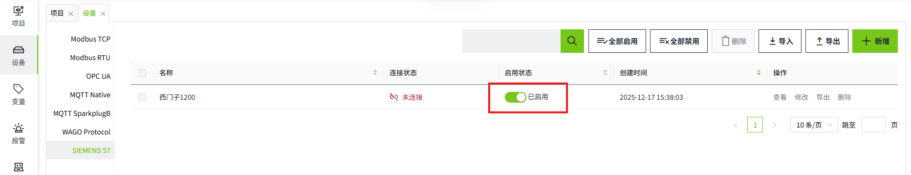
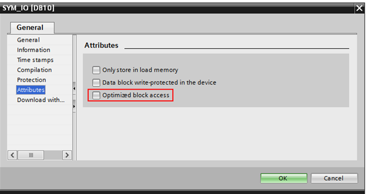
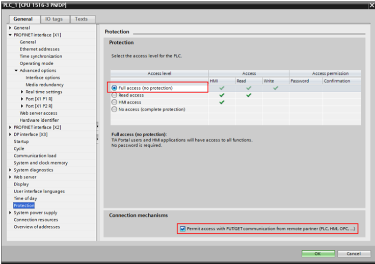
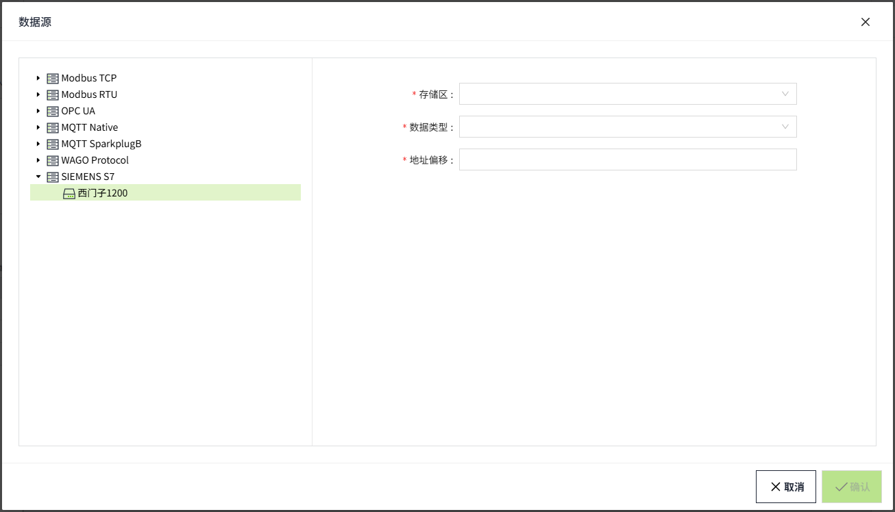

# SIEMENS S7

WAGO VC Hub中的西门子驱动程序支持与 S7 设备的基本连接。目前，WAGO  VC Hub具有适用于以下西门子 PLC 的驱动程序：

- S7-300
- S7-400
- S7-1200
- S7-1500

#### 连接到 SIEMENS 设备

1. 在”**设备**“->”**SIEMENS S7**“页面，点击“**新增**”按钮。
2. 在新增页面，保留所有默认值，并在以下字段中输入如下信息（说明：以下数据仅为示例，请根据实际情况填写）。

       设备名称：西门子1200

       型号：S7-1200

       地址：输入设备的 IP 地址，例如 100.10.4.12

       端口：102

       机架号：0

       槽号：2

       频率：1000

3. 单击**“确认”**按钮。此时该条数据将显示在SIEMENS S7的设备列表页面。状态一栏，仅表示驱动程序的启停状态，并不代表和设备的真正连接状态。

4. 在启用状态一栏点击启用按钮，启用该设备。

**配置字段**

| **名称**   | **描述**                                      |
|:------------|:-----------------------------------------------|
| 设备名称   | 设备连接的名称。                               |
| 型号       | 设备的型号。包括S7-300、S7-400、S7-1200、S7-1500。 |
| 地址       | 设备的域名或 IP 地址。                         |
| 端口       | 连接到设备时要使用的端口。                     |
| 机架号     | 设备所在的机架编号。                           |
| 槽号       | 分配给 CPU 的插槽编号。                        |
| 频率       | 数据采集的频率，单位毫秒。                      |
| 连接超时   | 连接的超时时间，单位毫秒。                      |
| 读数据超时 | 读取数据的超时时间，单位毫秒。                  |
| 写数据超时 | 写入数据的超时时间，单位毫秒。                  |

#### 注意事项

1. 设备列表中，**启用状态**表示设备是否已被启用，未启用的设备不会进行连接，启用的设备会尝试进行连接；**连接状态**表示设备是否已成功与系统建立通信连接。
2. **全部启用**和**全部禁用**，是对列表中的所有数据进行启用或禁用。
3.  暂不支持相同IP下多个设备共享连接。
4.  对于Bool变量不支持按位写，每次写值覆盖之前的字节。
5.  对于S7-1200和S7-1500，必须进行以下注意事项和配置更改 ：

- 必须 关闭优化块访问。

-  访问级别必须为“完全”且“连接机制”必须允许GET/PUT。

-  只能访问Global DB。
- 定时器 （TM） 和计数器 （CT） 区域不支持读取和写入。

#### 和变量绑定

将变量和西门子PLC中的数据进行绑定。

1. 创建一个I/O变量。

2. 在变量的编辑界面，点击数据源的设置按钮。

3. 在弹出的数据源窗口中，选择已创建的西门子设备，并在以下字段中输入如下信息（说明：以下数据仅为示例，请根据实际情况填写）。

参数类型：DB

DB数据块号：2

数据类型：Int

地址偏移：4

4. 点击“确认”按钮，完成设置。

**配置字段**

| **参数类型**       |                                                                                                                                                                                                                            |
|:--------------------|----------------------------------------------------------------------------------------------------------------------------------------------------------------------------------------------------------------------------|
| **名称**           | **描述**                                                                                                                                                                                                                   |
| I                  | 输入                                                                                                                                                                                                                       |
| Q                  | 输出                                                                                                                                                                                                                       |
| M                  | 标志                                                                                                                                                                                                                       |
| DB                 | 数据块                                                                                                                                                                                                                     |
| **支持的数据类型** |                                                                                                                                                                                                                            |
| **名称**           | **描述**                                                                                                                                                                                                                   |
| Byte               | 当变量的数据类型为Integer 时，才显示该数据类型。                                                                                                                                                                             |
| Word               | 当变量的数据类型为Integer 时，才显示该数据类型。                                                                                                                                                                             |
| LWord              | 当变量的数据类型为Integer 时，才显示该数据类型。                                                                                                                                                                             |
| DWord              | 当变量的数据类型为Integer 时，才显示该数据类型。                                                                                                                                                                             |
| Int                | 当变量的数据类型为Integer 时，才显示该数据类型。                                                                                                                                                                             |
| SInt               | 当变量的数据类型为Integer 时，才显示该数据类型。                                                                                                                                                                             |
| USInt              | 当变量的数据类型为Integer 时，才显示该数据类型。                                                                                                                                                                             |
| UInt               | 当变量的数据类型为Integer 时，才显示该数据类型。                                                                                                                                                                             |
| UDI nt             | 当变量的数据类型为Integer 时，才显示该数据类型。                                                                                                                                                                             |
| DI nt              | 当变量的数据类型为Integer 时，才显示该数据类型。                                                                                                                                                                             |
| Real               | 当变量的数据类型为Double 时，才显示该数据类型。                                                                                                                                                                              |
| LReal              | 当变量的数据类型为Double 时，才显示该数据类型。  | **注意：**  由于 Siemens 设备的限制，仅以下型号支持此数据类型：  - S7-1200 - S7-1500 | |-----------------------------------------------------------------------------------| |
| Bool               | 当变量的数据类型为Bool 时，才显示该数据类型。                                                                                                                                                                                |
| Char               | 当变量的数据类型为String 时，才显示该数据类型。                                                                                                                                                                              |
| String             | 当变量的数据类型为String 时，才显示该数据类型。                                                                                                                                                                              |
| Date               | 当变量的数据类型为DateTime 时，才显示该数据类型。                                                                                                                                                                            |
| **地址偏移**       | 读写的起始地址。                                                                                                                                                                                                            |
| **位偏移**         | 当变量的数据类型为Bool 时，才显示该字段。该偏移量始终被视为一个字节。                                                                                                                                                         |

