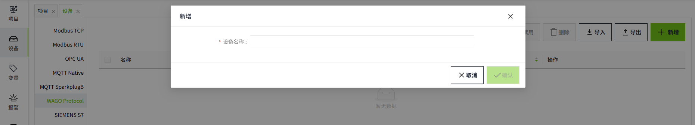
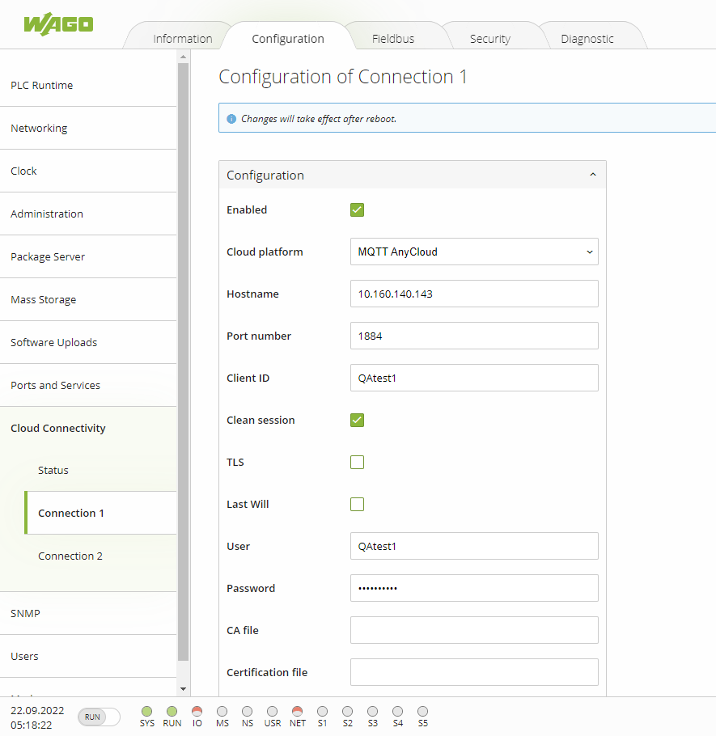
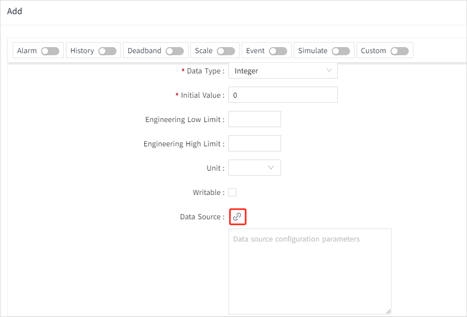
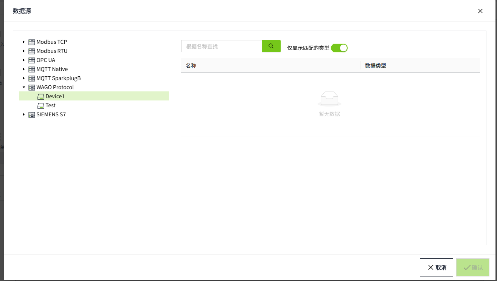

# WAGO Protocol

The WAGO Protocol driver in VC Hub supports the basic connection to WAGO PLCs. The system comes with an MQTT Broker, which supports the user's connection via the account and password provided by the system and the data communication via the WAGO Protocol driver.

Supports WAGO Protocol version 1.5.0.

## **Drive Connection to WAGO Protocol**

1. On the "**Devices**" -> "**WAGO Protocol**" screen, click the "Add" button.
2. Enter the device name in the Add window. 




3. Click on the "**OK**" button. The data will now be displayed in the device list of the WAGO Protocol. Please note that the status column only indicates the start/stop status of the driver, not the actual connection status of the device. 


**Configuration Fields**

| **Name**    | **Description**                                                                                                  |
|-------------|------------------------------------------------------------------------------------------------------------------|
| Device Name | Device name, unique in the device list.                                                                          |
| User Name   | Account number used to connect with a certain device, automatically generated by the system, cannot be modified. |
| Password    | Password used to connect with a certain device, automatically generated by the system, supports reset.           |

**Note:**

1. Please keep your username and password information in a safe place to avoid leakage to unauthorized personnel, and if leakage occurs, please reset your password in time.
2. **Enable All** and **Disable All **are to enable or disable all data in the list.

## **Connecting to the System MQTT Broker**

Before you can use the WAGO Protocol driver, you need to connect to the MQTT Borker, please follow the steps below to do so:

1. Get account and password: Click on the "View" button of the device to see the user name and password provided by the system.
2. Configuration of Cloud Connectivity

   - Use a web browser to open the WBM (Web-based Management) of your WAGO device.
   - Enter the **Username** and **Password** to authenticate on the PFC, then click **Submit**.
   - Under Configuration, select the **Cloud Connectivity** menu item and click on **Connection1**.
   - In the configuration section on the right, check the **Enabled** box to enable the current connection.
   - From the **Cloud platform** drop-down list, select MQTT AnyCloud.
   - In the **Hostname** field, enter the IP address published by your VC Hub program.
   - In the **Port** field, enter 1884.
   - In the **Client ID** field, enter the device identifier, **which must match the device name added in the WAGO Protocol device list**. This is used to identify your connection on the MQTT Server.
   - Check the Clean session box to enable session clearing.
   - In the **User** field, enter the username for connecting to the MQTT Server, **using the username from the device information added in the WAGO Protocol device lis**t.
   - In the **Password** field, enter the password for connecting to the MQTT Server, **using the password from the device information added in the WAGO Protocol device list**.
   - From the **Data protocol** drop-down list, select WAGO Protocol 1.5.
   - Click **Submit** and restart the device.
   - After a short wait, check the connection status in **Cloud Connectivity** on the WBM. The Cloud connection will display "connected".
   - *There is no need to configure other options, as the current VC Hub program does not implement them*.
**Note**: Please do not check **Use Compression**, as this will cause the WAGO Protocol driver to fail in processing data. And for the fields not mentioned in the above list, checking these fields does not affect functionality, because VC Hub has not yet implemented the corresponding features.

3. Connect to MQTT Broker: After confirming a successful connection, you can start transferring device data with the WAGO Protocol driver using the configured client. 




## **Enabling TLS Secure Connections**

The VC Hub program supports a secure connection with WAGO PLC devices via the TLS protocol.

Configure the client: Modify the connection configuration in the configuration page of the WAGO PLC device.

   - Port number: Change to 3883.
   - TLS: Select Enabled.
   - CA File: Fill in the path, /etc/ssl/certs/ server-cert.pem.
   - Obtain server certificate: Log in to the PLC system and execute commands:  openssl s_client -connect **[server IP]** :3883-showcerts </dev/null 2>/dev/null | openssl x509 -outform PEM > /etc/ssl/certs/server-cert.pem

**Note**: Replace [server IP] with the server IP deployed by VC Hub.


## **Publishing and subscribing to device data**

Refer to the WAGO Messaging Protocol , official documentation at  [https://www.wago.com/us/d/15719](https://www.wago.com/us/d/15719).

## **Binding to tags**

Bind a tag to a client measurement point.

1. Create an I/O tag


2. On the add window, click the binding button of the data source.



3. Select the  points to be bound.




4. Click the "**OK**" button to complete the configuration.

## WAGO Protocol PLC Program Command Request and Response Processing

Configure PLC Command:

```typescript
//Configure Command0 to accept three string parameters and reply with three string parameters.	
aCommandDescriptions[0].bCommandId := 0; // The command Id must be unique
aCommandDescriptions[0].bNumberOfRequestParameters := 3;
aCommandDescriptions[0].bNumberOfResponseParameters := 3;
aCommandDescriptions[0].sName := 'WriteValue';
//Configure the parameter names and types that Command0 receives
aCommandDescriptions[0].aRequestParameters[0].sParameterName := 'Name'; //The first parameter is the tag name.
aCommandDescriptions[0].aRequestParameters[0].eParameterType := WagoAppCloud.eCommandParameterType.CPT_STRING;
aCommandDescriptions[0].aRequestParameters[1].sParameterName := 'Value'; //The second parameter represents the tag value.
aCommandDescriptions[0].aRequestParameters[1].eParameterType := WagoAppCloud.eCommandParameterType.CPT_STRING;
aCommandDescriptions[0].aRequestParameters[2].sParameterName := 'RequestId'; //The third parameter is the request ID.
aCommandDescriptions[0].aRequestParameters[2].eParameterType := WagoAppCloud.eCommandParameterType.CPT_STRING;
//Configure the parameter names and types for Command0 response
aCommandDescriptions[0].aResponseParameters[0].sParameterName := 'Name'; //The first parameter is the tag name.
aCommandDescriptions[0].aResponseParameters[0].eParameterType := WagoAppCloud.eCommandParameterType.CPT_STRING;
aCommandDescriptions[0].aResponseParameters[1].sParameterName := 'Success'; //The second parameter indicates whether it was successful.
aCommandDescriptions[0].aResponseParameters[1].eParameterType := WagoAppCloud.eCommandParameterType.CPT_STRING;
aCommandDescriptions[0].aResponseParameters[2].sParameterName := 'RequestId'; //The third parameter is the request ID.
aCommandDescriptions[0].aResponseParameters[2].eParameterType := WagoAppCloud.eCommandParameterType.CPT_STRING;
```
 
Response processing:

```typescript
IF xCommandReceived THEN //After receiving the Command, xCommandReceived becomes True.
	dwReceivedCmdId := IncomingCommand.dwCommandId; //Obtain CommandId
	CASE dwReceivedCmdId OF //Determine CommandId
		0:
			response.dwCommandId:= dwReceivedCmdId; //The responseId should be consistent with the ReceivedId.
			response.bNumberOfResponseParameters := 3; //Set the reply parameter to 3
			response.dwInvokeId := IncomingCommand.dwInvokeId; //Set reply invocation ID
//Set three types of reply parameters        
response.aResponseParameters[0].eParameterType:=aCommandDescriptions[0].aResponseParameters[0].eParameterType; 
response.aResponseParameters[1].eParameterType:=aCommandDescriptions[0].aResponseParameters[1].eParameterType;			
response.aResponseParameters[2].eParameterType:=aCommandDescriptions[0].aResponseParameters[2].eParameterType;	
//Set three reply parameter names		
response.aResponseParameters[0].sParameterName:=aCommandDescriptions[0].aResponseParameters[0].sParameterName;		
response.aResponseParameters[1].sParameterName:=aCommandDescriptions[0].aResponseParameters[1].sParameterName;			
response.aResponseParameters[2].sParameterName:=aCommandDescriptions[0].aResponseParameters[2].sParameterName;
//Set the default values for the three reply parameters
response.aResponseParameters[0].sParameterValue := IncomingCommand.aRequestParameters[0].sParameterValue;     
                        //Request and response tag names should be kept consistent.
			response.aResponseParameters[1].sParameterValue :=BOOL_TO_STRING(FALSE); 
                        //Default Command execution failed
response.aResponseParameters[2].sParameterValue:=IncomingCommand.aRequestParameters[2].sParameterValue;
                        //The request and the reply request ID must be consistent.
			FOR index:=0 TO 9 BY 1 DO //Loop through and check if the name of the write value tag is consistent with the PLC tag name.
				IF(Publish.aTagConfiguration0[index].sTag=Name) THEN //Consistent then write the value
Publish.xVariable[index]:=STRING_TO_BOOL(IncomingCommand.aRequestParameters[1].sParameterValue);
				   response.aResponseParameters[1].sParameterValue :=BOOL_TO_STRING(TRUE);
                                   //Write value successful
				   EXIT;//Exit the loop
				END_IF
			END_FOR
			xResponseTrigger := TRUE;//Response
	END_CASE
END_IF
```
 
