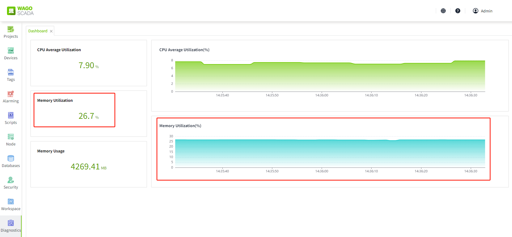
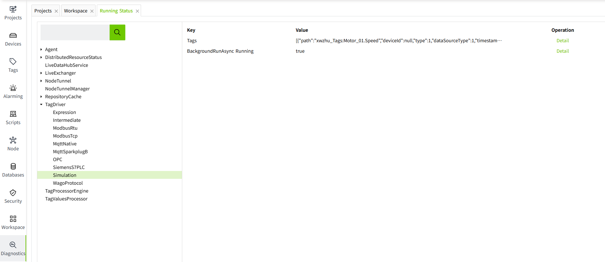
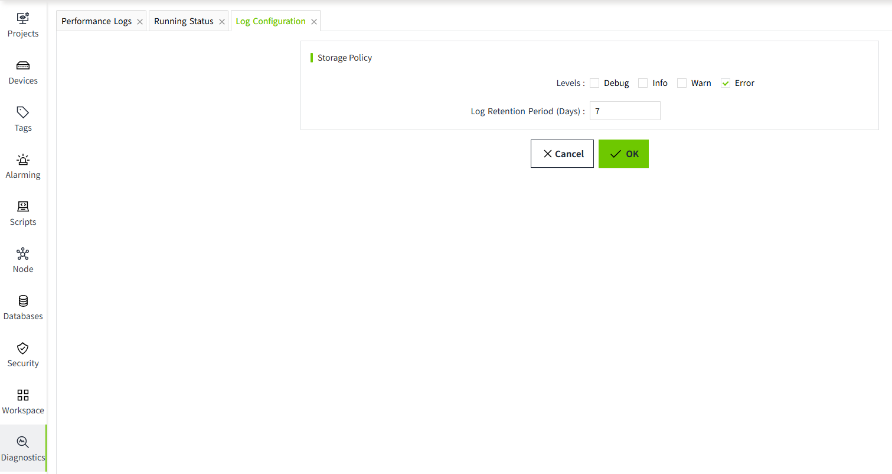
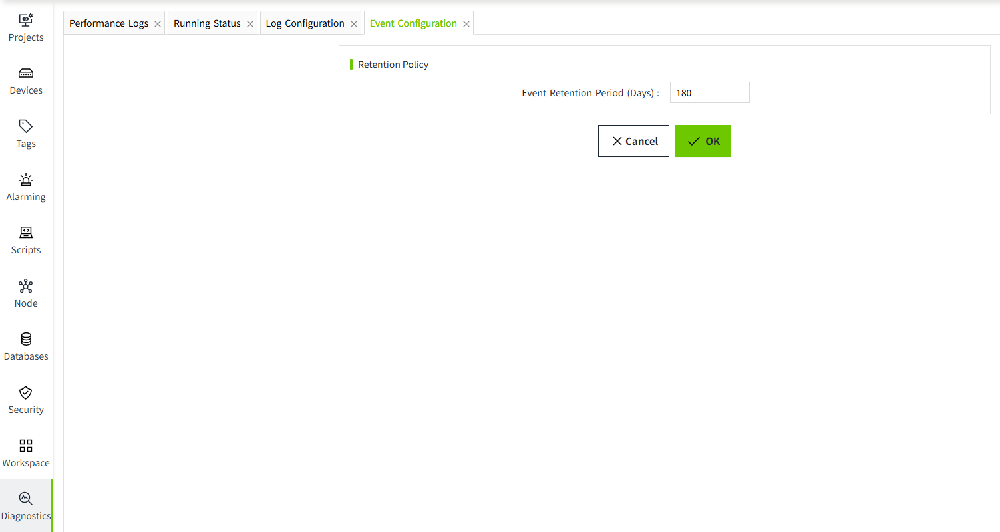

# Diagnostics

Diagnostic module is usually a tool for operation and maintenance personnel to carry out system diagnosis and troubleshooting, and is mainly used to query server status, logs and other information.

You can view related log data under the "Diagnostics" menu.

## **Dashboard**

The dashbaord is used to monitor and display the key indicators and data in real time to help users better understand the system operation and find and solve possible problems in time.

Indicators to be monitored:

- CPU Average Utilization
- Memory Utilization
- Memory Utilization

#### **CPU Average Utilization**

View the current CPU average utilization status through numerical values and line graphs. When the CPU average utilization exceeds 100%, it does not mean that the CPU is overloaded, but it is related to the number of cores of the CPU, for example, if the server CPU has 8 cores, then the percentage base of CPU utilization is 800%.

#### **Memory Utilization**

View the current server memory utilization percentage by value and line graph.

#### **Memory Usage**

With the specific memory usage values in the graph, you can clearly see how many MB of server memory is currently being used.

## **System Logs**

You can view the system logs recorded by the program on the System Logs page.

| **Icon**                                                                                                                                                                                                                              | **Level** |
|---------------------------------------------------------------------------------------------------------------------------------------------------------------------------------------------------------------------------------------|-----------|
| 
 | Debug     |
| 
 | Info      |
| 
 | Warn      |
| 
 | Error     |

Users can click on the "Details" button to the right of any data to view the specific log content.

**Filter**

- Time Range: the default range is from 00:00 of the current day to 00:00 of the next day, users can modify the time range for filtering query according to their needs, but the time span cannot exceed 24 hours.
- Log Level: Users can filter logs by log level, currently supports 4 levels, Debug, Info, Warn, Error, under the condition of selecting All, logs of all levels will be queried.
- Log content: Users can input the keywords of log content for fuzzy matching.

Click "Query" button after inputting conditions.

**Export**

Users can click the Export button to export all the data queried under the current filtering conditions and download it as an Excel file.

## **Performance Logs**

On the Performance Logs page, you can view the execution efficiency of core modules. 

## **Running Status**

You can view the execution status of a module on the Runninge Status page. Click the "Detail" button on the right to view the details.

## **Log Configuration**

You can configure the storage policy of system logs.

The default storage policy is to record only Error type logs and keep them for 7 days only. You can change it according to your needs. When you change it, you should consider the size of the hard disk, and it is not recommended to set the number of days to keep the logs too long. 

## **Event Configuration**

Used to configure the storage policy of tag events. The events recorded here can be displayed on the "Real-time Events" and "Historical Events" controls.

The default event expiration date is 180 days, and the system will clean up the stale data regularly according to the set expiration date. 

