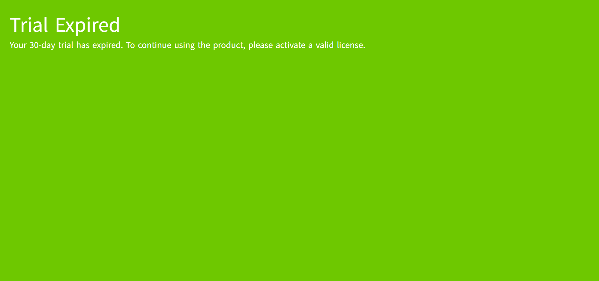
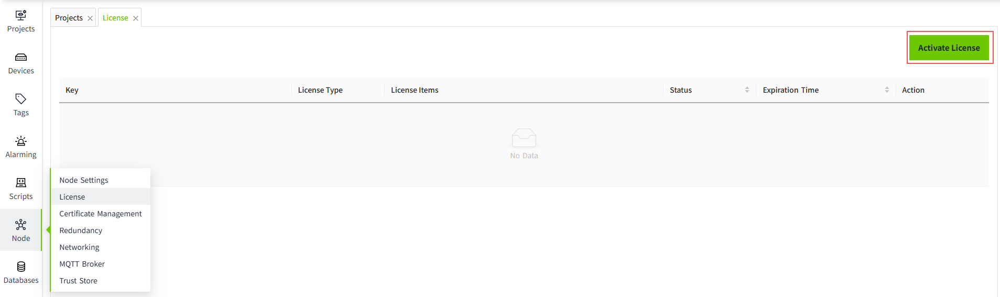

# License and Activation

VC Hub uses licenses to activate features on the VC Hub server. At the moment, only **online activation** is supported.

## Trial Mode

After installing VC Hub, the system automatically enters a **30-day trial period**. During the trial period, all features are fully available.

When the trial period expires:

- The **Admin Console** and **Designer** pages will remain accessible.
- **Driver data acquisition will stop**.
- The **Preview** and **Runtime** pages will display a message indicating that the trial has expired.

After the trial expires, you may:

1. **Enter a trial license again** to start another 30-day trial, or
2. **Purchase the appropriate feature licenses** to restore full functionality.

## Trial Countdown

The 30-day trial countdown starts **immediately after the installation** of VC Hub.

## Trial Expired

After the trial period expires, the preview and the running page will be forced to jump to the "Trial Expired" interface.

## Trial Extension

After the trial expires, you can enter another trial license (please contact Sales to obtain one) to extend the trial period for an additional 30 days.

You can also enter a new trial license **before** the current trial ends. Regardless of how many days remain, once a new trial license is applied, the trial countdown will automatically reset to 30 days.

## Activation

After activation, the license key will be **bound to the installation server**, and the same key cannot be activated on multiple servers.

Activation Steps:

1. Click ”Node“->"License", and click on the "Activate License" button.

2. Fill in the key and click the "Activate" button.

3. After successful activation, the license list will show the license information. For activated keys, you can perform deactivate and refresh operation.

## Deactivation

When you need to change the server, you must first perform a **deactivation**. After deactivation, the corresponding license will be removed from the current server. Unless necessary, please avoid using the deactivation function frequently.

## Refresh

You can refresh the license information at any time. After refreshing, the latest status of the license will be retrieved.

## Renewal

If you need to renew a license key, the sales representative will perform the renewal after the renewal order is completed. You only need to refresh the license information to obtain the updated validity period.

## Add Module

If you need to purchase additional modules, after the order is completed, the sales representative will provide the license key for the new module. You only need to activate the provided license key.

