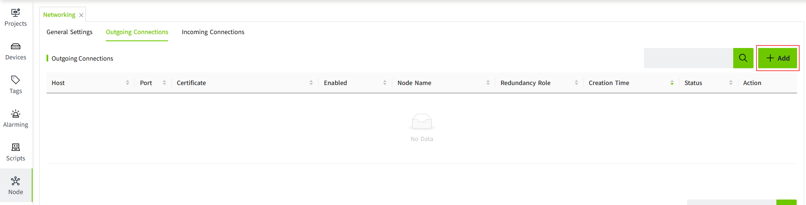

# Networking

The networking module allows multiple VC Hub instances to be connected to form a decentralized distributed cluster.

The Networking module provides the following features:

- A web socket-based tunnel network over which VC Hub instances can send and receive data.
- Cross-node remote asset tree access, other VC Hub instances can access the remote asset tree associated with the current VC Hub instance.
- Incoming connection security configuration based on white list or manual auditing, incoming connections can also be disabled.
- SSL support, incoming connections must start a secure connection when SSL is enabled, and incoming connections will not be successfully accessed until the certificate for the incoming connection has been audited.

**Note:** For the network to be formed, all the nodes must have the exact same version. Otherwise, some functions may malfunction.

## Data communication between networked servers

In a network setup, server A and server B are connected, and server B and server C are also connected. This configuration allows server A to view the asset information of server C.

## Networking Configuration Steps

The steps below will guide you through the configuration process for networking. We'll use Node A and Node B as an example.

**Example 1: No root certificate uploaded to the Trust Store of Node A and Node B**

Step 1: On Node A,** **go to "Node" → "Certificate Management", configure the *Redundancy and Networking Certificate*.

Step 2: On Node A,** **navigate to ”Node” → “Networking“ → “General Settings“, enable *Networking*. Keep “Require Two Way Authentication“ disabled.

Step 3: On Node B,** **go to "Node" → "Certificate Management", configure the *Redundancy and Networking Certificate*.

Step 4: On Node B,** **navigate to ”Node” → “Networking“ → “General Settings“, enable *Networking*.

Step 5: On Node A, navigate to ”Node” → “Networking“ → ** **"Outgoing Connections", create a new connection to Node B , the outgoing address should be set to the identifier of Node B, such as its node name or host address.

Step 6: On Node B, navigate to ”Node” → “Networking“ → ** **"Incoming Connections", under the certificate list, approve Node A’s certificate. Once approved, Node A will appear in the incoming connections list.

Step 7: On Node B, approve Node A’s connection from the incoming connection list. Once approved, the networking connection between Node A and Node B is established.

**Note:** If “Require Two Way Authentication“ is enabled on Node A, after step 5, Node B’s certificate will appear in Node A’s *Outgoing Certificate List*. You must approve it before continuing with the following steps. 

**Example 2: Networking root certificates already uploaded to the Trust Store of Node A and Node B**

Step1: On Node A, go to  "Node" → "Certificate Management", configure the *Redundancy and Networking Certificate*.

Step 2: On Node A, navigate to ”Node” → “Networking“ → “General Settings“, enable *Networking*. Keep “Require Two Way Authentication“ disabled.

Step 3: On Node B, go to  "Node" → "Certificate Management", configure the *Redundancy and Networking Certificate*.

Step 4: On Node B, navigate to ”Node” → “Networking“ → “General Settings“, enable *Networking*.

Step 5: On Node A, navigate to ”Node” → “Networking“ →  "Outgoing Connections", create a new connection to Node B , the outgoing address should be set to the identifier of Node B, such as its node name or host address.

Step 6: On Node B, navigate to ”Node” → “Networking“ →  "Incoming Connections",

- If the root certificate of Node A’s networking certificate exists in Node B’s Trust Store, the certificate will be automatically trusted and won’t appear in the certificate list. Node A will appear directly in the incoming connection list.
- If the root certificate is not present, Node A’s certificate will appear in the certificate list. Approve it to establish trust and display Node A in the incoming connection list.

Step 7: On Node B, approve Node A’s connection from the incoming connection list to complete the networking setup.

 **Note:** If “Require Two Way Authentication“  is enabled on Node A:     
 - If Node B’s root certificate is not in Node A’s Trust Store, its certificate will appear in Node A’s *Outgoing Certificate List* after step 5. Approve it to proceed.    
 - If Node B’s root certificate **is** in Node A’s Trust Store, the certificate will be automatically trusted and won’t appear in the certificate list. 

## **Basic Network Configuration**

After clicking "**Node**" > "**Networking**", users can see the general configuration page of networking. 

| **Configuration Item**         | **Description**  |
|--------------------------------|-----------------|
| Enabled                        | Uncheck the box to disable the networking function.  |
| Port                           | Default 8099, the listening port for networking.|
| Require Two Way Authentication | Performs two-way TLS authentication. If true, you need to approve the remote node's certificate in the outgoing list before approving this node's certificate in the remote node's incoming list. |
| Allow Incoming Connections     | Unchecked, all incoming connections will be denied.|
| Connection Policy              | The connection policy options for incoming connections are as follows:   1. Approved Only: Default policy, when the incoming connection is established, the incoming connection cannot be used to send and receive data. Users can find the corresponding incoming connection on the IncomingConnection Management page and click Approve before the incoming connection can be used to send and receive data.  2. Unrestricted: If you select Unrestricted, the incoming connection can be used to send and receive data directly after the connection is established.  3. Specified Node Names: When the node name of the incoming connection is included in the Specified Node Names list, the incoming connection can send and receive data directly after it is created. |
| Specified Node Names           | The list of node names, hidden by default. This configuration is visible when the user selects Specified Node Names in the connection policy. When the node name of the incoming connection is included in the list of specified node names, this incoming connection can send and receive data directly after it is created. |
| Ping Rate(ms)                  | In milliseconds, the frequency of heartbeats sent to the remote connection after the incoming connection is created. |
| Ping Timeout(ms)               | In milliseconds, the timeout for sending heartbeats to the remote connection after the incoming connection is created.|
| Missed Pings                   | In milliseconds, the maximum number of heartbeat failures after an incoming connection is created, and the incoming connection is determined to be unavailable. |

## **Outgoing Connections**

When the current node needs to connect to another node, you can create an outgoing connection from the current node.

**Note:** For clarity, the current node is referred to as **Node A**, and the other node is referred to as **Node B** in the following sections. 

**Add Outgoing Connection**: Click "Add" button to pop up the Add window, fill in the address and port of the remote VC Hub node and confirm, an outgoing connection will be created.

| **Configuration item**   | **Description**                                                                                                                                                          |
|--------------------------|--------------------------------------------------------------------------------------------------------------------------------------------------------------------------|
| Enabled                  | Uncheck to disable this outgoing connection.                                                                                                                             |
| Host                     | The network address of the remote VC Hub process.                                                                                                                        |
| Port                     | Default 8099, the listening port of the remote VC Hub node.                                                                                                              |
| Description              | Information about the outgoing connection.                                                                                                                               |
| Ping Rate(ms)            | In milliseconds, the frequency of heartbeats sent to the remote connection after the incoming connection is created.                                                     |
| Ping Timeout(ms)         | In milliseconds, the timeout for sending a heartbeat to the remote connection after the incoming connection is created.                                                  |
| Http Connect Timeout(ms) | In milliseconds, default 10000, the timeout for http requests to connect to a remote VC Hub process.                                                                     |
| Http Read Timeout(ms)    | Unit milliseconds, default 10000, timeout time for http request to send data to remote VC Hub process.                                                                   |
| Missed Pings             | After the incoming connection is created and the number of heartbeat failures exceeds the maximum number, this incoming connection will be determined to be unavailable. |

On the outgoing connections page, users can view all currently created outgoing connections as well as their statuses.

###### Managing Outgoing Connection Status

When adding an outgoing connection on **Node A**, the connection address should be set to the **node name** or **host** of **Node B**.

After the connection is added, the information displayed in the outgoing connection list will vary depending on the **"General Settings"** of **Node A**, and can be categorized into the following two cases:

1. If "Require Two Way Authentication" is disabled on **Node A**, only the  “Outgoing Connections“ list is displayed.

Just after creating an outgoing connection, the status of the node's outgoing connection is shown as **Faulted**.

The status of the data in the "Outgoing Connections" list depends on the operations performed on the ”Incoming Connections” page of **Node B**  for both certificates and incoming connections.

The status of the outgoing address is displayed as **Running** only if the certificate and the incoming connection are all approved on **Node B's** "Incoming Connections" page.

1. If "Require Two Way Authentication" is enabled on **Node A** , both the  “Outgoing Connections“ list and the "Certificate" list will be shown.

In this case, you must first **allow Node B’s certificate** in the certificate list on Node A’s outgoing connections page. Only after that will Node A appear in the incoming connection list on Node B.

The status of Node A’s outgoing connection will be shown as **"Running"** only when all the following conditions are met:

   1. On Node A’s “Outgoing Connections“ page, Node B’s  certificate in the “Certificate“** **list has been approved.
   2. On Node B’s ”Incoming Connections” page:
      - Node A’s certificate has been approved .
      - Node A’s incoming connection has been approved.
**Outgoing Connection Actions:** On the **outgoing connections list**, the following actions are available for each outgoing connection:

- **Enable**: Activates the outgoing connection.
- **Edit**: Opens a dialog window to modify the outgoing connection configuration.
- **Delete**: Removes the outgoing connection.After deletion, if this node was part of a connected network with other nodes, the connection will be terminated.

**Certificate Actions:** On the **certificate list**, the following actions are available for each certificate:

- **Allow**: Accepts the certificate and enables connection with the corresponding outgoing node.
- **Reject**: Denies the certificate.Once rejected, the node will no longer be able to establish a network connection with this node.
- **Delete**: Removes the certificate entry. After deletion, the node will not be able to join the network.
- **View**: Opens a dialog window displaying detailed information about the certificate.

#### **Incoming Connections**

After Node B is added as an outgoing address on Node A, information about **Node A** will appear in both the certificate list and the incoming connection list on **Node B’s Incoming Connections** page.

Once Node A’s certificate and incoming connection are allowed on Node B’s side, a network connection between the two nodes will be established.

Example:

1. Node A creates an outgoing connection and specifies Node B as the target address.On Node B, navigate to ”Incoming Connections”. 

You will see Node A’s certificate listed with a default status of “Pending Approval.”

2. On Node B’s "Incoming Connections" page, click **“Approve”** for Node A’s certificate. After approval, Node A will appear in the incoming connections list with a connection status of **“Pending Approval.”**

3. Approve the incoming connection for Node A. At this point, the networking between Node A and Node B is established.
4. On Node A, the outgoing connection to Node B will now show a status of **“Running.”**

**Note:**

If “Require Two Way Authentication” is enabled in Node A's "General Settings" page, you must first approve Node B’s certificate in Node A’s “Outgoing Certificate“ List. Only after that should you approve Node A’s certificate and connection in Node B’s “Incoming Connections“ page.Networking between Node A and Node B will only be successfully established after mutual certificate approval.

#### Managing Incoming Connection Status

**Certificate Actions:** On the certificate list of the Incoming Connections page, the following actions are available:

-  **Approve**: When a connection is created, the associated certificate is initially in a Pending state. You must manually approve the certificate by clicking Approve.

Once approved, the certificate status will change to Approved.

-  **Deny**: You can click the Deny button to change the status of an already approved certificate to Denied. Once a certificate is rejected, all incoming or outgoing connections associated with it will be terminated immediately.

- **View**: Click the View button to open a popup displaying the certificate’s detailed information and attributes.
- **Delete**: Click the Delete button to remove the certificate from the list. If a remote node is actively using the deleted certificate to initiate a connection, the certificate will be re-created automatically upon the next connection attempt.

**Incoming Connection Actions:** The incoming connection information for a node will only appear in the Incoming Connection List after its certificate has been approved in the certificate list. Once the certificate is allowed, you can perform operations on the corresponding incoming connection.

1. **Approve**: Newly created incoming connections are in the Pending state by default. After clicking Approve, the connection status updates to Approved.
2. **Deny**: Clicking Deny in the connection list changes the status to Denied.
3. **Delete**: Clicking Delete removes the incoming connection from the list.

   - If the certificate is in the Approved state and the remote node has not enabled ”Require Mutual Authentication”, the incoming connection will be automatically recreated after deletion.
   - If  ”Require Mutual Authentication” is enabled on the remote node and its outgoing certificate is also approved, the incoming connection will also be automatically recreated after deletion.