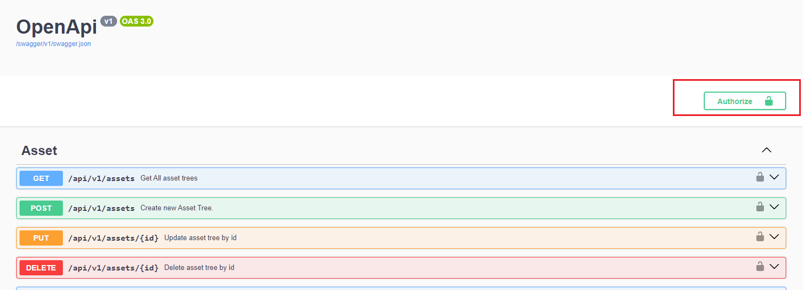
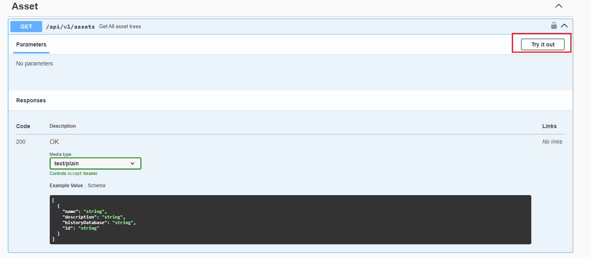

# API Document (Swagger)

When you enter the VC Hub host address in the browser and append the suffix "swagger" (e.g.,  [https://example.com/swagger](https://example.com/swagger),  [http://localhost:8066/swagger](http://localhost:8066/swagger)), it will navigate to the Open API documentation page. This page lists all the Open API definitions for VC Hub.


We can use Swagger to invoke and test these Open APIs.

1. Click the "Authorize" button to enter the access token. For access token, we can refer to the chapter **Open Id Connect**.  Please to noted when enter the access token, the access token should be formated as "Bearer  {access_token}".




2. Click the down arrow icon to expand the API detail panel


3. Click the "Try it out", then click the "Execute" button to invoke the API, the 




4. The server response with data of API result.


## How to Specify the Response Language?

When calling the API, include the following field in your HTTP request headers: `Accept-Language: zh-CN` or `Accept-Language: en-US`

The system determines the response language in the following priority order:

1. **Accept-Language header**: If set to `zh-CN` or `en-US`, the system will strictly return messages in the specified language.
2. **User session cookie**: If `Accept-Language` is not set, the system will read the language flag from the session cookie (e.g., `lang=en-US`).
3. **Default language**: If both values are missing or invalid, the system defaults to English (`en-US`).

**Supported Languages:**

- `zh-CN`: Simplified Chinese
- `en-US`: American English

**Example:** The application serves both Chinese and American users. If you need to obtain detailed information about a certain user, to avoid communication barriers caused by language differences, the system returns error messages based on the user’s language preference when an API call fails.

**Chinese user request:**

```json
GET api/v1/user/999
Accept-Language: zh-CN
```
 
**Response:**

```json
{
  "message": "用户不存在"
}
```
 
**American user request:**

```json
GET api/v1/user/999
Accept-Language: en-US
```
 
**Response:**

```json
{
  "message": "User does not exist"
}
```