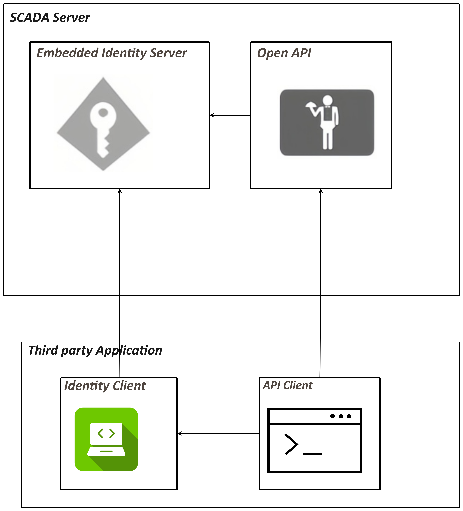

# Open API

VC Hub Open API refers to a set of Web API interfaces that allow third-party developers to access the functionalities of the VC Hub platform in their applications. VC Hub provides these Web API interfaces to third parties via OpenId.

VC Hub open API follows the RESTful style, all API URLs are based on resources. Considering the requirements of API version control, the API URL starts with the prefix of Version No. The API URL will like api/{VersionNo}/{ResourceName}. Additionally, VC Hub provides WebSocket-based APIs, with paths that start with 'ws'.

| **Function Method** | **Http Method** | **Http Request Body** | **Http Response Body** |
|---------------------|-----------------|-----------------------|------------------------|
| List                | GET             | N/A                   | Resource*list          |
| Get                 | GET             | N/A                   | Resource               |
| Create              | POST            | Resource              | Resource or Empty      |
| Update              | PUT, PATCH      | Resource              | Resource or Empty      |
| Delete              | DELETE          | N/A                   | N/A                    |

The following are some example of the API definition.

| **URL**            | **Http Method** | **Description**        |
|--------------------|-----------------|------------------------|
| api/v1/assets      | GET             | Get all assets         |
| api/v1/assets      | POST            | Create new asset       |
| api/v1/assets/{id} | PUT             | Update the asset by id |
| api/v1/assets/{id} | DELETE          | Delete the asset by id |

