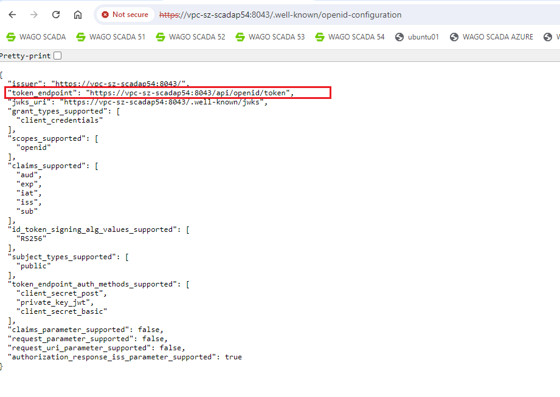
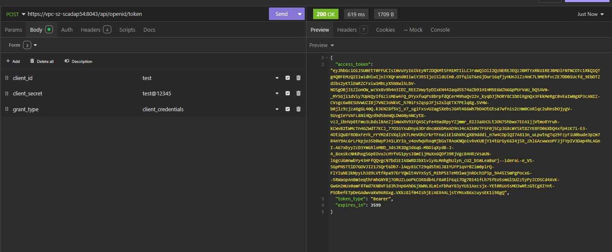

# Open Id Connect

The Open API integrates the standard OpenID Connect protocol. To call the Open API, third-party applications should use the client ID and client secret(For instructions on how to obtain the client ID and client secret, please refer to the chapter "**Security->OpenID Connect Client Registrations**".) to request an access token for validation and authorization from VC Hub. However, before obtaining the client ID and secret, you first need to retrieve the token validation and authorization URL for the VC Hub Open API. To do this, enter the URL   [https://{host}/.well-known/openid-configuration](https://server.com:8443/.well-known/openid-configuration) in your browser to obtain the VC Hub OpenID Connect configuration, which includes a `token_endpoint` URL for Open API token validation and authorization. 

**Note:** Open API only supports the HTTPS protocol, so be sure to use HTTPS when retrieving the `token_endpoint`.



The third-party application sends the client ID and client secret to the `token_endpoint` URL (specifically by using a POST request, placing the `client_id`, `client_secret`, and `grant_type` parameters in the request body. The value of the `grant_type` parameter must be `client_credentials`, for example:

```Plain Text
grant_type=client_credentials&client_id=your_client_id&client_secret=your_client_secret
```
 
), the server then returns an access token, the third-party application can then use this access token to access the authorized VC Hub Open API.

