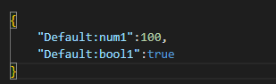

# Realtime Data API Definitions

#### GET /api/v1/tagValues

Get tag values by tag list

Protocol: Https

Request Payload(QueryString):

| Name | Type     | Description       |
|------|----------|-------------------|
| path | String[] | The tag path list |

Response Payload(JsonArray):

| Name     | Type    | Description            |
|----------|---------|------------------------|
| path     | String  | The tag path           |
| property | string  | The property name      |
| value    | Dynamic | The property value     |
| quality  | String  | The quality of the tag |

#### GET /api/v1/tagProperties

Get properies by property path list.

Protocol: Https

Request Payload(QueryString):

| Name | Type     | Description                                                                                                  |
|------|----------|--------------------------------------------------------------------------------------------------------------|
| path | String[] | The property path list, the property path is composed of tag path and property name.(e.g. Default:tag1#unit) |

Response Payload(JsonArray):

| Name    | Type     | Description            |
|---------|----------|------------------------|
| path    | String   | The tag path           |
| value   | Dynamic  | The tag value          |
| time    | DateTime | The timestamp          |
| quality | String   | The quality of the tag |

#### POST /api/v1/tagValues

Write tag values, support batch write.

protocol: Https

Request Payload(Key-value pair list):

| Name  | Type    | Description    |
|-------|---------|--------|
| key   | String  | The tag name |
| value | Dynamic | The tag value |

Note: This payload request is a list of key-value pair list, as shown below.

Response Payload(JsonObject):

| Name         | Type                | Description                                                                                                                                                                                                                                                                                                                                                                                                                      |
|--------------|---------------------|----------------------------------------------------------------------------------------------------------------------------------------------------------------------------------------------------------------------------------------------------------------------------------------------------------------------------------------------------------------------------------------------------------------------------------|
| totalCount   | Integer             | Total count of request tag values                                                                                                                                                                                                                                                                                                                                                                                                |
| successCount | Integer             | The successful tag count to be written                                                                                                                                                                                                                                                                                                                                                                                           |
| successCount | Integer             | The failed  tag count to be written                                                                                                                                                                                                                                                                                                                                                                                              |
| data         | Key-value Pair List | A key-value list shows every result of tag write result, for tag failed to be written, an error message is returned. The following demonstrates the structure of the key-value pair list.   |

## TagValues /ws/v1/realtimeData

Get realtime tag values. The first response in the session provides the complete set of real-time alarms, followed by incremental updates with new alarms.

Request Payload(JsonArray):

| Name | Type     | Description       |
|------|----------|-------------------|
| path | String[] | The tag path list |

Response Payload(JsonArray):

| Name    | Type     | Description            |
|---------|----------|------------------------|
| path    | String   | The tag path           |
| value   | Dynamic  | The tag value          |
| time    | DateTime | The timestamp          |
| quality | String   | The quality of the tag |

#### TagProperties /ws/v1/realtimeData

Get properies by property path list.

Protocol: WebSockets

Request Payload(JsonArray):

| Name | Type     | Description                                                                                                  |
|------|----------|--------------------------------------------------------------------------------------------------------------|
| path | String[] | The property path list, the property path is composed of tag path and property name.(e.g. Default:tag1#unit) |

Response Payload(JsonArray):

| Name    | Type     | Description            |
|---------|----------|------------------------|
| path    | String   | The tag path           |
| value   | Dynamic  | The tag value          |
| time    | DateTime | The timestamp          |
| quality | String   | The quality of the tag |

#### Alarms /ws/v1/realtimeData

Get realtime alarms

Protocol: WebSockets

Request Payload:NA

Response Payload(JsonArray):

| Name         | Type     | Description                                        |
|--------------|----------|----------------------------------------------------|
| eventId      | String   | The id of the history record                       |
| path         | String   | The tag path                                       |
| type         | String   | The alarm type (Limit, LimitHigh1, LimitHigh2… )   |
| priority     | String   | The alarm priority (Low,Mid,High,Urgent)           |
| status       | Status   | The alarm status( UnAck,Acked, Rtun, Norm)         |
| value        | Dynamic  | The tag value tiggered alarm                       |
| valueType    | String   | The value type of tag value                        |
| description  | String   | The alrm description                               |
| ackTime      | DateTime | The acknowledge time of the alarm                  |
| ackNotes     | String   | The notes of the alarm                             |
| recoveryTime | DateTime | The recovery time                                  |
| operator     | String   | The user who acknownlege the alarm                 |
| isShelved    | Boolean  | A flag indicate whether the alarm is shelved       |
| ackMode      | String   | The acknownledge mode (Auto,Manual,ManualNeedInfo) |
| activeTime   | DateTime | The alarm active time.                             |

#### IncrementAlarms /ws/v1/realtimeData

Get incremented realtime alarms.The session initially returns the full set of real-time alarm data, and subsequently pushes incremental updates of alarm changes.

Protocol: WebSockets

Request Payload:NA

Response Payload((JsonArray):

| Name  | Type                | Description                                                                                            |
|-------|---------------------|--------------------------------------------------------------------------------------------------------|
| IsAll | Bool                | A flag indicator whether the data is full data or incremented data                                     |
| Data  | Key-value pair list | The key-value pair list. The key represents event id and the value represents alarm detail(AlarmModel) |

AlarmModel

| Name         | Type     | Description                                        |
|--------------|----------|----------------------------------------------------|
| eventId      | String   | The id of the history record                       |
| path         | String   | The tag path                                       |
| type         | String   | The alarm type (Limit, LimitHigh1, LimitHigh2… )   |
| priority     | String   | The alarm priority (Low,Mid,High,Urgent)           |
| status       | Status   | The alarm status( UnAck,Acked, Rtun, Norm)         |
| value        | Dynamic  | The tag value tiggered alarm                       |
| valueType    | String   | The value type of tag value                        |
| description  | String   | The alrm description                               |
| ackTime      | DateTime | The acknowledge time of the alarm                  |
| ackNotes     | String   | The notes of the alarm                             |
| recoveryTime | DateTime | The recovery time                                  |
| operator     | String   | The user who acknownlege the alarm                 |
| isShelved    | Boolean  | A flag indicate whether the alarm is shelved       |
| ackMode      | String   | The acknownledge mode (Auto,Manual,ManualNeedInfo) |
| activeTime   | DateTime | The alarm active time.                             |

#### ShelvedAlarms /ws/v1/realtimeData

Get current shelved alarms

Protocol: WebSockets

Request Payload:NA

Response Payload(JsonArray):

| Name           | Type   | Description                               |
|----------------|--------|-------------------------------------------|
| eventId        | String | The id of the history record              |
| path           | String | The tag path                              |
| expirationTime | String | The expiration time of the shelved alarm. |
| priority       | String | The alarm priority (Low,Mid,High,Urgent)  |
| operator       | String | The user who acknownlege the alarm        |

#### POST /api/v1/alarms/ack

Acknownledge the alarm

Protocol: Https

Request Payload(JsonObject):

| Name     | Type   | Description                              |
|----------|--------|------------------------------------------|
| eventId  | String | The id of the history record             |
| path     | String | The tag path                             |
| operator | String | The user who acknownlege the alarm       |
| notes    | String | The nodes of current acknownledge action |

#### POST /api/v1/alarms/batchAck

Acknownledge the alarms

Protocol: Https

Request Payload(JsonArray):

| Name     | Type   | Description                              |
|----------|--------|------------------------------------------|
| eventId  | String | The id of the history record             |
| path     | String | The tag path                             |
| operator | String | The user who acknownlege the alarm       |
| notes    | String | The nodes of current acknownledge action |

Response Payload: NA

