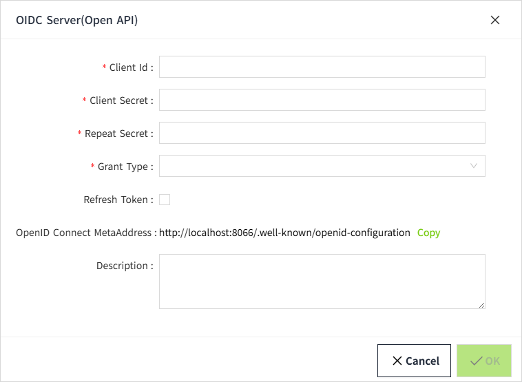
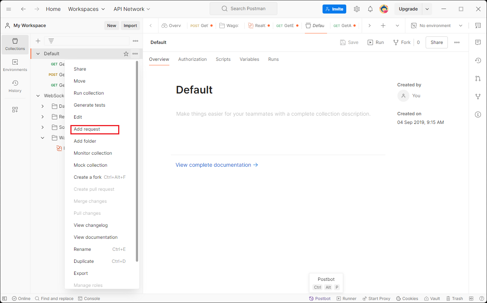
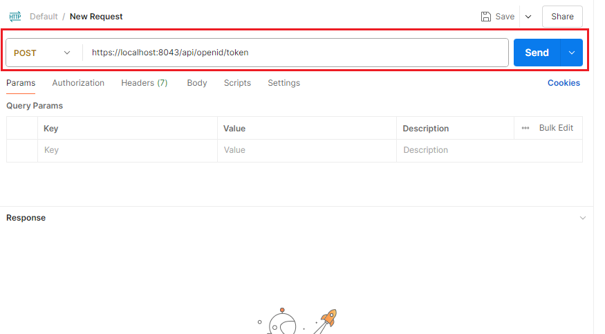

# Get Access token

Before testing the Open API, we should first acquire the access token.

1. Log in VC Hub, navigate to the **Security->OIDC Server(Open API)** page, and create a new pair of client ID and client secret.  For details about the API credential management page, refer to chapter **"Secutity -> OIDC Server(Open API) Registrations"**. 

    

    

2. Click the "Open API" link and grant all permissions to the new client id.

    

    

3.  Open the Postman application and create an HTTP request by clicking the menu, as shown in the screenshot below.

    

4. Create a GET request for the URL `https://localhost:8043/.well-known/openid-configuration.` Send the request by clicking the **Send** button, and extract the **Token URL** from the response. Note that the Open API only supports HTTPS protocol. The default port of https is 8043 and it can be configured on node settings page.  For the node settings page,  refer to chapter **"Node Configuration"**.

    

5. Create a POST request with the token url retrived from the previous step.

    

6.  Enter the client ID and client secret registered on API credentials page,  as shown in the example below. Set the grant_type to "client_credentials", then click the send button. The access token can be extracted from the HTTP response. Note that the request body format must be  **x-www-form-urlencoded.**

    

| **Key**       | **Description**                                                                         |
|---------------|-----------------------------------------------------------------------------------------|
| client_id     | The client id registered in the API credentials management page                         |
| client_secret | The client secret registered in the API credentials management page                     |
| grant_type    | The grant type of the open id request. Only the "client_credentials" value is supported |

