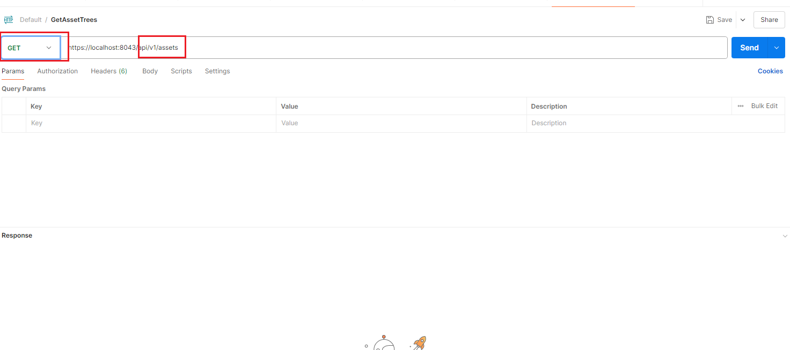
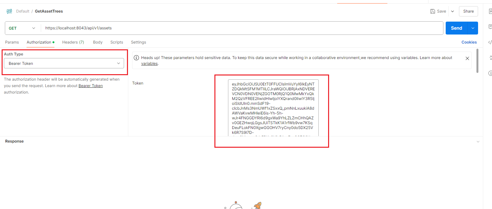

# Invoke Web APIs over HTTPs

Open API provides Web APIs over the HTTPS protocol, with the default HTTPS port set to 10443.

1. Before creating an HTTP request for Open API in Postman, browse the API definitions on the Swagger documentation page. To access the Swagger page, refer to chapter **Open API->API Document (Swagger)**.  The API definitions also can be found on chapter **Open API->Asset API Definitions**,**Open API->Historical Data API Definitions**,**Open API->Realtime Data API Definitions**.

    

2. Create a new request in Postman UI according to API definitions.

    

3. Open the **Authorizaiton** Tab, select **Bearer Token** from the Auth Type dropdown list, and enter the access token in the **Token** text box.

    

4. Click the **Send** button, the API returns the response with success status code.

    

