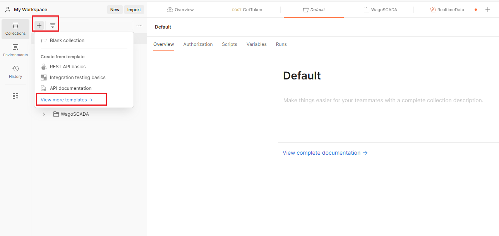
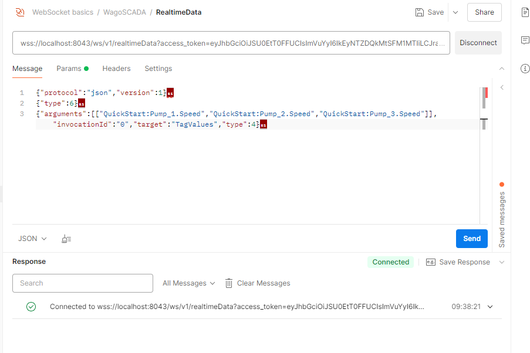

# Subscribe to real-time data via WebSocket API

Open API offers WebSocket API for real-time data access. Using the WebSocket API, you can subscribe to real-time data, including tag values, tag properties, and tag alarms.

1. Open the postman home page, click the **+** icon, then click the **View more templates** link.

2. Click the **API protocol 101** menu, then select the **WebSocket basics **option.

3. Create a new folder under **WebSocket basics. ** Open the menu by clicking the dropdown menu of the new folder, as shown in  below screenshot, then click the **WebSocket** option.

4. Enter ther URL wss://localhost:8043/ws/v1/realtimeData

5. Open the **Params** tab and enter the access_token. 

6. Click the **Connect** button, and Postman will indicate the Websocket connection has been established.

7. Once connected, open the **Message** tab and send payload with the format like the below example. Note that the special charactar **** must not be ignored. The part [["Default:m1","Default:m2","Default:m3"]] in third line should be replaced the tags actually exist in the system.

{"protocol":"json","version":1}

{"type":6}

{"arguments":[["Default:m1","Default:m2","Default:m3"]],"invocationId":"0","target":"TagValues","type":4}

8. After the payload is sent, postman will continuously receive the real-time tag values.

9. The above example demonatrates how to subscribe the tag values. For the other Websocket APIs, refer to chapter **Open API-> Realtime Data API Definitions** . The **target** field in the payload in the example below represents the method name of Reamtime Data API.  You can invoke the other WebSocket APIs by replacing **target** value with the method name specified in the **Realtime Data API Definitions** document. 

